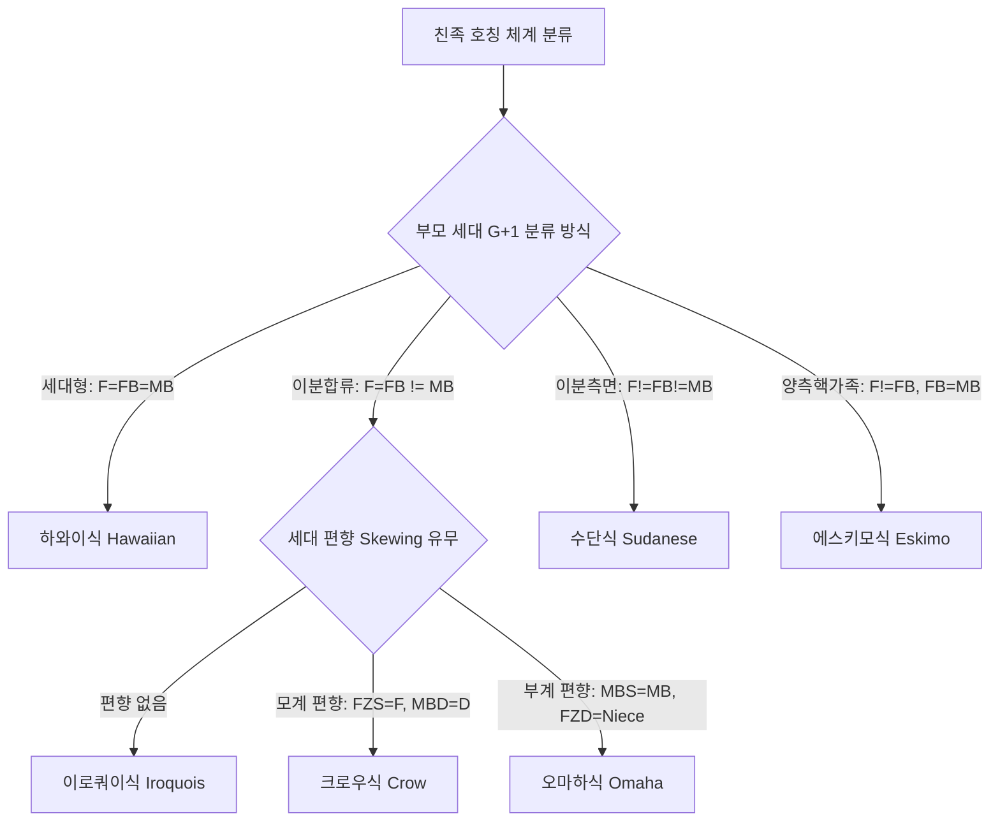

# Problem #045: 문화인류학 친족 대수학(Kinship Algebra)과 레비-스트로스의 구조주의 동맹 이론

## 1. 친족 체계 연구의 학문적 의의

친족 체계(Kinship System)는 생물학적 번식(Reproduction)과 혈연(Consanguinity)을 사회적 분류와 권리·의무의 체계로 전환하는 인류 사회의 가장 기초적인 제도입니다.
19세기 루이스 헨리 모건(Lewis Henry Morgan)이 아메리카 원주민의 친족 호칭을 조사한 이래, 친족 연구는 단순한 족보 조사가 아니라 **인간 심성과 사회 구조의 보편적 문법**을 탐구하는 인문학의 핵심 분야로 발전했습니다.

1949년 클로드 레비-스트로스(Claude Lévi-Strauss)는 촘스키의 변형생성문법이 언어에 가져온 것과 동등한 혁명을 친족학에 가져왔습니다. 그는 친족을 '혈통(Descent)'이 아닌 **'결혼에 의한 여성과 재화의 교환(Alliance Theory)'** 관점에서 재정의했습니다.

---

## 2. 조지 머독(George P. Murdock)의 6대 친족 체계 비교

머독은 1949년 저서 『사회 구조(*Social Structure*)』에서 에고(Ego)를 기준으로 1차 세대(G+1: 부모 세대)와 0차 세대(G0: 사촌/형제 세대)의 호칭 병합 규칙을 바탕으로 전 세계 사회를 6대 유형으로 분류했습니다.

### 1) 하와이식 (Hawaiian)
- 가장 극단적인 세대형(Generational) 체계입니다.
- 같은 성별의 부모 세대는 모두 하나의 호칭(아버지/어머니)으로 부릅니다.
- 모든 사촌은 나의 친형제/자매와 완전히 동일하게 취급되므로, 사촌 간의 결혼은 엄격한 근친상간으로 금지됩니다.

### 2) 에스키모식 (Eskimo)
- 현대 서구 및 한국 사회의 법적 친족관과 가장 유사한 핵가족 중심(Bilateral) 체계입니다.
- 핵가족 구성원(아버지, 어머니, 형제, 자매)만 고유 칭호를 가지며, 방계 친족은 부계/모계 구분 없이 삼촌(Uncle), 고모/이모(Aunt), 사촌(Cousin)으로 일괄 통합됩니다.

### 3) 이로쿼이식 (Iroquois)
- 이분합류(Bifurcate Merging)의 표준형입니다.
- 아버지의 남자 형제는 '아버지', 어머니의 여자 형제는 '어머니'로 합류합니다.
- 따라서 평행사촌($FBS, MZS$)은 나의 친형제/자매가 되어 결혼이 금기되지만, 교차사촌($MBD, FZD$)은 명확히 구별되어 다른 씨족과의 전략적 혼인 동맹 파트너가 됩니다.

### 4) 크로우식 (Crow) & 오마하식 (Omaha)
- 강력한 단계적 혈통(Unilineal Descent)을 가진 사회에서 발생하는 **세대 편향(Generational Skewing)** 현상입니다.
- **크로우식(모계제)**: 고모의 혈통(아버지의 모계)에 속한 사람들은 나이와 무관하게 존칭을 받아, 고모 아들($FZS$)을 '아버지', 고모 딸($FZD$)을 '고모'로 부릅니다.
- **오마하식(부계제)**: 외삼촌의 혈통(어머니의 부계)에 속한 사람들은 존칭을 받아, 외삼촌 아들($MBS$)을 '외삼촌', 외삼촌 딸($MBD$)을 '어머니'로 부릅니다.

### 5) 수단식 (Sudanese)
- 8가지 모든 사촌과 4가지 삼촌/고모/이모에게 단 하나의 중복도 허용하지 않는 가장 정밀한 서술형(Descriptive) 체계입니다.

---

## 3. 레비-스트로스의 동맹 이론(Alliance Theory)과 교환의 구조

레비-스트로스는 근친상간 금기(Incest Taboo)의 진정한 기능이 생물학적 유전병 예방이 아니라, **"내부의 여성을 외부에 선물함으로써 타 집단과의 상호 교환망을 구축하는 사회적 의무"**라고 설명했습니다.

1. **제한 교환 (Restricted Exchange / 대칭 교환)**:
   - 두 집단(A와 B)이 직접 서로의 자매나 딸을 맞교환하는 형태입니다.
   - 양측 교차사촌 혼인(Bilateral Cross-Cousin Marriage)이 이에 해당합니다.
2. **일반 교환 (Generalized Exchange / 순환 비대칭 교환)**:
   - 집단 A는 B에게, B는 C에게, C는 다시 A에게 여성을 보내는 순환 고리($A \to B \to C \to A$)입니다.
   - **모계 교차사촌 혼인(Matrilateral Cross-Cousin Marriage: $MBD$)**: 항상 외삼촌의 딸과만 결혼할 수 있으며, 고모의 딸($FZD$)과의 결혼은 순환의 방향을 역류시키므로 엄격히 금지됩니다. 이는 사회 전체를 하나의 거대한 유기적 연대 그물망으로 엮어냅니다.
