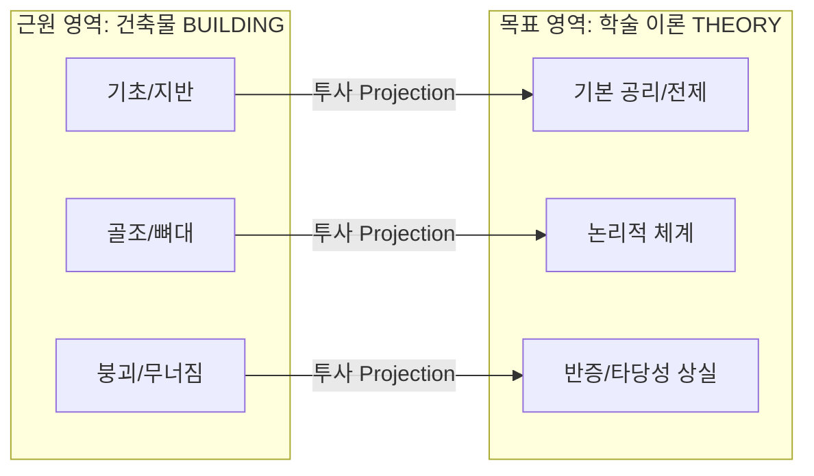

# Problem #046: 인지언어학 개념적 은유 이론과 레이코프의 프레이밍 이론

## 1. 객관주의 의미론의 붕괴와 체화된 인지(Embodied Cognition)

전통 서양 분석철학(프레게, 러셀, 초기 비트겐슈타인)의 객관주의 의미론은 진리 조건을 중심으로 언어를 분석했습니다: "기호는 외부 세계의 객관적 실재를 1:1로 표상하며, 의미는 참/거짓으로 환원된다."

그러나 조지 레이코프와 마크 존슨은 인지과학 실험과 언어학적 증거를 통해 이를 반박했습니다. 인간의 뇌는 물리적 신체를 가지고 중력, 공간, 온기, 운동을 경험하며 진화했습니다.
따라서 우리는 고도의 추상적인 개념(사랑, 시간, 국가, 도덕, 정의)을 직접 파악할 수 없으며, **이미 뇌의 감각-운동 피질에 각인된 신체적 경험(Image Schemas)**을 빌려와 은유적으로 투사(Cross-Domain Mapping)함으로써 비로소 이해할 수 있습니다. 이것이 **체화된 인지(Embodied Cognition)**와 **개념적 은유 이론(Conceptual Metaphor Theory, CMT)**의 핵심입니다.

---

## 2. 근원 영역(Source)에서 목표 영역(Target)으로의 인지 사상

개념적 은유는 $X = Y$라는 단순한 언어적 표현이 아니라, 뇌 신경망의 시냅스 연결을 통한 **지식 체계의 구조적 사상(Systematic Mapping)**입니다:

- "그 이론의 기초가 흔들린다(The foundation is shaky)."
- "논문의 뼈대를 세우다(Construct a framework)."
- "반론에 의해 학설이 무너졌다(The theory collapsed)."
이 표현들은 우연한 관용구가 아니라, 우리 뇌 속에 `THEORY IS A BUILDING`이라는 신경 회로가 활성화되어 있기 때문에 자연스럽게 생성되는 언어적 반영입니다.

---

## 3. 조지 레이코프의 정치 프레이밍과 이중개념주의(Biconceptualism)

레이코프는 언어가 단순한 정보 전달의 수단이 아니라, 사람들의 무의식적 가치관을 조작하는 **인지적 프레임(Cognitive Frame)**의 활성화 장치임을 입증했습니다.

### 1) 엄격한 아버지 모델 (Strict Father Model)
- 기본 은유: `국가는 가정이며, 정부는 엄격한 아버지이다.`
- 도덕적 전제: 세상은 근본적으로 험난하고 유혹이 가득하다. 따라서 강한 의지력과 규율(Discipline)을 갖추어야만 생존할 수 있다.
- 정책적 귀결: 개인의 자립(Self-reliance), 범죄에 대한 엄벌주의, 복지 축소(나태함을 조장한다고 봄), 군사력과 국경 통제 강조.

### 2) 자애로운 부모 모델 (Nurturant Parent Model)
- 기본 은유: `국가는 가정이며, 정부는 자애로운 부모이다.`
- 도덕적 전제: 인간은 본성적으로 타인과 공감(Empathy)하며 협력할 수 있다. 고난에 처한 구성원을 돌보는 것은 공동체의 의무이다.
- 정책적 귀결: 공교육과 의료 복지 확충(사회적 안전망), 환경 규제, 소수자 인권 보호, 국제 외교적 협력.

### 3) 이중개념주의 (Biconceptualism)
현대 유권자의 대다수는 순수한 100% 보수나 100% 진보가 아닙니다. 사람들의 뇌 속에는 두 가지 프레임이 동시에 존재(이중개념주의)하며, 정치 연설이나 미디어가 어떤 프레임의 단서 어휘(Cues)를 지속적으로 자극하느냐에 따라 특정 프레임의 시냅스가 강화(Hebbian Learning)되어 투표 성향이 결정됩니다.
