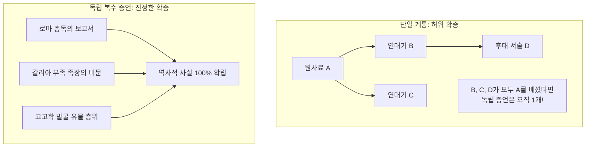

# Problem #047: 랑케의 실증주의 역사학과 사료비판(Quellenkritik) 이론

## 1. 전근대 역사 서술의 한계와 실증사학의 정립

역사학은 과거의 사실을 복원하는 학문이지만, 사료(Historical Sources)는 언제나 불완전하고 왜곡되기 쉽습니다:
- 고대 그리스의 역사가 헤로도토스는 신화와 전설을 여과 없이 수록하여 '역사의 아버지이자 거짓말의 아버지'라는 이중적 평가를 받았습니다.
- 중세 수도원 연대기들은 기적, 용의 출현, 천벌 등 종교적 교훈을 주입하기 위해 사실을 윤색했습니다.
- 통치자들의 공식 기록은 패전과 실정을 은폐하고 전공을 수십 배 부풀리는 정치적 선전(Propaganda)에 불과했습니다.

19세기 독일의 레오폴트 폰 랑케(Leopold von Ranke)는 국가 문서 보관소(Venetian Archives, Prussian State Archives)의 1차 사료(외교 문서, 대사 보고서, 서신, 회계 장부)를 직접 발굴하고, 철저한 문헌학적·비판적 검증을 거친 사료만을 근거로 역사를 서술하는 **실증주의 사료비판(Quellenkritik)**을 확립했습니다.

---

## 2. 사료비판의 2대 축: 외적 비판과 내적 비판

### 1) 외적 비판 (External Criticism / Lower Criticism)
사료의 '물리적 진위'를 밝히는 작업입니다.
- **물질 분석**: 양피지, 종이 재질, 잉크의 성분, 필체(Palaeography), 인장(Diplomatics) 분석.
- **시대착오(Anachronism) 검출**:
  - 1440년 인문주의자 로렌초 발라(Lorenzo Valla)는 교황청의 세속 지배권 근거였던 『콘스탄티누스 기증서(*Donatio Constantini*)』를 분석했습니다.
  - 4세기 콘스탄티누스 황제 시대에는 존재하지 않았던 중세 봉건제 라틴어 어휘(`feudum`, `satrap`)와 콘스탄티노폴리스 건설 이전의 언급을 찾아내어 8세기에 날조된 위작(Forgery)임을 완벽하게 폭로했습니다.

### 2) 내적 비판 (Internal Criticism / Higher Criticism)
진품으로 판명된 사료의 내용이 '과연 믿을 수 있는가'를 평가하는 작업입니다.
- **시간적 거리와 망각 곡선**: 사건 직후 작성된 일기나 공문서는 세월이 흐른 뒤 노년에 쓴 회고록보다 신뢰도가 월등히 높습니다.
- **저자의 이해관계와 편향(Conflict of Interest & Bias)**: 저자가 사건의 이해당사자(전쟁 당사자, 궁정 관료, 이단 심문관)인 경우 자신의 이익을 위해 고의적인 왜곡을 가할 가능성을 통계적으로 보정해야 합니다.

---

## 3. 상호 교차 확증과 복수 증언 원칙

로마법의 격언 **"단일 증언은 증언이 아니다(*Testis unus, testis nullus*)"**는 사료비판의 황금률입니다. 아무리 신뢰도 높은 인물이라도 단 1명의 증언만으로는 역사적 확정을 내릴 수 없습니다.

사료 B와 C가 사료 A를 그대로 전재(Copying)한 것이라면, 겉으로는 3개의 사료가 일치하는 것처럼 보여도 독립적인 증언은 오직 A 하나뿐입니다.
진정한 역사적 확실성은 **서로 적대적이거나 완전히 무관한 복수의 독립 사료가 동일한 사실을 일치되게 증언할 때** 비로소 달성됩니다.
