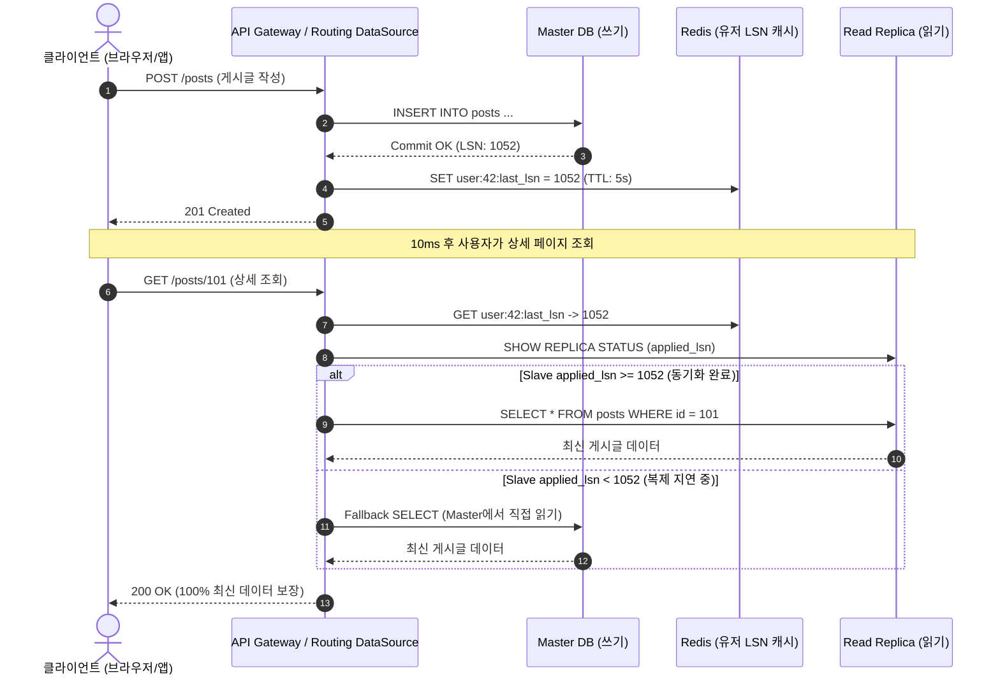

# 📚 기술 백서: DB 복제 지연(Replication Lag)과 Read-Your-Own-Writes 정합성

> **"DB를 Master-Slave로 나누어 읽기 트래픽을 분산하는 순간, 당신은 분산 시스템의 최종 일관성(Eventual Consistency)의 늪에 발을 들인 것입니다."**

서비스 트래픽이 증가하면 모든 엔지니어가 가장 먼저 시도하는 인프라 확장이 바로 **Master-Slave (Primary-Replica) 복제**입니다.
쓰기 쿼리(`INSERT`, `UPDATE`, `DELETE`)는 Master DB 1대로 보내고, 수많은 읽기 쿼리(`SELECT`)는 2~3대의 Slave DB로 분산(Scale-out)시키는 구조입니다.

하지만 이를 순진하게 적용했다가는 **"방금 결제했는데 결제 내역이 안 떠요!", "프로필 사진을 바꿨는데 새로고침하니 원래대로 돌아가요!"**라는 치명적인 정합성 버그에 직면하게 됩니다.
이 백서에서는 복제 지연의 근본 원인과 이를 해결하는 핵심 일관성 모델인 **Read-Your-Own-Writes** 패턴을 살펴봅니다.

---

## 1. 현실 비유: 은행 본점과 지점의 팩스 지연

은행 본점(Master DB)과 전국의 지점(Slave DB)을 상상해 보십시오.

1. **입금 ($t=100\text{ms}$)**:
   * 고객이 본점 창구에 가서 현금 100만 원을 입금했습니다.
   * 본점 장부에는 즉시 `잔액: 100만 원`이 기록되었습니다.
2. **복제 지연 (Replication Lag)**:
   * 본점은 전국 지점들에 "이 고객이 100만 원 입금했으니 장부에 적어두세요"라며 팩스를 보냅니다.
   * 팩스가 전송되고 지점 행원이 이를 장부에 옮겨 적는 데 **50ms의 시간**이 걸립니다.
3. **잔액 조회 ($t=110\text{ms}$)**:
   * 고객이 본점 문을 나서자마자 바로 옆에 있는 1번 지점 ATM에 카드를 넣고 잔액을 조회했습니다.
   * 1번 지점의 장부에는 아직 본점 팩스가 도착하지 않았습니다.
   * 화면에 뜨는 잔액: **`0원`**!
4. **대참사**:
   * 고객은 경악하며 "내 돈 100만 원이 증발했다!"고 경찰에 신고하고 창구 직원의 멱살을 잡습니다.

지점 장부가 0.1초 뒤에 맞춰질 예정이라도, **방금 돈을 넣은 '본인'이 자신의 잔액을 조회할 때 0원이 뜨는 것은 절대 용납될 수 없습니다.**

---

## 2. 왜 비동기 복제를 사용할까? (동기 복제의 한계)

"그렇다면 본점이 지점 장부에 다 적을 때까지 고객을 기다리게 하면 되잖아요?"  
이것이 바로 **완전 동기 복제(Synchronous Replication)**입니다.

하지만 동기 복제는 다음과 같은 치명적인 문제를 야기합니다:
* **응답 지연(Latency) 폭증**: Master의 커밋 속도가 가장 느린 Slave의 네트워크 속도에 묶입니다.
* **가용성(Availability) 붕괴**: Slave 1대만 네트워크 장애로 응답이 늦어져도 Master의 모든 쓰기 작업이 멈춥니다 (2PC 블로킹 문제).

따라서 현대의 거의 모든 RDBMS(MySQL, PostgreSQL, AWS RDS Aurora)는 기본적으로 **비동기 복제(Asynchronous Replication)**를 사용합니다.
Master는 로컬 WAL(Write-Ahead Log, MySQL의 Binlog)에 기록하자마자 클라이언트에 `200 OK`를 주고, Slave는 백그라운드에서 천천히 Binlog를 가져와 리플레이(Replay)합니다.

이 비동기 파이프라인 사이에서 필연적으로 발생하는 시간차를 **복제 지연(Replication Lag)**이라고 부릅니다.

---

## 3. 일관성의 붕괴: Monotonic Read와 Read-Your-Own-Writes

분산 시스템에서 복제 지연으로 인해 깨지는 대표적인 일관성 모델입니다:

1. **단조 읽기(Monotonic Read)의 붕괴**:
   * 사용자가 새로고침을 누를 때마다 로드밸런서가 Slave1과 Slave2로 번갈아 쿼리를 보냅니다.
   * Slave1은 LSN 10까지 복제되었고, Slave2는 지연되어 LSN 8 상태입니다.
   * 사용자는 **첫 번째 새로고침에서 최신 글을 보았다가, 두 번째 새로고침에서 글이 사라지는 기괴한 시간 역행(Time Travel)**을 경험합니다.
2. **Read-Your-Own-Writes (RYOW)의 붕괴**:
   * 다른 사람이 쓴 댓글은 1초 늦게 보여도 서비스에 큰 문제가 없습니다 (최종 일관성 수용 가능).
   * 하지만 **내가 방금 작성한 글, 내가 수정한 프로필, 내가 결제한 내역**은 내가 새로고침했을 때 100% 즉시 보여야 합니다.

---

## 4. 3대 읽기 라우팅 전략 비교

### 전략 1: NAIVE (무조건 Slave 라우팅)
* 모든 `@Transactional(readOnly = true)` 쿼리를 무조건 Slave로 보냅니다.
* **장점**: 구현이 극히 단순함.
* **단점**: 글 작성 후 리다이렉트 시 `404 Not Found`, 프로필 수정 후 구버전(`STALE`) 노출 등 극심한 사용자 경험 파탄 및 중복 쓰기 연타 유발.

### 전략 2: TIME_WINDOW (쓰기 후 N초 동안 Master 라우팅)
* 사용자가 쓰기(`POST`, `PUT`, `DELETE`)를 수행하면 세션이나 쿠키에 마지막 쓰기 시각 $t_{write}$를 기록합니다.
* 이후 $t - t_{write} < \text{SAFE\_WINDOW}$ (예: 1초) 동안은 해당 사용자의 모든 읽기 요청을 **Master DB**로 강제 라우팅합니다.
* **장점**: 분산 인프라 수정 없이 애플리케이션 레벨에서 쉽게 구현 가능.
* **치명적 단점 2가지**:
  1. **Master DB 과부하 (리소스 낭비)**: 보통 복제는 10~20ms면 끝나는데, 1초 동안 수십 번의 읽기 쿼리가 전부 Master로 몰려 Slave를 둔 의미가 퇴색됩니다.
  2. **지연 스파이크(Lag Spike) 취약성**: Slave에 대량 배치나 인덱스 재구성이 걸려 복제 지연이 3초로 튀면, 1초 뒤 Master 라우팅이 풀리면서 사용자는 여전히 `NOT_FOUND`와 `STALE`을 만나게 됩니다!

### 전략 3: LSN_AWARE (Log Sequence Number 추적 정밀 라우팅 - Golden Standard)
* Master는 쓰기 트랜잭션 성공 시 해당 트랜잭션의 커밋 번호인 **LSN(Log Sequence Number)** 또는 **GTID(Global Transaction Identifier)**를 클라이언트에게 반환합니다.
  ```http
  HTTP/1.1 200 OK
  Set-Cookie: last_write_lsn=1052; Path=/
  ```
* 클라이언트는 이후 읽기 요청 시 이 `last_write_lsn`을 헤더나 쿠키로 함께 보냅니다.
* 데이터베이스 라우터는 대상 Replica의 현재 동기화 위치인 `applied_lsn`을 확인합니다:
  * $\text{applied\_lsn} \ge \text{last\_write\_lsn}$: **"이미 이 유저의 변경 사항이 복제 완료되었군!" $\to$ 안심하고 Slave에서 읽기!**
  * $\text{applied\_lsn} < \text{last\_write\_lsn}$: **"아직 복제가 안 끝났군!" $\to$ 안전하게 Master로 우회(Fallback)!**
* **효과**:
  * 복제가 10ms 만에 끝나면 즉시 11ms부터 Slave로 트래픽을 분산하여 **Master 부하를 극적으로 절감(MASTER_LOAD_SAVED)**합니다.
  * 복제 지연이 10초로 길어지더라도 Replica가 따라잡을 때까지 정확하게 Master로 보호하므로 **데이터 불일치 버그 발생률 0%**를 달성합니다!

---

## 5. 실무 백엔드 아키텍처 구현 (Spring Boot & Redis)

실무에서 LSN 기반 RYOW를 구현하는 전형적인 아키텍처입니다:



---

## 6. 결론: 분산 데이터베이스의 마침표

Primary-Replica 분할은 만병통치약이 아닙니다.
복제 지연이라는 물리적 현실을 외면한 채 트래픽만 나누면, 고객센터는 분노한 유저들의 문의로 마비됩니다.

* **타인의 데이터는 최종 일관성(Eventual Consistency)으로 여유 있게**,
* **자신의 데이터는 Read-Your-Own-Writes로 엄격하게** 격리하는 정밀한 라우팅 전략이야말로, 진정한 시니어 엔지니어가 갖추어야 할 분산 아키텍처의 핵심 소양입니다.
