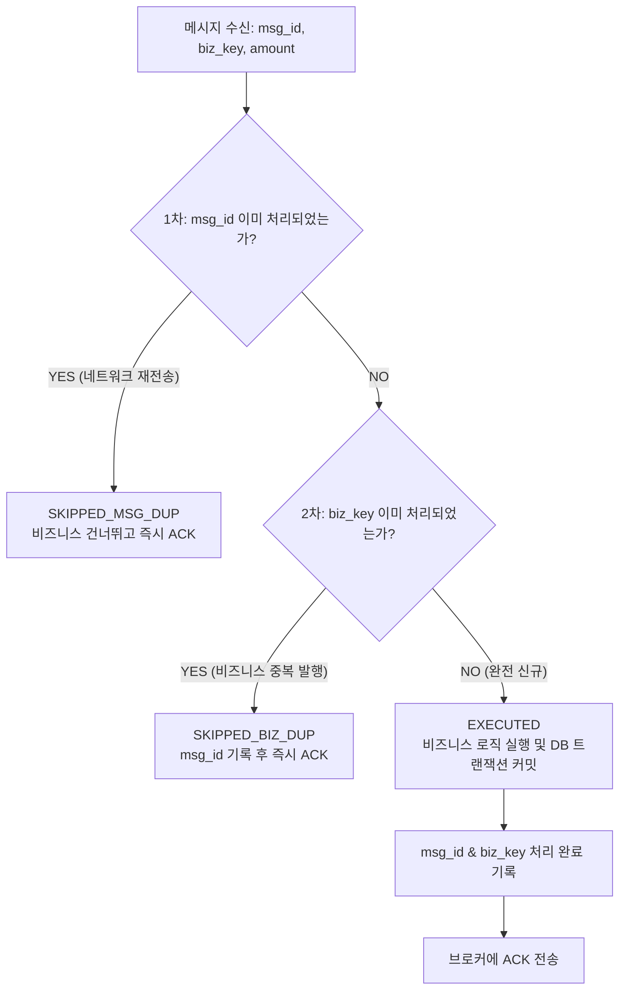

# 📚 기술 백서: 메시지 큐 At-Least-Once와 컨슈머 멱등성 (Idempotency)

> **"분산 네트워크 환경에서 메시지가 정확히 한 번만 전달되는 유토피아는 존재하지 않습니다. 중복을 막는 것은 큐가 아니라 당신의 컨슈머 코드입니다."**

Kafka, RabbitMQ, AWS SQS, Google Cloud Pub/Sub 등 현대 분산 아키텍처의 필수 인프라인 메시지 큐(Message Queue)를 다루다 보면 누구나 한 번쯤 겪는 재앙이 있습니다.
바로 **"메시지가 두 번, 세 번 연속으로 들어와 똑같은 주문이 2번 결제되거나 쿠폰이 2번 나가는 중복 처리 버그"**입니다.

이 현상은 메시지 브로커의 버그가 아니라, **분산 네트워크의 본질적인 물리적 한계**에서 비롯됩니다.
이 백서에서는 메시지 전달 보장 수준의 원리와 실무에서 100% 무결성을 보장하는 **2단계 멱등 컨슈머(Idempotent Consumer)** 설계 기법을 다룹니다.

---

## 1. 현실 비유: 등기우편 배달부와 확인증(ACK) 분실

1. **우체부(브로커)의 배달**:
   * 우체부가 집에 찾아와 10만 원이 든 등기우편(메시지)을 수취인(컨슈머)에게 전달합니다.
2. **수취인의 서명**:
   * 수취인은 봉투를 뜯어 10만 원을 지갑에 넣고, 우체부에게 "잘 받았습니다"라며 서명된 **확인증(ACK)**을 건넵니다.
3. **바람에 날아간 확인증 (네트워크 타임아웃)**:
   * 우체부가 우체국으로 돌아가는 길에 돌풍이 불어 확인증이 날아가 분실되었습니다!
4. **우체국의 재배달 지시**:
   * 우체국 시스템: *"어? 배달부로부터 수취인 확인증이 안 왔네? 배달 실패인가 보군. 내일 다시 배달해라!"*
5. **다음 날 아침의 비극**:
   * 우체부가 또 10만 원 봉투를 들고 찾아왔습니다.
   * **바보 수취인(Naive Consumer)**: "어? 또 돈이 왔네?" 하고 또 받아서 지갑에 넣습니다 $\to$ 20만 원 이중 수령!
   * **똑똑한 수취인(Idempotent Consumer)**: 현관문의 **수령 장부(Deduplication Table)**를 확인합니다:  
     *"등기번호 #1004? 어제 10시에 이미 수령했는데요? 돈은 안 받고 확인증(ACK)만 다시 써서 드릴게요!"*

---

## 2. 메시지 전달 보장 수준 3단계

컴퓨터 과학의 **두 장군 문제(Two Generals' Problem)**에 의해, 신뢰할 수 없는 네트워크(Unreliable Network) 상에서 메시지 유실과 중복을 동시에 0%로 만드는 완벽한 인프라는 불가능합니다.

| 전달 보장 수준 | 설명 | 장점 | 치명적 단점 | 실무 사용처 |
|:---:|---|---|---|---|
| **At-Most-Once**<br>(최대 1회) | 메시지를 읽자마자 ACK를 먼저 보냄.<br>처리 중 서버가 죽으면 메시지 영구 소실. | 절대 중복 없음 | 메시지 유실 가능 | 지표 수집, 로그 트래킹 |
| **At-Least-Once**<br>(최소 1회) | 비즈니스 처리가 끝난 후 ACK를 보냄.<br>ACK가 유실되면 브로커가 재전송. | **메시지 절대 유실 없음** | **중복 수신 발생** | **대부분의 엔터프라이즈 시스템 기본값** |
| **Exactly-Once**<br>(정확히 1회) | 유실도 없고 중복도 없음. | 이상적 | 분산 트랜잭션(2PC) 비용 극심,<br>외부 시스템 연동 시 불가능 | Kafka 내부 스트림즈 등 제한적 환경 |

> **분산 엔지니어링의 대원칙:**  
> **"인프라(메시지 큐)는 At-Least-Once로 메시지 유실을 철저히 방어하고, 애플리케이션(컨슈머)은 멱등성(Idempotency)을 구현하여 Exactly-Once의 효과를 만들어낸다!"**

---

## 3. 메시지 중복이 발생하는 2대 원인

실무에서 중복은 한 가지 경로로만 발생하지 않습니다:

```text
[경로 A: 브로커 재전송]
Producer --(msg_1)--> Broker --(msg_1)--> Consumer (쿠폰 지급 완료)
                                              |
                                              X (ACK 유실/타임아웃)
                      Broker --(msg_1 재전송)--> Consumer (또 쿠폰 지급?!)

[경로 B: 프로듀서 재시도 / 클라이언트 광클]
User (결제 광클!) ----> Producer (타임아웃 재시도)
                           |--(msg_1, order_100)--> Broker --> Consumer (10,000원)
                           |--(msg_2, order_100)--> Broker --> Consumer (10,000원 또 지급?!)
```

1. **경로 A (동일 `msg_id` 중복)**:
   * 컨슈머가 작업을 완료했으나 네트워크 단절, 컨슈머 리밸런싱(Heartbeat 실패)으로 브로커가 오프셋 커밋(ACK)을 못 받아 동일 `msg_id`를 재전송.
2. **경로 B (새로운 `msg_id`, 동일 `biz_key` 중복)**:
   * 클라이언트의 새로고침/광클 연타, 또는 프로듀서가 브로커로 발행할 때 네트워크 타임아웃을 겪어 재시도하면서 **완전히 새로운 메시지 ID로 동일한 주문/결제 이벤트를 발행**.

---

## 4. 2단계 완전 멱등 컨슈머 (Full Idempotent Consumer) 아키텍처

단순히 메모리나 Redis에 `msg_id`만 검사하는 컨슈머는 **경로 B(새로운 `msg_id`로 들어오는 비즈니스 중복)에 완전히 뚫려버립니다.**

진정한 엔터프라이즈 멱등 컨슈머는 **2단계 방어선**을 구축합니다:



### 1단계 방어선: 메시지 ID 중복 제거 (Redis / In-Memory Cache)
* 고속 캐시를 통해 브로커의 네트워크 재전송 메시지를 0.001초 만에 걸러냅니다.
* Redis 명령:
  ```text
  SET idempotent:msg:msg_1001 "PROCESSED" NX EX 86400
  ```
* `NX` 옵션을 주어 이미 키가 존재하면 `nil`을 반환하므로 분산 환경에서도 안전한 원자적 락이자 중복 검사기로 동작합니다.

### 2단계 방어선: 비즈니스 고유 키 제약 (RDB Unique Constraint)
* 프로듀서 재시도로 인해 새로운 `msg_id`가 발급되었더라도, 비즈니스 도메인의 고유 키(`order_id`, `payment_id`)를 데이터베이스 레벨에서 보호합니다.
* 테이블 설계:
  ```sql
  CREATE TABLE coupon_issuances (
      id BIGINT AUTO_INCREMENT PRIMARY KEY,
      order_id VARCHAR(64) NOT NULL,
      amount INT NOT NULL,
      created_at TIMESTAMP DEFAULT CURRENT_TIMESTAMP,
      CONSTRAINT uq_order UNIQUE (order_id) -- 비즈니스 멱등성의 최후 보루!
  );
  ```
* 2번째 메시지가 유입되면 DB의 `DuplicateKeyException`에 의해 롤백되고 안전하게 무시됩니다.

---

## 5. 실무 체크리스트: 멱등 컨슈머 작성 3원칙

1. **중복 검사와 비즈니스 실행을 원자적(Atomic)으로 묶어라**:
   * 메시지 처리와 중복 키 기록이 분리되면, 처리 도중 서버가 다운되었을 때 영원히 재시도가 막히는 팬텀 버그가 발생합니다.
2. **건너뛴 메시지도 반드시 브로커에 정상 ACK를 보내라**:
   * 중복이라고 해서 예외를 던지거나 ACK를 안 보내면, 브로커는 영원히 해당 메시지를 재전송하여 큐가 막히는 포이즌 필(Poison Pill) 장애가 발생합니다.
3. **비즈니스 식별자(Natural Key)를 메시지 페이로드에 반드시 포함하라**:
   * UUID 같은 임의의 메시지 ID에만 의존하지 말고, 비즈니스를 대표하는 `order_id`, `payment_key`, `user_id`를 반드시 페이로드에 실어 보내야 2단계 멱등성을 달성할 수 있습니다.
