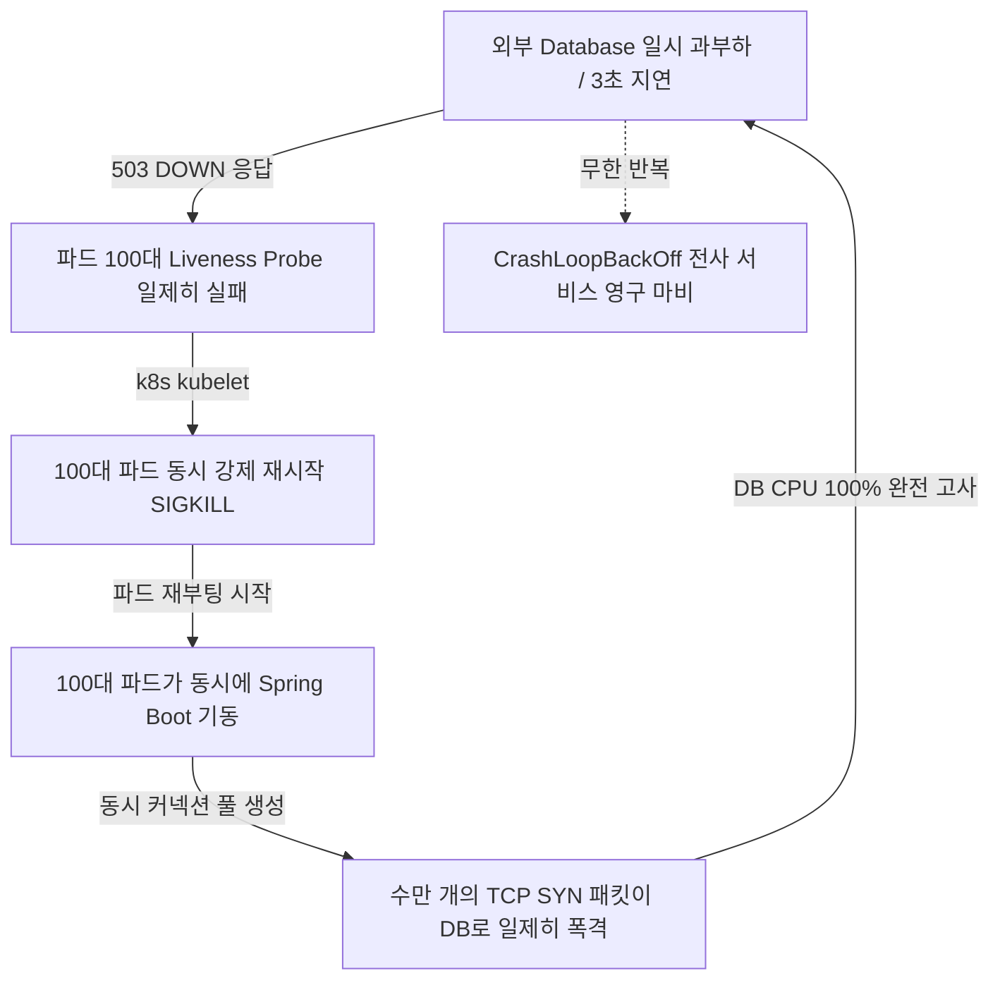

# 헬스체크의 두 얼굴: Liveness Probe vs Readiness Probe 완벽 해부

> "시스템이 아프다고 해서, 항상 머리에 총을 쏴서 리셋할 필요는 없다.  
> 때로는 잠시 병가를 내어 쉬게 해주는 것(트래픽 차단)만으로도 스스로 살아난다."

---

## 1. 현실 세계 비유: 비행기 조종사와 전기 충격기

공항에 짙은 안개가 끼어 활주로가 전혀 보이지 않고, 관제탑과의 레이더 통신이 3초간 지연되었습니다.

```text
[상황 발생: 안개로 시야 차단 & 레이더 통신 3초 지연]

❌ 딥 헬스체크 항공사 (Deep Health Check):
   "조종사가 관제탑과 통신이 안 되네? 조종사가 죽었나 보다!
    조종실 문을 부수고 들어가 조종사 심장에 5만 볼트 전기 충격기를 쏴서 기절시켰다 깨우자!"
   결과 -> 조종사가 기절했다 깨어나는 동안 비행기는 추락하고, 깨어나자마자 또 레이더가 안 잡히니 또 전기 충격기를 쏴서 영구 뇌사.

✅ 프로브 분리 항공사 (Liveness vs Readiness):
   "조종사의 심장은 멀쩡히 뛰고 있는가? (Liveness: OK, 전기 충격기 쏠 필요 없음)
    지금 당장 승객을 태우거나 착륙할 준비가 되었는가? (Readiness: NO, 시야 미확보)
    안개가 걷힐 때까지 잠시 착륙 대기선회(Holding Pattern)를 지시하고 승객 탑승을 멈추자."
   결과 -> 3초 뒤 안개가 걷히자마자 단 한 번의 충격이나 부상 없이 즉시 정상 운항 재개!
```

쿠버네티스(Kubernetes) 환경에서 수많은 초보 백엔드 엔지니어와 바이브 코더들이 저지르는 가장 치명적인 인프라 사고가 바로 **외부 DB 장애 시 파드 100대가 집단 연쇄 자살하는 "딥 헬스체크(Deep Health Check)"**입니다.

---

## 2. 쿠버네티스 헬스체크 3총사의 명확한 역할 분담

쿠버네티스는 컨테이너의 상태를 점검하기 위해 3가지 독립적인 프로브(Probe)를 제공합니다.

| 프로브 종류 | 묻는 질문 | 확인 대상 | 실패 시 쿠버네티스의 조치 |
| :--- | :--- | :--- | :--- |
| **Startup Probe** | "너 아직 태어나는 중이니?" | 애플리케이션 부팅 및 초기화 완료 여부 | 다른 프로브 검사를 유예하고 부팅을 기다림 (타임아웃 시 Kill) |
| **Liveness Probe** | "너 심장 뛰고 있니? 살았니?" | **순수 내부 프로세스 정상성** (데드락, 무한루프, 심각한 메모리 오염) | **컨테이너 강제 종료(SIGKILL) 및 재시작 (Restart)** |
| **Readiness Probe** | "너 지금 손님(트래픽) 받을 준비 됐니?" | **외부 의존성 포함 서빙 가능 여부** (DB 연결, 캐시 연결, 웜업 완료) | **Service 엔드포인트에서 제외 (트래픽 유입 즉시 차단)** |

### 핵심 차이: 재시작(Restart)인가, 차단(Isolate)인가?
- **Liveness Probe**는 **"치명적 질병(좀비 상태)"**을 고치는 최후의 수단입니다. 애플리케이션 내부 스레드가 교착상태(Deadlock)에 걸려 영원히 어떤 요청도 처리할 수 없을 때는, 프로세스를 강제로 죽이고 새로 띄우는 것 외에는 치료법이 없습니다.
- **Readiness Probe**는 **"일시적 피로(트래픽 소화 불가, 외부 지연)"**를 다루는 완충 장치입니다. DB가 일시적으로 느려졌거나 커넥션 풀이 꽉 찼다면, 새 요청을 잠시 안 받으면 기존 작업이 끝나면서 자연스럽게 회복됩니다.

---

## 3. 대재앙의 메커니즘: 연쇄 재시작 폭풍 (Cascading Restart Storm)

초보 개발자들은 흔히 Spring Boot Actuator나 프레임워크가 제공하는 기본 `/health` 엔드포인트를 Liveness Probe에 그대로 연결합니다.  
기본 `/health`는 DB, Redis, RabbitMQ 등 모든 의존성의 핑(Ping)을 때려보고 하나라도 실패하면 HTTP 503(DOWN)을 반환합니다.



### 수학적 재앙의 스케일
파드가 $N = 100$대 있고, 각 파드의 HikariCP 기본 커넥션 풀 크기가 $C = 10$이라고 가정해 봅시다.
1. 평상시: 100대 파드가 총 1,000개의 커넥션을 맺고 유휴 상태로 유지하며 안정적으로 트래픽을 처리합니다.
2. DB 3초 지연 발생 $\to$ 100대 파드의 Liveness Probe가 실패하여 일제히 재부팅됩니다.
3. 재부팅된 100대 파드가 기동과 동시에 `HikariPool.getConnection()`을 호출합니다.
4. 순식간에 **$100 \times 10 = 1,000$개의 새로운 TLS/TCP 핸드셰이크와 인증 쿼리가 0.1초 만에 DB로 동시 집중**됩니다.
5. DB는 새로운 연결을 맺어주느라 CPU 100%에 도달하여 기존 쿼리조차 처리하지 못하고 완전히 뻗어버립니다.
6. DB가 안 붙으니 새로 뜬 파드들도 Liveness Probe에 걸려 또다시 재부팅됩니다.  
$\to$ 이것이 바로 수석 인프라 엔지니어들도 밤새 식은땀을 흘리게 만드는 **"도그파일 효과(Dogpile Effect)와 연쇄 재시작 폭풍"**입니다.

---

## 4. 올바른 프로브 설계 3대 원칙

### 원칙 1: Liveness Probe는 철저하게 내부 지향적이어야 한다
Liveness 엔드포인트는 외부 네트워크(DB, 캐시, 타 마이크로서비스)를 절대로 호출해서는 안 됩니다.
- 오직 로컬 메모리 상태, 백그라운드 이벤트 루프 지연, 데드락 감지만 수행해야 합니다.
- 가장 이상적인 Liveness 응답: "내 프로세스가 살아서 HTTP 요청을 받아 200 OK를 즉시 뱉을 수 있는가?"

### 원칙 2: 외부 의존성 평가는 오직 Readiness Probe에만 위임한다
DB가 죽으면 Readiness Probe만 실패하게 만듭니다.
- Readiness가 실패하면 쿠버네티스는 해당 파드를 재부팅하지 않고, **Kube-Proxy 라우팅 테이블(Service Endpoints)에서만 조용히 뺍니다.**
- 파드는 살아서 기존에 진행 중이던 요청을 마무리하고, DB가 다시 살아나는지 백그라운드로 얌전히 기다립니다.
- DB가 복구되면 파드는 재부팅 시간(20~60초) 없이 **0.1초 만에 즉시 엔드포인트에 재등록되어 정상 서빙을 시작**합니다!

### 원칙 3: 지터(Jitter)와 임계치(Threshold)로 펄럭임(Flapping)을 방지한다
네트워크는 언제나 패킷 유실이나 순간적인 지연이 발생할 수 있습니다.
- `failureThreshold`: 1번 삐끗했다고 바로 조치하지 말고, 연속 3회 이상 실패했을 때만 상태를 변경합니다.
- `periodSeconds`: 너무 잦은 검사(예: 1초마다)는 프로브 자체가 서버 부하를 유발하므로 5~10초 간격이 적절합니다.
- `successThreshold`: 복구될 때도 연속 1~2회 성공을 확인한 뒤 안전하게 트래픽을 재개합니다.

---

## 5. 실무 구현 가이드

### 쿠버네티스 Deployment 매니페스트 (k8s YAML)
```yaml
apiVersion: apps/v1
kind: Deployment
metadata:
  name: my-backend-api
spec:
  replicas: 10
  template:
    spec:
      containers:
      - name: api-server
        image: my-backend:v1.0.0
        # 1. 스타트업 프로브: 앱이 뜰 때까지 최대 30초 대기
        startupProbe:
          httpGet:
            path: /actuator/health/liveness
            port: 8080
          failureThreshold: 30
          periodSeconds: 1

        # 2. 라이브니스 프로브: 오직 프로세스 생존만 확인 (재부팅 트리거)
        livenessProbe:
          httpGet:
            path: /actuator/health/liveness
            port: 8080
          failureThreshold: 3
          periodSeconds: 10

        # 3. 레디니스 프로브: DB 연결 등 서빙 가능 여부 확인 (트래픽 제어)
        readinessProbe:
          httpGet:
            path: /actuator/health/readiness
            port: 8080
          failureThreshold: 2
          successThreshold: 1
          periodSeconds: 5
```

### Spring Boot 2.3+의 내장 프로브 분리 설정
Spring Boot 2.3부터는 쿠버네티스를 위해 Liveness와 Readiness를 자동으로 분리해 주는 표준 스펙을 지원합니다 (`application.yml`):

```yaml
management:
  endpoint:
    health:
      probes:
        enabled: true # /actuator/health/liveness 및 /readiness 엔드포인트 자동 분리 활성화
```
- `/actuator/health/liveness`: 애플리케이션 컨텍스트 상태와 내부 헬스만 체크 (DB 무시).
- `/actuator/health/readiness`: `AvailabilityState`, DB 커넥션 풀 상태를 종합 점검.

---

## 6. 요약

> 1. **Liveness Probe**: 프로세스 데드락/좀비 복구용. **외부 DB 검사를 절대 넣지 마라.** 실패 시 강제 재시작(`SIGKILL`).
> 2. **Readiness Probe**: 트래픽 인입 제어용. 외부 의존성 장애 시 **트래픽만 차단하고 파드는 살려두어라.**
> 3. 둘을 분리하는 것만으로도 DB 일시 장애가 전사 서비스 영구 다운으로 번지는 대참사를 완벽하게 막을 수 있다.
