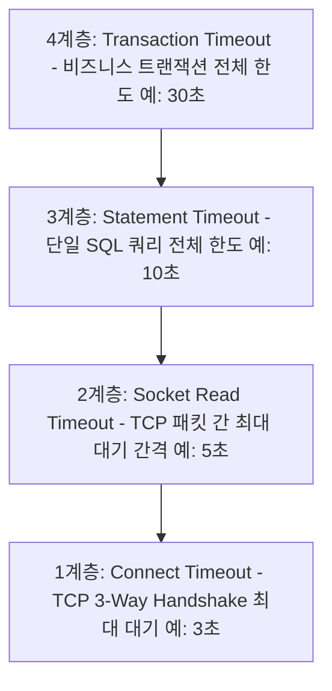

# 타임아웃의 3대 덫: Connect vs Socket Read vs Statement Timeout 완벽 해부

> "타임아웃을 3초로 걸었다고 해서, 장애 시 시스템이 3초 만에 회복될 거라 믿는 것은  
> 네트워크 엔지니어링에서 가장 위험하고 순진한 착각이다."

---

## 1. 현실 세계 비유: 음식점 배달 주문 3대 타임아웃

배고픈 저녁, 중화요리 집에 배달 주문을 시키는 상황을 떠올려 보세요.

```text
1. 전화 신호음 대기 시간 (Connection Timeout):
   가게 번호를 누르고 직원이 "네, 만리장성입니다!" 하고 수화기를 들 때까지 기다리는 시간.
   만약 가게가 정전이거나 전화선이 끊겼는데(방화벽 패킷 폐기 / Silent Drop),
   직원이 전화를 받을 때까지 뚜- 뚜- 소리만 들으며 2분 동안 수화기를 든 채 멍하니 서 있는 상황!

2. 접시 간 도착 대기 시간 (Socket Read Timeout, SO_TIMEOUT):
   주문이 들어가서 첫 번째 짬뽕이 나오고, 다음 탕수육 접시(TCP 패킷)가 나올 때까지 기다리는 최대 시간.
   주방장이 탕수육을 튀기다 말고 도망갔다면(DB 데드락/네트워크 마비),
   접시가 무한정 안 오므로 제때 숟가락을 내려놓고 일어나야 합니다.

3. 총 식사 완료 한도 시간 (Statement / Query Timeout):
   주문 접수부터 모든 코스 요리가 식탁에 차려질 때까지 허용되는 전체 식사 시간.
```

초보 개발자들은 스프링부트에 `query-timeout: 3000` (3초) 하나만 걸어두면 모든 장애가 3초 안에 끝날 거라 믿습니다.  
하지만 네트워크 계층의 타임아웃을 설정하지 않으면, 방화벽 문제 하나로 **스레드가 127초 동안 얼어붙어 전사 서버가 다운**됩니다.

---

## 2. DB 및 네트워크 클라이언트의 4대 타임아웃 위계질서

엔터프라이즈 시스템에서는 아래 4개의 타임아웃이 **피라미드 구조(위계질서)**를 이루어야 합니다.



### 황금 부등식
$$\text{Connect Timeout} \le \text{Socket Read Timeout} \le \text{Statement Timeout} \le \text{Transaction Timeout}$$

이 순서가 뒤집히거나 아래 계층(Connect, Socket)이 누락되면, 위쪽 계층의 타임아웃은 전혀 힘을 쓰지 못하고 껍데기만 남게 됩니다.

---

## 3. 침묵의 살인자: Silent Drop과 Linux 127초의 저주

실무에서 가장 무서운 네트워크 장애는 서버가 명시적으로 "나 죽었어"라고 거절(`TCP RST` 또는 `ICMP Port Unreachable`)하는 것이 아닙니다.  
클라우드 보안 그룹(Security Group) 오설정, 라우터 고장, 방화벽 정책 변경으로 인해 **패킷이 응답 없이 조용히 증발하는 "사일런트 드롭(Silent Drop)"**입니다.

### 리눅스 커널의 TCP SYN 지수 백오프
리눅스 OS는 상대방이 응답하지 않으면 "네트워크가 일시적으로 혼잡한가 보다"라고 판단하고 지수 백오프(Exponential Backoff)로 SYN 패킷을 재전송합니다 (`tcp_syn_retries=6` 기본값):

$$1\text{초} + 2\text{초} + 4\text{초} + 8\text{초} + 16\text{초} + 32\text{초} + 64\text{초} = 127\text{초}$$

- 애플리케이션 레벨에서 `Connect Timeout`을 지정하지 않으면, 톰캣 스레드는 **무려 2분 7초(127초) 동안 아무것도 하지 못하고 블로킹(대기)** 상태에 갇힙니다.
- 초당 10개의 요청만 유입되어도 20초 만에 톰캣의 200개 스레드 풀이 완전히 고갈되며, 전사 서비스가 마비되는 **스레드 기아(Thread Starvation)**가 발생합니다.

---

## 4. Statement Timeout의 한계와 Socket Read Timeout의 필요성

"쿼리 타임아웃(Statement Timeout)을 3초로 걸어뒀는데 왜 안 먹히나요?"

1. **Statement Timeout의 작동 원리**:
   - JDBC 드라이버 내부에서 별도의 타이머 스레드를 띄웁니다.
   - 3초가 지나면 타이머 스레드가 DB 서버로 `CANCEL QUERY` 패킷을 전송하여 쿼리 중단을 요청합니다.
2. **그러나 소켓 레벨이 멈춰 있다면?**:
   - 네트워크 케이블이 빠졌거나 스위치가 다운되어 소켓이 블로킹 I/O 대기 상태에 빠져 있으면, JDBC 드라이버 자체가 OS 시스템 콜(`recv()`)에서 빠져나오지 못합니다.
   - 취소 패킷을 보낼 네트워크 경로도 막혀 있고, 메인 스레드는 소켓 락에 걸려 타임아웃 인터럽트조차 수신하지 못합니다.
3. **구원투수: Socket Read Timeout (`SO_TIMEOUT`)**:
   - OS 커널 레벨에서 소켓에 타이머를 겁니다.
   - "상대방으로부터 다음 1바이트의 패킷이 $N$초 이내에 오지 않으면, OS가 즉시 소켓을 강제로 닫고 `SocketTimeoutException`을 던져라!"
   - 이 설정이 있어야만 패킷이 끊겼을 때 즉시 메인 스레드가 탈출할 수 있습니다.

---

## 5. 실무 모범 설정 가이드 (HikariCP & JDBC URL)

### Spring Boot `application.yml` 설정 템플릿
```yaml
spring:
  datasource:
    # 1. HikariCP 커넥션 풀 레벨 타임아웃
    hikari:
      connection-timeout: 3000      # 풀에서 유휴 커넥션을 빌려오는 최대 대기 시간 (3초)
      validation-timeout: 2000      # 커넥션 유효성 검사 핑 타임아웃 (2초)
      max-lifetime: 1800000         # 커넥션 최대 생존 시간 (30분)

    # 2. JDBC 드라이버 소켓 레벨 타임아웃 (MySQL / MariaDB 예시)
    url: jdbc:mysql://db.internal:3306/mydb?connectTimeout=3000&socketTimeout=5000

    # 3. PostgreSQL 예시
    # url: jdbc:postgresql://db.internal:5432/mydb?connectTimeout=3&socketTimeout=5
```

### 각 파라미터의 역할
- `connectTimeout=3000`: TCP 3-Way Handshake가 3초를 넘기면 즉시 연결 실패 처리.
- `socketTimeout=5000`: 쿼리 전송 후 다음 패킷 도착 간격이 5초를 넘기면 즉시 에러 발생.
- `hikari.connection-timeout=3000`: 200개 커넥션 풀이 꽉 찼을 때 새 스레드가 3초 이상 줄 서지 않고 빠른 실패(Fail-Fast).

---

## 6. 요약

> 1. `Statement Timeout`만 믿는 것은 안전벨트만 매고 에어백과 브레이크 없이 절벽을 달리는 것과 같다.
> 2. 방화벽 패킷 드롭(Silent Drop) 발생 시, `Connect Timeout`이 없으면 리눅스 커널은 **127초 동안 스레드를 잡고 놓아주지 않는다.**
> 3. 반드시 `Connect Timeout` $\le$ `Socket Read Timeout` $\le$ `Statement Timeout` $\le$ `Transaction Timeout`의 4계층 위계질서를 완성하라.
