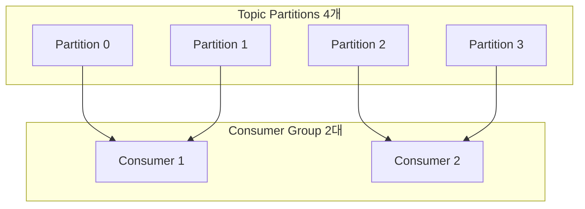

# 카프카의 우주 철칙: 파티션(Partition)과 컨슈머 그룹의 1:1 매핑 완전 정복

> "파티션이 3개인 토픽에 컨슈머 서버를 10대로 늘리는 것은,  
> 화구(가스레인지)가 3개뿐인 주방에 요리사 10명을 고용해 7명을 멀뚱멀뚱 세워두는 것과 같다."

---

## 1. 현실 세계 비유: 피자 3판과 10명의 식사 당번

회사 탕비실에 피자 3판(파티션 3개)이 배달되었고, 10명의 배고픈 직원들(컨슈머 인스턴스 10대)이 모여들었습니다.

```text
🍕 피자 0번 판, 🍕 피자 1번 판, 🍕 피자 2번 판

카프카(Kafka)의 우주 철칙:
"각 피자 조각의 먹는 순서(메시지 오프셋 순서)를 정확히 지키기 위해,
 한 판의 피자는 동일한 컨슈머 그룹 내에서 반드시 '단 1명의 전담자'만 먹어야 한다!"

결과:
- 직원 1: 피자 0번 전담
- 직원 2: 피자 1번 전담
- 직원 3: 피자 2번 전담
- 직원 4 ~ 10 (총 7명): 옆에서 손가락만 빨며 구경 (IDLE 상태)
```

이 규칙을 모르면 "메시지 처리가 밀린다"며 컨슈머 서버를 10대로 증설했다가,  
**서버 비용만 3배로 나가고 7대는 놀고 있으며 처리 속도는 1도 안 빨라지는 황당한 참사**를 겪게 됩니다.

---

## 2. 왜 1개 파티션을 2명 이상의 컨슈머가 동시에 읽으면 안 되는가?

일반적인 전통적 메시지 큐(RabbitMQ 등)는 1개의 큐에서 여러 컨슈머가 메시지를 경쟁적으로 꺼내갑니다(Competing Consumers).  
하지만 카프카는 왜 1개 파티션을 오직 1개의 컨슈머에게만 독점 배정할까요?

### 메시지 순서 보장(Ordering Guarantee)과 오프셋(Offset) 커밋
카프카의 핵심 가치는 **"파티션 단위의 엄격한 순서 보장"**입니다.
1. 파티션 0번에 `[주문 생성] -> [결제 완료] -> [배송 시작]` 순서로 메시지가 들어옵니다.
2. 만약 컨슈머 A와 컨슈머 B가 파티션 0번을 동시에 읽는다면:
   - 컨슈머 B가 `[배송 시작]`을 먼저 처리하고, 컨슈머 A가 나중에 `[결제 완료]`를 처리하는 **순서 역전 재앙**이 발생합니다.
   - 또한 현재 어디까지 읽었는지를 나타내는 `Offset`을 브로커에 커밋할 때 두 컨슈머 간에 심각한 레이스 컨디션(Race Condition)이 발생합니다.
3. 따라서 카프카는 설계상 **"하나의 파티션은 동일 컨슈머 그룹 내에서 반드시 단 1개의 컨슈머만 소유할 수 있다"**는 절대 불변의 제약을 둔 것입니다!

### 병렬 처리의 절대적 상한선
$$\text{실제 일하는 컨슈머 수 } C_{effective} = \min(P, C)$$
- 토픽 파티션 수 $P = 3$, 컨슈머 수 $C = 10 \implies C_{effective} = 3$ (7대 유휴 놀고 있음)
- 토픽 파티션 수 $P = 10$, 컨슈머 수 $C = 3 \implies C_{effective} = 3$ (각 컨슈머가 평균 3.3개 파티션 분담)

---

## 3. 파티션 할당 전략 (Partition Assignment Strategy)

컨슈머 그룹에 멤버가 추가되거나 빠질 때, 카프카 클러스터의 그룹 코디네이터(Group Coordinator)와 리더 컨슈머는 파티션을 재분배(Rebalance)합니다.



### 1. RangeAssignor (기본 전략 중 하나)
- 토픽별로 파티션을 정렬한 뒤, 컨슈머 수로 나눈 연속된 구간을 배정합니다.
- 장점: 로직이 단순하고 연속된 파티션 번호를 관리하기 쉽습니다.
- 단점: 여러 토픽을 구독할 때 특정 앞쪽 컨슈머(예: `c-01`)에게 파티션이 과도하게 몰리는 불균형(Skew)이 발생할 수 있습니다.

### 2. RoundRobinAssignor
- 모든 파티션을 $0$번부터 $P-1$번까지 순환하며 컨슈머들에게 공평하게 1개씩 라운드로빈으로 돌려 배정합니다.
- 장점: 파티션 수가 컨슈머 수로 나누어떨어지지 않을 때도 최대 1개 차이로 가장 균등하게 분배됩니다.

### 3. CooperativeStickyAssignor (최신 카프카 권장)
- 과거의 할당 방식(Eager)은 리밸런싱이 일어날 때 모든 컨슈머가 작업을 멈추는 **STW(Stop-The-World)**가 발생했습니다.
- 스티키(Sticky) 방식은 기존 할당 상태를 최대한 유지하면서, 변경이 필요한 파티션만 점진적으로 넘겨주어 서비스 중단을 최소화합니다.

---

## 4. 실무 카프카 스케일아웃 3대 황금률

### 황금률 1: 컨슈머를 늘리기 전에 토픽의 파티션 수를 확인하라!
- 처리 속도를 2배로 올리고 싶다면, **먼저 파티션 수를 2배로 늘리고, 그다음에 컨슈머 인스턴스를 늘려야 합니다.**
- 파티션이 3개인데 서버를 10대로 늘리는 것은 돈을 하수구에 버리는 짓입니다.

### 황금률 2: 파티션은 늘릴 수는 있지만, 절대 줄일 수는 없다!
- 카프카의 파티션은 **불가역적(Irreversible)**입니다. (한 번 10개로 늘리면 3개로 되돌릴 수 없음)
- 파티션을 무작정 100개, 1,000개로 늘리면 브로커 파일 핸들러와 리밸런싱 비용이 급증하므로, 예상 최대 트래픽을 고려하여 신중하게 결정해야 합니다.

### 황금률 3: 파티션 증설 시 메시지 키(Key) 해싱 주의!
- 카프카 프로듀서는 키가 있는 메시지를 보낼 때 기본적으로 `hash(key) % P`로 파티션을 결정합니다.
- 파티션 수 $P$가 변경되는 순간, 동일한 사용자의 주문 메시지가 과거에는 파티션 1번으로 가다가 파티션 5번으로 튀어버려 **메시지 순서가 뒤섞일 수 있습니다!**

---

## 5. 요약

> 1. 하나의 파티션은 컨슈머 그룹 내에서 **오직 단 1개의 컨슈머만 전담**할 수 있다. (순서 보장의 철칙)
> 2. 컨슈머 수가 파티션 수보다 많으면, 초과된 컨슈머들은 **아무 일도 하지 못하는 잉여 유휴 자원(IDLE)**이 된다.
> 3. 처리량을 스케일아웃하려면 반드시 **파티션 증설과 컨슈머 증설이 1:1로 발맞추어 진행**되어야 한다.
