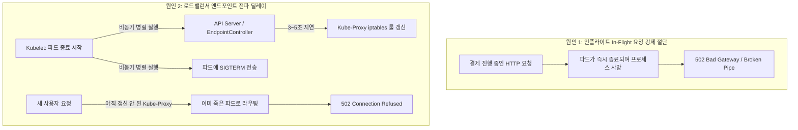

# 배포 버튼이 부른 502 악몽: 쿠버네티스 무중단 배포와 그레이스풀 셧다운(Graceful Shutdown)

> "롤링 업데이트(RollingUpdate)를 걸었다고 해서 저절로 무중단 배포가 되는 것은 아니다.  
> `preStop` 훅 없는 롤링 배포는 손님이 탄 엘리베이터의 와이어를 끊고 새 엘리베이터를 거는 것과 같다."

---

## 1. 현실 세계 비유: 영업 중인 레스토랑의 주방장 교대식

저녁 피크 시간, 레스토랑에서 주방장을 교대(새 버전 릴리즈)하는 상황을 상상해 보세요.

```text
❌ 초보자의 무식한 교대식 (Naive Immediate Shutdown):
   지배인이 주방으로 뛰어 들어가 구 주방장 멱살을 잡고 문밖으로 내쫓습니다(SIGKILL 강제 사살).
   1. 구 주방장이 굽고 있던 한우 스테이크(진행 중인 결제 요청)는 바닥에 패대기쳐집니다.
      -> 손님들은 [502 Bad Gateway / Connection Reset by Peer] 폭탄을 맞고 분통을 터뜨립니다.
   2. 홀 서빙 매니저(Kube-Proxy 로드밸런서)에게 "구 주방장 퇴근했다"는 무전이 닿는 데 3초가 걸립니다.
      매니저는 쫓겨난 주방장의 빈 화구로 계속 주문서를 던져 수십 장의 주문서가 허공으로 날아갑니다!

✅ 올바른 그레이스풀 셧다운 (Graceful Shutdown with PreStop Hook):
   1단계: 신임 주방장이 출근해 조리도구를 완벽히 세팅합니다 (Readiness Probe 200 OK).
   2단계: 홀 서빙 매니저에게 "구 주방장 퇴근 예정" 무전을 칩니다 (Service Endpoint 제거 시작).
   3단계 [PreStop sleep 5초]: 무전이 홀 전체에 전파되는 5초 동안 구 주방장은 화구 앞을 지키며,
          이미 날아오고 있던 마지막 주문서들까지 전부 두 손으로 받습니다.
   4단계 [SIGTERM & Grace Period]: 새 주문 접수창구를 닫고, 이미 굽기 시작한 스테이크를
          30초 동안 끝까지 정성스럽게 구워 손님에게 서빙한 뒤 깔끔하게 퇴근합니다!
   결과 -> 손님은 주방장이 바뀐 줄도 모른 채 502 에러 0건의 완벽한 무중단 서빙(Zero Downtime) 달성!
```

---

## 2. 배포 시 502 Bad Gateway가 터지는 2대 근본 원인

쿠버네티스에서 `kubectl apply`로 새 버전을 배포할 때 502 에러가 발생하는 원인은 정확히 2가지입니다.



### 충격적인 진실: 엔드포인트 제거와 SIGTERM은 "동시에(비동기)" 발생한다!
많은 개발자들이 "쿠버네티스가 로드밸런서에서 파드를 먼저 빼고 난 다음에 파드를 죽이겠지?"라고 착각합니다.  
**절대 아닙니다!** 쿠버네티스 아키텍처에서 두 작업은 서로 다른 컴포넌트가 **완전히 비동기적으로 동시에** 수행합니다.
- `EndpointController` $\to$ `kube-proxy` $\to$ 노드 `iptables` 규칙 갱신: **수 초(1~5초) 소요**.
- `Kubelet` $\to$ 컨테이너 런타임 $\to$ `SIGTERM` 신호 전송: **0.01초 만에 즉시 실행**.
- 즉, **파드는 이미 죽어버렸는데 로드밸런서는 3초 동안 죽은 파드로 트래픽을 계속 쏘아대는 비극**이 필연적으로 발생합니다!

---

## 3. 구원투수: PreStop Hook (`sleep 5`)의 마법

이 전파 지연 문제를 해결하는 전 세계 SRE들의 유일무이한 표준 공식이 바로 **`preStop` 훅의 `sleep`**입니다.

```yaml
lifecycle:
  preStop:
    exec:
      command: ["/bin/sh", "-c", "sleep 5"]
```

```text
[파드 종료 라이프사이클 타임라인]

t=0s: 파드 삭제 명령 수신 (Terminating 상태로 변경)
      ├── (트랙 A) EndpointController가 Service Endpoints에서 파드 IP 제거 시작
      └── (트랙 B) 파드 컨테이너 내부에서 [preStop: sleep 5] 실행!

t=0~3s: Kube-Proxy와 Ingress가 iptables 룰을 갱신하며 트래픽 유입 중단
        파드는 sleep 5초 동안 살아서 날아오는 잔여 트래픽을 정상 수신함!

t=5s: sleep 5초 종료 -> 컨테이너 프로세스에 [SIGTERM] 신호 드디어 발송!
      Spring Boot: "더 이상 새 HTTP 요청은 받지 않고 커넥터를 닫는다."

t=5~15s: [Grace Period] 이미 접수된 인플라이트 요청들을 끝까지 처리하고 200 OK 응답.

t=15s: 모든 요청 완료 후 프로세스 자진 정상 종료 (0 에러!).
```

---

## 4. 실무 모범 무중단 배포 설정 템플릿

### 1. Kubernetes Deployment 매니페스트 (`deployment.yaml`)
```yaml
apiVersion: apps/v1
kind: Deployment
metadata:
  name: my-api-service
spec:
  replicas: 4
  strategy:
    type: RollingUpdate
    rollingUpdate:
      maxSurge: 25%         # 배포 시 새 파드를 먼저 25% 띄움
      maxUnavailable: 0     # 구 파드는 하나도 죽이지 않고 무중단 유지
  template:
    spec:
      terminationGracePeriodSeconds: 30 # preStop(5초) + 스프링 그레이스풀(20초) 고려 30초 설정
      containers:
      - name: app
        image: my-app:v1.2.0
        lifecycle:
          preStop:
            exec:
              command: ["/bin/sh", "-c", "sleep 5"] # 엔드포인트 전파 지연 완충 골든타임
```

### 2. Spring Boot 2.3+ 무중단 셧다운 (`application.yml`)
```yaml
server:
  shutdown: graceful # 기본값(immediate) 대신 graceful 활성화!

spring:
  lifecycle:
    timeout-per-shutdown-phase: 20s # 진행 중인 요청 처리 최대 대기 시간 (20초)
```

---

## 5. 요약

> 1. 배포 시 발생하는 502 에러는 **인플라이트 요청 강제 절단**과 **엔드포인트 라우팅 전파 딜레이(1~5초)** 때문이다.
> 2. 엔드포인트 제거와 파드 종료 시그널은 비동기로 동시 실행되므로, **`preStop: sleep 5`로 파드의 사형 집행을 5초간 유예**해야 한다.
> 3. `preStop sleep (5초)` + `Spring Boot server.shutdown=graceful (20초)` + `terminationGracePeriodSeconds (30초)` 삼위일체가 갖춰져야 진정한 **Zero-Downtime 무중단 배포**가 완성된다.
