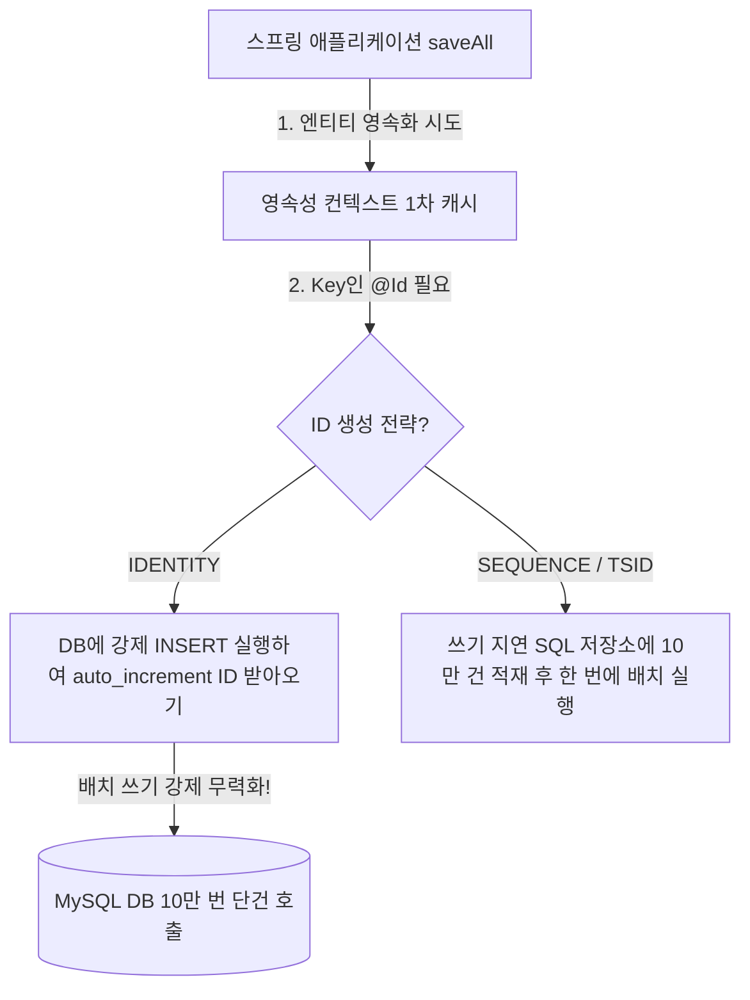

# 밤샘 배치의 주범: 단건 쿼리 RTT 지옥 vs rewriteBatchedStatements의 마법

> "JPA `repository.saveAll()`을 호출했다고 안심하지 마라.  
> `GenerationType.IDENTITY`를 쓴 순간, 당신의 코드는 10만 번 왕복 달리기를 시작한다."

---

## 1. 현실 세계 비유: 벽돌 10만 장과 지게차

공사장에 벽돌 10만 장을 날라야 합니다.

```text
❌ 초보자의 단건 순차 INSERT (손으로 1장씩 10만 번 왕복):
   인부가 벽돌 1장을 양손에 쥐고 공사장까지 걸어갔다 돌아옵니다.
   벽돌 1장당 100미터(네트워크 RTT)를 걸어야 하므로,
   10만 장을 나르면 10,000,000미터(지구 둘레 1/4!)를 걸어야 합니다.
   인부는 새벽 내내 걷다가 탈진해서 쓰러집니다.

✅ JDBC 배치 인서트 (지게차가 파레트에 1,000장씩 묶어 나르기):
   지게차가 벽돌 1,000장을 파레트에 차곡차곡 쌓은 뒤, 단 1번의 왕복으로 공사장에 싣고 갑니다.
   10만 장을 나르는 데 단 100번의 왕복이면 충분합니다!
   왕복 횟수가 1,000분의 1로 줄어들어 몇 시간 걸리던 작업이 수 초 만에 끝납니다.
```

---

## 2. 네트워크 RTT(Round-Trip Time)의 수학적 공포

아무리 최신 NVMe SSD와 수십 코어 CPU를 갖춘 최고급 DB 서버라도, **네트워크 물리 법칙(빛의 속도와 패킷 왕복 지연)**을 거스를 수는 없습니다.

클라우드 VPC 내부에서 앱 서버와 DB 간의 네트워크 왕복 시간(RTT)은 보통 **`1ms ~ 2ms`** 수준입니다. 평소에는 눈 깜짝할 새도 안 되는 짧은 시간입니다.

### 10만 건 단건 INSERT 시 소요 시간 계산
- 순수 네트워크 RTT: $100,000 \times 2\text{ms} = 200,000\text{ms} \approx \mathbf{3.3분}$
- 만약 트랜잭션을 걸지 않아 **`Auto-Commit` (건당 fsync 5ms)**이 발생한다면?
  $$100,000 \times (2\text{ms} + 5\text{ms}) = 700,000\text{ms} \approx \mathbf{11.6분}$$
- 만약 데이터가 100만 건이라면?
  $$1,000,000 \times 7\text{ms} = 7,000,000\text{ms} \approx \mathbf{116분 (약 2시간!)}$$

DB CPU 사용률은 5%도 안 되는데, 앱 서버는 네트워크 패킷이 돌아오기만을 기다리며 몇 시간 동안 멍하니 굳어있는 것입니다!

---

## 3. JPA 개발자의 가장 흔한 함정: `GenerationType.IDENTITY`

"저는 `saveAll(list)`를 썼는데 왜 배치로 안 들어가고 1건씩 10만 번 나갈까요?"



### 왜 IDENTITY는 배치를 끌 수밖에 없는가?
- JPA의 영속성 컨텍스트(1차 캐시)는 엔티티를 관리할 때 **`@Id` 값을 Key로 사용**합니다.
- `GenerationType.IDENTITY`는 ID 생성을 전적으로 MySQL의 `AUTO_INCREMENT`에 위임합니다.
- 즉, **DB에 실제로 INSERT 쿼리를 날려서 실행해 보기 전까지는 엔티티의 ID 값을 알 수 없습니다!**
- 따라서 Hibernate는 쓰기 지연(Transactional Write-Behind) 배치를 포기하고, **`save()`를 부를 때마다 즉시 DB로 단건 INSERT를 날릴 수밖에 없습니다.**

---

## 4. MySQL JDBC의 비밀 무기: `rewriteBatchedStatements=true`

설령 순수 JDBC나 `JdbcTemplate`으로 `executeBatch()`를 쓰더라도, MySQL JDBC 드라이버의 기본 설정으로는 충분하지 않습니다.

### 기본 동작:
JDBC 드라이버는 쿼리들을 모아서 한 번에 보내긴 하지만, 브로커 내부에서는:
```sql
INSERT INTO users (name) VALUES ('Alice');
INSERT INTO users (name) VALUES ('Bob');
INSERT INTO users (name) VALUES ('Charlie');
```
세미콜론으로 구분된 수천 개의 개별 SQL을 파싱하느라 여전히 DB에 큰 오버헤드를 줍니다.

### `rewriteBatchedStatements=true` 활성화 시:
드라이버가 클라이언트 메모리에서 SQL을 마법처럼 하나의 **다중 행(Multi-row) INSERT**로 재작성합니다:
```sql
INSERT INTO users (name) VALUES ('Alice'), ('Bob'), ('Charlie');
```
- DB 파서(Parser)가 쿼리를 단 1번만 파싱하고 실행 계획을 세웁니다.
- 디스크 트랜잭션 로그(WAL/Redo Log) 기록 횟수가 수천 분의 1로 격감합니다.
- 네트워크 TCP 패킷 수가 극적으로 줄어들어 처리 속도가 **수십 배에서 수백 배까지 가속**됩니다!

---

## 5. 실무 모범 대용량 배치 INSERT 구현 가이드

### 1. HikariCP JDBC URL 설정 (`application.yml`)
```yaml
spring:
  datasource:
    url: jdbc:mysql://db.internal:3306/mydb?rewriteBatchedStatements=true&profileSQL=false
```

### 2. Spring `JdbcTemplate.batchUpdate()` 템플릿
```java
@Repository
@RequiredArgsConstructor
public class BulkInsertRepository {
    private final JdbcTemplate jdbcTemplate;

    public void bulkInsert(List<PaymentRecord> records, int batchSize) {
        String sql = "INSERT INTO payments (order_id, amount, status) VALUES (?, ?, ?)";
        
        jdbcTemplate.batchUpdate(sql, records, batchSize, (ps, record) -> {
            ps.setString(1, record.getOrderId());
            ps.setBigDecimal(2, record.getAmount());
            ps.setString(3, record.getStatus());
        });
    }
}
```

---

## 6. 요약

> 1. 대량 데이터 삽입 시 성능을 갉아먹는 진짜 주범은 디스크가 아니라 **네트워크 패킷 왕복 시간(RTT)**이다.
> 2. `GenerationType.IDENTITY`는 JPA의 쓰기 지연 배치를 무력화하므로, 대용량 작업 시 **`JdbcTemplate.batchUpdate()`나 TSID/UUID**를 사용해야 한다.
> 3. MySQL JDBC URL에 **`rewriteBatchedStatements=true`**를 추가하는 것만으로도 작업 속도가 **100배~500배 이상 폭발적으로 빨라진다.**
