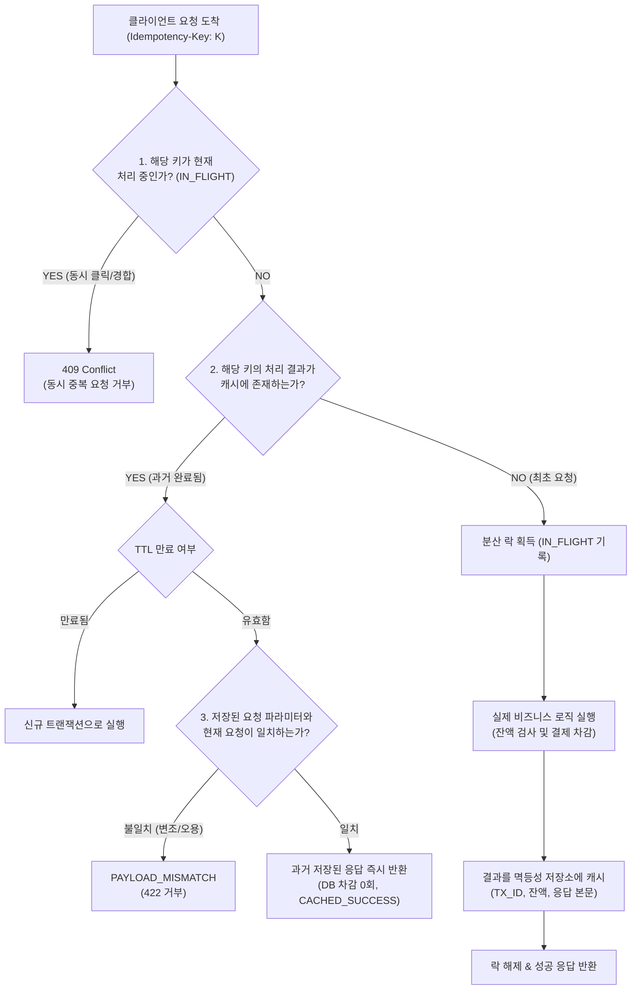

# 📚 Problem #057 이론 백서: 한 번만 결제했는데 왜 통장에서 돈이 두 번 빠져나가요?!: 네트워크 타임아웃과 API 멱등성 (Idempotency Key & Deduplication)

> **"네트워크 세계에서 타임아웃(Timeout)은 '실패'를 뜻하지 않는다. 서버는 일을 다 끝냈는데 당신만 응답을 못 받은 것일 수 있다!"**

---

### 1. 현실 세계 비유: 영수증 종이가 떨어진 햄버거집 카운터

길거리 햄버거 가게에 손님 앨리스가 들어왔습니다.

```
[비극의 시나리오: 멱등성 없는 카운터 (NAIVE)]
1. 앨리스: "치즈버거 세트 1개(7,000원) 주세요!" (1만 원 지폐 전달)
2. 점원: 돈을 금고에 넣고 포스기에 주문 입력 완료!
3. 점원: 영수증을 출력하려는데... 앗! 영수증 프린터 종이가 똑 떨어졌습니다!
4. 앨리스: (5분 동안 멍하니 서 있다가) "어? 돈이 안 들어갔나? 결제 실패인가 보네..."
5. 앨리스: "치즈버거 세트 1개(7,000원) 주세요!" (또 1만 원 지폐 전달)
6. 점원: (아까 손님인지 모르고) "네 감사합니다!" 하고 또 금고에 넣고 치즈버거 2세트를 주방에 주문!
7. 결과: 앨리스는 버거 1개 먹으려다 14,000원이 뜯겼고, 통장에선 돈이 두 번 빠져나갔습니다!

[구원의 시나리오: 주문 번호표가 찍힌 스마트 키오스크 (IDEMPOTENT)]
1. 앨리스: 스마트폰 앱으로 주문 번호 [ORD-9821]이 박힌 주문서를 전송합니다.
2. 키오스크: [ORD-9821]을 금고에 기록하고 7,000원 결제 완료!
3. 키오스크: 통신망 일시 장애로 앨리스 폰에 "응답 전송 실패(Timeout)" 발생.
4. 앨리스: 불안해서 앱의 [재시도] 버튼을 누릅니다. (주문 번호는 여전히 [ORD-9821])
5. 키오스크: "잠깐! [ORD-9821]은 10초 전에 이미 정상 결제(TX_000001)됐잖아?"
6. 키오스크: 돈을 또 빼지 않고, 방금 전 성공했던 영수증(TX_000001)을 그대로 앨리스 화면에 다시 띄워줍니다!
7. 결과: 앨리스가 재시도 버튼을 100번 연타해도 결제는 정확히 단 1번만 일어납니다!
```

이것이 바로 전 세계 금융, 이커머스, 클라우드 인프라의 절대 원칙인 **멱등성(Idempotency)**의 핵심입니다.

---

### 2. 분산 시스템의 제1 함정: "네트워크는 신뢰할 수 없다"

초보 개발자나 AI 바이브 코더는 코드를 짤 때 언제나 **"요청을 보내면 서버가 실행하고 응답을 준다"**는 장밋빛 성공 경로(Happy Path)만 생각합니다.

```
[클라이언트] -------- POST /api/pay (10,000원) --------> [서버]
[클라이언트] <------- 200 OK (결제 성공) -------------- [서버]
```

하지만 현실의 모바일 LTE/5G, Wi-Fi, 해저 광케이블은 언제든지 패킷이 끊어집니다.
클라이언트에서 `SocketTimeoutException (5000ms)`이 발생했을 때, 실제로 벌어진 일은 다음 3가지 중 하나입니다.

```
시나리오 A: 요청이 서버에 도달도 못 하고 가다가 유실됨 (서버 결제 안 됨)
시나리오 B: 요청이 서버에 도달해서 처리 도중 서버가 다운됨 (반쯤 처리되거나 롤백됨)
시나리오 C: 서버에서 완벽히 결제하고 DB 잔액 차감했는데, 성공 응답(200 OK) 패킷만 길에서 유실됨!
```

**문제는 클라이언트 입장에서 시나리오 A, B, C가 100% 똑같은 "네트워크 타임아웃 에러"로 보인다는 점입니다!**

만약 시나리오 C 상황에서 클라이언트 앱이 단순 재시도(Retry)를 날리면 어떻게 될까요?
서버가 멱등성을 갖추지 않았다면, 서버는 이를 **완전히 새로운 결제 요청**으로 인식하여 고객의 통장에서 돈을 두 번, 세 번 차감해 버립니다.

---

### 3. 멱등성(Idempotence)이란 무엇인가?

수학에서 연산자 $f$가 멱등성을 가진다는 것은 다음을 의미합니다.

$$f(f(x)) = f(x)$$

즉, **"같은 연산을 1번 수행하든, 100번 수행하든 시스템의 최종 결과 상태가 항상 동일한 성질"**입니다.

#### HTTP 메서드와 멱등성
| HTTP 메서드 | 멱등성 여부 | 설명 |
| :--- | :---: | :--- |
| `GET` | **O (멱등)** | 같은 URL을 100번 조회해도 서버 데이터는 변하지 않음 |
| `PUT` | **O (멱등)** | `age = 25`로 100번 덮어써도 최종 나이는 25세로 동일 |
| `DELETE` | **O (멱등)** | `id = 7`을 삭제하면 처음엔 삭제되고, 이후엔 이미 없으므로 최종 상태는 동일 |
| `POST` | **X (비멱등)** | `POST /orders`를 3번 날리면 주문서가 3장 발행되고 결제가 3번 됨! |

결제나 송금 같은 핵심 비즈니스 로직은 리소스를 새로 생성하므로 대부분 `POST` 메서드를 사용합니다.
따라서 본질적으로 비멱등적인 `POST` 요청에 멱등성을 부여하기 위해 발명된 장치가 바로 **`Idempotency-Key (멱등성 키)`**입니다.

---

### 4. 멱등성 키(Idempotency Key) 아키텍처와 3대 방어선

현대 핀테크(Stripe, 토스페이먼츠, 카카오페이)와 빅테크(AWS, Google Cloud)는 HTTP 요청 헤더에 고유한 멱등성 키를 실어 보냅니다.

```http
POST /v1/charges HTTP/1.1
Host: api.stripe.com
Authorization: Bearer sk_live_...
Idempotency-Key: 9b1deb4d-3b7d-4bad-9bdd-2b0d7b3dcb6d
Content-Type: application/json

{
  "amount": 10000,
  "currency": "krw"
}
```

서버는 이 멱등성 키를 가지고 **3대 방어선**을 펼칩니다.



#### 제1 방어선: 분산 락과 `IN_FLIGHT` (동시 더블 클릭 방지)
- 성급한 유저가 결제 버튼을 0.05초 만에 따닥!(더블 클릭) 연타하는 경우입니다.
- 첫 번째 요청이 DB에서 잔액을 확인하고 차감 쿼리를 날리는 도중에 두 번째 요청이 서버에 들어옵니다.
- 서버는 Redis의 `SET key "IN_FLIGHT" NX PX 30000`을 통해 원자적 락을 겁니다.
- 뒤따라온 요청은 락 획득에 실패하므로 즉시 `409 Conflict`를 반환하여 동시 이중 차감을 원천 차단합니다.

#### 제2 방어선: 처리 완료 결과 캐싱 (타임아웃 재시도 방어)
- 첫 번째 요청이 정상 완료되면, 결과(`status: SUCCESS`, `tx_id: TX_000001`, `timestamp`)를 Redis나 DB의 멱등성 테이블에 저장합니다.
- 네트워크 순단으로 응답을 못 받은 클라이언트가 2초 뒤 동일한 `Idempotency-Key`로 재시도 요청을 보냅니다.
- 서버는 캐시를 확인하고 **"이미 성공한 요청"**임을 파악하여, DB 결제 로직을 단 1줄도 실행하지 않고 **기존 성공 응답(`TX_000001`)을 그대로 돌려줍니다 (`CACHED_SUCCESS`)**.

#### 제3 방어선: 파라미터 지문(Fingerprint) 검증 (키 재사용 및 변조 방어)
- 만약 해커나 버그가 있는 클라이언트가 같은 `Idempotency-Key`를 쓰면서 결제 금액을 3,000원에서 50,000원으로 바꾸거나, 유저 ID를 바꿔서 보낸다면 어떻게 해야 할까요?
- 이전 3,000원 결제 영수증을 그냥 주면 대형 보안 사고가 터집니다.
- 따라서 서버는 멱등성 키와 함께 **최초 요청의 파라미터(페이로드)**를 함께 해시하여 저장합니다.
- 파라미터가 1글자라도 다르면 `PAYLOAD_MISMATCH (422 Unprocessable Entity)` 에러로 요청을 즉각 기각합니다.

---

### 5. 실패한 요청(잔액 부족 등)도 멱등키로 캐시해야 할까?

**네, 반드시 캐시해야 합니다!**

만약 잔액 2,000원을 가진 유저가 5,000원 결제를 시도했다가 `INSUFFICIENT_FUNDS` 에러를 받았습니다.
그 직후 다른 곳에서 10,000원이 입금되었습니다.
유저의 폰이 아까 실패했던 요청을 똑같은 `Idempotency-Key`로 재시도한다면 어떻게 해야 할까요?

멱등성의 정의는 **"동일한 요청은 동일한 결과를 보장한다"**입니다.
따라서 최초 요청이 실패했다면 동일한 멱등성 키의 재시도는 여전히 `CACHED_INSUFFICIENT_FUNDS`로 응답해야 합니다.
새로운 잔액으로 다시 결제하고 싶다면, 클라이언트는 **새로운 의도(Intent)**를 나타내는 **새로운 멱등성 키**를 발급해서 요청해야 합니다.

---

### 6. 비전공자/AI 바이브 코더를 위한 실무 핵심 요약

1. **클라이언트는 항상 결제/주문 버튼마다 고유 UUIDv4를 생성하라**:
   - 화면이 열리거나 폼이 렌더링될 때 `idempotencyKey = uuidv4()`를 만듭니다.
   - 네트워크 에러로 재시도할 때는 **절대로 새 UUID를 만들지 말고, 같은 UUID를 재전송**해야 합니다!
2. **서버는 DB 트랜잭션 전후로 멱등성을 방어하라**:
   - 요청 시작: Redis `SET key in_flight NX` (없으면 생성, 있으면 409 반환)
   - 요청 완료: Redis `SET key completed_result EX 86400` (24시간 보관)
3. **타임아웃 에러를 만났을 때 절대 당황하지 마라**:
   - 멱등성 키가 구현되어 있다면, 백오프(Backoff) 알고리즘과 함께 안심하고 재시도(Retry)하면 됩니다!
