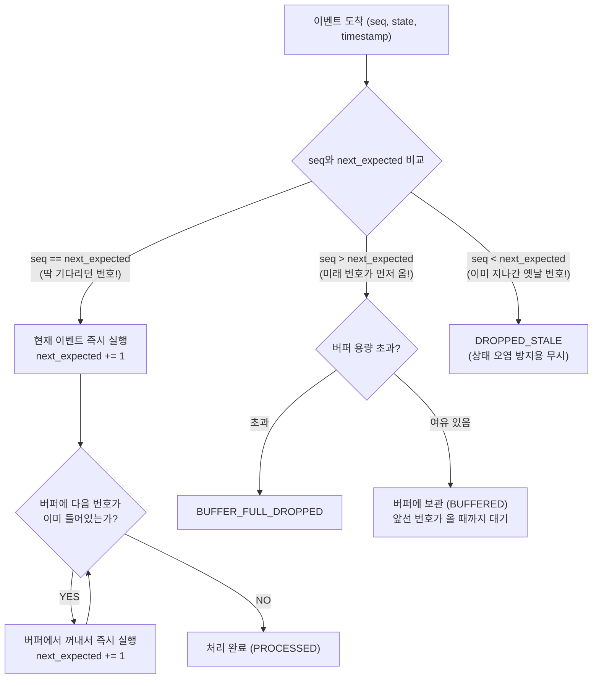

# 📚 Problem #058 이론 백서: 배송 완료된 상품이 왜 '결제 대기'로 되돌아가요?!: 네트워크 패킷 지연과 시퀀스 번호 재정렬 버퍼 (Out-of-Order Delivery & Reordering Buffer)

> **"네트워크에 던져진 메시지들은 절대로 보낸 순서대로 도착하지 않는다. 순서가 중요한 비즈니스 로직에 재정렬 버퍼가 없다면, 미래의 이벤트가 과거의 상태를 덮어쓰는 시간 역전 참사가 터진다!"**

---

### 1. 현실 세계 비유: 수제버거 공정의 번호표 거치대

수제버거 전문점에서 햄버거 1개를 완성하는 5단계 공정을 상상해 보세요.

```
[정상적인 햄버거 제조 순서]
1번 상자: 빵(번) 굽기
2번 상자: 쇠고기 패티 굽고 올리기
3번 상자: 치즈와 양상추 얹기
4번 상자: 특제 소스 뿌리고 뚜껑 덮기
5번 상자: 예쁜 종이에 포장해서 손님에게 출하
```

식재료 배달 기사 5명이 각각 오토바이를 타고 출발했는데, 도로 교통 상황 때문에 가게에 **1번 $\to$ 4번 $\to$ 5번 $\to$ 2번 $\to$ 3번** 순서로 도착했습니다!

```
❌ 멍청한 알바생 (NAIVE):
1. 1번 상자(빵)가 오자 빵을 굽습니다. (상태: 빵 완성)
2. 4번 상자(소스)가 오자 구운 빵 위에 소스를 들이붓습니다! (상태: 소스 투하)
3. 5번 상자(포장지)가 오자 소스 묻은 빵을 포장지에 싸서 '배달 완료' 도장을 쾅 찍어버립니다! (상태: 출하 완료)
4. 10분 뒤, 뒤늦게 2번(패티)과 3번(치즈) 상자가 도착했습니다.
5. 알바생은 이미 포장된 햄버거를 다시 뜯어 패티를 쑤셔 넣으며, 주문 전광판을 "출하 완료"에서 다시 "패티 굽는 중"으로 되돌려버립니다!
6. 결과: 햄버거는 곤죽이 되었고, 주방 주문 시스템은 시간 역전으로 완전히 망가졌습니다!

✅ 베테랑 주방장 (BUFFERED - 재정렬 버퍼):
1. 주방장은 번호표 거치대(Reordering Buffer)를 만들어 둡니다.
2. 1번 상자(빵)가 오자 빵을 굽습니다. "다음은 2번 차례다!" (next_expected = 2)
3. 4번 상자(소스)와 5번 상자(포장지)가 먼저 오자, "어? 2번 패티가 아직 안 왔네!" 하고 4번과 5번을 거치대 선반에 잠시 킵(BUFFERED)해 둡니다.
4. 드디어 2번(패티) 상자가 도착합니다!
5. 2번 패티를 얹고(next_expected = 3), 거치대를 보니 이미 3번(치즈), 4번(소스), 5번(포장지)이 차례대로 기다리고 있습니다!
6. 거치대에서 3번, 4번, 5번을 연속으로 꺼내(DRAIN) 0.1초 만에 완벽한 수제버거를 완성합니다!
```

이것이 바로 컴퓨터 네트워크(TCP/QUIC)와 실시간 분산 시스템(Kafka, WebRTC, 게임 엔진)이 순서를 보장하는 핵심 원리, **시퀀스 번호(Sequence Number)와 재정렬 버퍼(Reordering Buffer)**입니다.

---

### 2. 왜 네트워크와 분산 시스템에서 순서가 뒤바뀔까?

많은 초보 개발자와 AI 바이브 코더는 "내가 1번, 2번, 3번 순서로 `send()`를 불렀으니 받는 쪽도 당연히 1, 2, 3 순서로 받겠지?"라고 순진하게 믿습니다.

하지만 현실의 분산 환경에서는 순서가 무조건 뒤바뀝니다:

1. **다중 경로 패킷 라우팅 (Multipath Routing)**:
   - 인터넷 라우터들은 패킷마다 다른 해저 광케이블이나 통신사 회선으로 우회시킵니다. 1번 패킷은 부산을 거쳐 늦게 오고, 2번 패킷은 대전을 거쳐 먼저 도착할 수 있습니다.
2. **비동기 멀티스레드 워커 (Worker Pool)**:
   - 서버에서 스레드 10개가 메시지를 동시에 가져가 처리하면, 1번 메시지를 잡은 스레드가 DB 락 때문에 0.1초 지연되는 사이 2번, 3번 스레드가 먼저 작업을 끝내고 웹소켓으로 이벤트를 쏴버립니다.
3. **네트워크 재전송 (TCP/UDP/MQ Retries)**:
   - 1번 패킷이 잠깐 손실되어 재전송(Retransmission)되는 동안, 뒤따라오던 2번, 3번 패킷이 이미 목적지에 도착해 버립니다.
4. **카프카(Kafka) 파티션 키 미지정**:
   - 동일 주문에 대한 이벤트를 보낼 때 `order_id`를 파티션 키로 지정하지 않으면, 1번은 0번 파티션, 2번은 1번 파티션으로 분산되어 순서 보장이 완전히 파괴됩니다.

---

### 3. 상태 머신(FSM)의 파멸: 상태 역전(State Regression) 버그

이커머스 주문이나 물류 시스템은 엄격한 상태 전이(State Transition)를 따릅니다.

$$\text{CREATED} (1) \longrightarrow \text{PAID} (2) \longrightarrow \text{PREPARING} (3) \longrightarrow \text{SHIPPED} (4) \longrightarrow \text{DELIVERED} (5)$$

만약 네트워크 지연으로 인해 이벤트가 `1 → 3 → 4 → 5 → 2` 순서로 들어왔을 때, 도착하는 족족 DB를 업데이트하면 어떤 비극이 벌어질까요?

```
t=100ms: Event 1 (CREATED) 도착    → order.status = "CREATED"
t=120ms: Event 3 (PREPARING) 도착  → order.status = "PREPARING" (PAID 건너뜀 / JUMPED)
t=130ms: Event 4 (SHIPPED) 도착    → order.status = "SHIPPED"
t=140ms: Event 5 (DELIVERED) 도착  → order.status = "DELIVERED" (고객 배송 완료!)
t=200ms: Event 2 (PAID) 뒤늦게 도착 → order.status = "PAID" (상태 역전 참사! REGRESSION)
```

**고객은 이미 물건을 받아서 쓰고 있는데, 쇼핑몰 어드민 전광판에는 해당 주문이 "결제 대기"로 되돌아갑니다!**  
물류 창고 자동화 로봇은 "어? 결제 완료됐네? 상품 또 보내야지!" 하고 **고객에게 똑같은 고가 전자기기를 2번 배송**하는 천문학적 금융 사고가 터집니다.

---

### 4. 시퀀스 번호와 재정렬 버퍼의 4대 작동 원리

이 문제를 해결하기 위해 이벤트 발행자(Producer)는 각 채널(주문 ID, 소켓 ID)마다 $1, 2, 3, \dots$로 단조 증가하는 **시퀀스 번호(Sequence Number)**를 부여합니다.

수신자(Consumer)는 `next_expected_seq = 1` 포인터와 **재정렬 버퍼(Reordering Buffer)**를 들고 4가지 규칙을 수행합니다.



#### 1. 정규 도착 (`seq == next_expected`): 즉각 실행 & 연쇄 드레인(Drain)
- 기다리던 번호가 오면 즉시 상태를 반영하고 `next_expected`를 1 올립니다.
- 그 직후 버퍼를 검사하여, 방금 도착한 패킷 덕분에 퍼즐이 맞춰진 다음 번호들(`next_expected, next_expected+1, ...`)을 **연쇄적으로 꺼내어(Drain) 일괄 처리**합니다.

#### 2. 미래 패킷 선행 도착 (`seq > next_expected`): 버퍼링(BUFFERED)
- 중간에 패킷이 지연되었음을 감지합니다.
- 상태 머신을 건드리지 않고, 패킷을 메모리 버퍼(최소 힙 또는 정렬 맵)에 안전하게 대기시킵니다.

#### 3. 과거 패킷 지연/중복 도착 (`seq < next_expected`): 안전 폐기(`DROPPED_STALE`)
- 이미 배송 완료(`seq=5`)까지 다 끝났는데 10분 전 길을 잃었던 `seq=2` 패킷이 뒤늦게 기어들어옵니다.
- `seq < next_expected`이므로, **"이미 지난 과거의 낡은 데이터"**로 판정하여 DB를 오염시키지 않고 즉각 버립니다!

#### 4. 패킷 영구 유실과 헤드오브라인 블로킹(HOL Blocking) 타임아웃
- 만약 2번 패킷이 지연된 게 아니라 **아예 우주로 날아가 영구 유실**되었다면 어떻게 될까요?
- 2번이 영원히 안 온다고 3, 4, 5번을 영원히 버퍼에 묵혀두면 시스템 전체가 멈춰버립니다 (Head-of-Line Blocking).
- 따라서 버퍼에 가장 오래 머문 패킷의 대기 시간이 `BUFFER_TIMEOUT_MS`를 초과하면:
  - **"2번 패킷은 유실되었다"**고 선언하고, 누락된 갭을 건너뛴 뒤(`TIMEOUT_GAPS += 1`) 버퍼에 대기 중인 가장 작은 번호로 포인터를 강제 점프시켜 시스템을 전진시킵니다.

---

### 5. 현실 세계의 실제 프로덕션 구현 사례

| 기술 분야 | 프로토콜 / 시스템 | 재정렬 버퍼의 실제 역할 |
| :--- | :--- | :--- |
| **운영체제 커널** | **TCP 수신 윈도우 (Receive Window)** | 비순서로 도착한 TCP 세그먼트를 소켓 버퍼에 모았다가, 갭이 메워지면 유저 애플리케이션에 `read()`로 순서대로 전달 |
| **실시간 음성/화상** | **WebRTC / RTP 지터 버퍼 (Jitter Buffer)** | 패킷이 뒤죽박죽 와도 50~100ms 지터 버퍼에 담아 순서대로 스피커로 재생 (목소리가 로봇처럼 찌그러지는 현상 방어) |
| **분산 이벤트 스트리밍** | **Apache Kafka 파티션 순서 보장** | 파티션 내 단조 증가 Offset을 통한 순서 보장 및 컨슈머 재정렬 버퍼 |
| **멀티플레이 게임** | **클라이언트 예측 & 넷코드 (Netcode)** | 플레이어 좌표 패킷이 늦게 와도 틱 번호(Tick Number)로 버퍼링하여 캐릭터가 과거 위치로 순간이동(고무줄 현상/Rubberbanding)하는 것 방어 |

---

### 6. 비전공자/AI 바이브 코더를 위한 실무 체크리스트

1. **상태를 변경하는 모든 메시지에는 반드시 단조 증가 시퀀스 번호(또는 타임스탬프 + 버전)를 실어라**:
   - `order_id`당 1부터 증가하는 `version` 또는 `seq` 컬럼을 DB에 두세요.
2. **DB 업데이트 쿼리에 낙관적 조건(Optimistic Guard)을 걸어라**:
   - `UPDATE orders SET status = 'PAID', version = 2 WHERE id = 101 AND version < 2;`
   - 이렇게 하면 뒤늦게 도착한 구버전 패킷이 실행되어도 조건 불일치로 영향받는 행이 0개가 되어 상태 역전을 DB 레벨에서도 2중으로 막을 수 있습니다.
3. **카프카를 쓸 때는 반드시 비즈니스 고유 키를 파티션 키로 지정하라**:
   - 같은 유저/주문의 이벤트는 항상 동일한 파티션으로 들어가야 순서가 보장됩니다!
