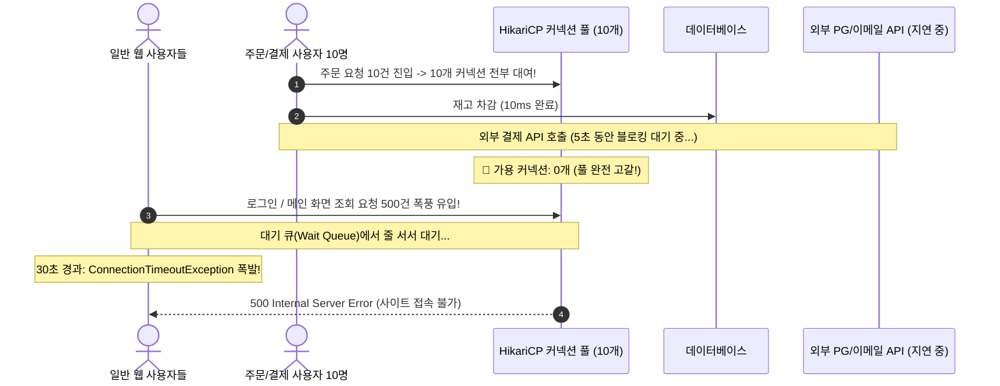

# 📚 Problem #059 이론 백서: 이메일 발송 API가 느려졌는데 왜 쇼핑몰 전체가 마비돼요?!: 롱 러닝 트랜잭션과 커넥션 풀 고갈 (Long-Running Transaction & HikariCP Pool Starvation)

> **"DB 커넥션은 '변기'와 같다. 용무가 끝났으면 즉시 바지를 올리고 나와야 한다. 변기에 앉아서 30분 동안 유튜브를 보고 있으면 밖에서 기다리던 전교생이 폭동을 일으킨다!"**

---

### 1. 현실 세계 비유: 화장실 변기에서 유튜브 보는 손님

번화가 대형 쇼핑몰에 화장실 칸이 딱 10개(DB 커넥션 풀 크기 = 10) 있습니다.

```text
❌ 롱 러닝 트랜잭션 (NAIVE):
1. 어떤 고객이 "회원가입 환영 이메일 발송" 작업을 하러 화장실 1번에 들어갔습니다.
2. 3초 만에 DB에 유저 정보 저장(볼일)을 끝냈습니다.
3. 그런데 화장실 문을 잠근 채 변기에 앉아서, 해외 이메일 발송 서버의 응답을 기다리며 30분 동안 유튜브(외부 I/O)를 보고 있습니다!
4. 이런 고객 10명이 화장실 10칸을 각각 하나씩 차지하고 앉아있습니다.
5. 밖에서 10초 만에 손만 씻고 나가려는 수백 명의 일반 고객들(로그인, 상품 검색, 장바구니 클릭)이 화장실 문 앞에서 발을 동동 구릅니다.
6. 30초 동안 문이 하나도 안 열리자(Connection Timeout 30초 초과), 고객들은 분노의 500 에러를 뿜으며 쇼핑몰 문을 박차고 나가버립니다!

✅ 트랜잭션 분리 및 즉시 반환 (OPTIMIZED):
1. 고객이 화장실 1번에 들어와 0.05초 만에 DB 유저 저장을 끝냅니다.
2. 즉시 물을 내리고 문을 열고 나와 화장실(DB 커넥션)을 다음 사람에게 넘겨줍니다!
3. 이메일 발송(유튜브 시청)은 화장실 밖 로비 의자(비동기 워커 스레드)에 편하게 앉아서 수행합니다.
4. 화장실 10칸은 0.05초 단위로 쉼 없이 회전하며, 밖에서 기다리는 고객 대기열(Wait Queue)은 0명으로 유지됩니다!
```

이것이 바로 백엔드 장애 보고서(Post-mortem)에 단골로 등장하는 **롱 러닝 트랜잭션(Long-Running Transaction)과 DB 커넥션 풀 고갈(Connection Pool Starvation)**의 본질입니다.

---

### 2. 초보 개발자가 가장 많이 저지르는 실수: 습관성 `@Transactional`

Spring Boot, Django, NestJS를 배운 주니어 개발자들은 서비스 메서드를 작성할 때 아무 생각 없이 메서드 상단에 `@Transactional`을 붙이곤 합니다.

```java
// ❌ 대참사를 부르는 전형적인 안티패턴 코드
@Transactional
public void orderProduct(OrderRequest request) {
    // 1. DB 재고 차감 (0.01초 소요) -> DB 커넥션 획득!
    stockService.decrease(request.getProductId());

    // 2. 외부 PG사(결제사) API 호출 (평소 0.5초, 장애 시 5초 지연!)
    // ⚠️ 경고: 외부 결제사 응답이 올 때까지 DB 커넥션을 5초 동안 쥐고 놓아주지 않음!
    paymentGateway.requestPayment(request.getCardInfo());

    // 3. 외부 카카오 알림톡 발송 API (1초 소요)
    // ⚠️ 경고: 알림톡 보내는 동안에도 DB 커넥션은 멍하니 낭비됨!
    notificationService.sendKakaoTalk(request.getUserPhone());

    // 4. 주문 완료 저장 (0.01초 소요)
    orderRepository.save(new Order(request));
    // -> 메서드가 끝날 때 비로소 DB 커넥션 반환! (총 6초간 커넥션 독점)
}
```

#### 트랜잭션의 실제 라이프사이클
1. `@Transactional` 메서드에 진입하는 순간, 프레임워크는 커넥션 풀(HikariCP)에서 **실제 물리 DB 커넥션 1개를 체크아웃(Checkout)**합니다.
2. 이 커넥션은 메서드가 완전히 종료(`commit` 또는 `rollback`)될 때까지 **단 1밀리초도 다른 스레드에 양보되지 않습니다**.
3. 메서드 중간에 외부 네트워크 호출(Stripe, AWS S3, 이메일, 알림톡)이 끼어 있으면, **DB 서버는 아무 일도 안 하면서 커넥션만 묶인 채** 있게 됩니다!

---

### 3. 커넥션 풀 고갈이 서비스 전체를 죽이는 연쇄 파멸 메커니즘

Spring Boot의 표준 커넥션 풀인 **HikariCP의 기본 커넥션 수는 고작 10개**입니다.

만약 외부 PG사나 이메일 서버에 일시적인 장애가 발생하여 응답 시간이 평소 100ms에서 5초로 지연되면 어떻게 될까요?



1. 주문 요청이 단 10개만 들어와도 10개 커넥션이 5초 동안 완전히 잠깁니다.
2. 그 5초 동안 들어오는 로그인, 메인 페이지 조회, 상품 검색 등 **외부 결제와 1도 상관없는 수천 명의 일반 사용자**들이 DB 커넥션을 얻지 못해 대기 큐에 갇힙니다.
3. 30초(`connectionTimeout`)가 지나면 `SQLTransientConnectionException: HikariPool-1 - Connection is not available, request timed out after 30000ms` 에러가 폭발하며 사이트 전체가 마비됩니다.
4. 쿠버네티스의 Liveness Probe 헬스체크(`SELECT 1`)마저 타임아웃되어 **정상적인 파드들까지 모조리 강제 재부팅**되는 파멸적 연쇄 붕괴가 발생합니다.

---

### 4. 해결책: 3대 프로덕션 아키텍처 패턴

#### 1. 트랜잭션 범위 최소화 (Transaction Scope Minimization)
외부 네트워크 호출 전후로 트랜잭션을 쪼개어, 순수 DB 작업에만 커넥션을 점유하도록 분리합니다.

```java
// ✅ 올바른 패턴: 외부 I/O는 트랜잭션 밖에서 수행!
public void orderProduct(OrderRequest request) {
    // Step 1: 재고 선점 (초단기 트랜잭션: 10ms만 커넥션 점유 후 즉시 반환)
    stockService.decreaseWithShortTx(request.getProductId());

    // Step 2: 외부 PG사 결제 (커넥션 전혀 없이 외부 네트워크 호출: 5초 걸려도 무해!)
    PaymentResult result = paymentGateway.requestPayment(request.getCardInfo());

    // Step 3: 주문 완료 저장 (초단기 트랜잭션: 10ms만 점유 후 즉시 반환)
    orderService.completeOrderWithShortTx(request, result);
}
```

#### 2. `TransactionSynchronizationManager.afterCommit()` 활용
Spring에서 DB 작업이 완전히 커밋되어 커넥션이 풀에 반환된 **직후(afterCommit)**에 알림톡이나 이메일 발송 비동기 작업을 트리거합니다.

#### 3. 트랜잭셔널 아웃박스 패턴 (Transactional Outbox Pattern)
이메일이나 결제 이벤트를 직접 호출하지 않고, 같은 DB 트랜잭션 내의 `outbox_events` 테이블에 1ms 만에 INSERT만 치고 커넥션을 반환합니다.  
별도의 백그라운드 워커(Kafka / Debezium)가 이벤트를 읽어 외부로 전송하므로, 사용자 서빙 웹 서버의 커넥션 풀은 100% 안전하게 보호됩니다.

---

### 5. "그럼 커넥션 풀을 1,000개로 늘리면 해결되나요?" (HikariCP 공식의 비밀)

많은 초보자들이 커넥션 풀이 마르면 `maximum-pool-size: 1000`으로 늘리는 실수를 범합니다.

HikariCP 창시자 브렛 울드리지(Brett Wooldridge)는 다음 유명한 공식을 제시했습니다:

$$\text{connections} = ((\text{CPU Cores} \times 2) + \text{Effective Spindle Count})$$

4코어 8스레드 서버라면 **적정 커넥션 풀 크기는 고작 10~15개**입니다!
만약 커넥션을 1,000개로 늘리면:
- 1,000개의 스레드가 동시에 DB CPU를 차지하려고 싸우며 **컨텍스트 스위칭(Context Switching) 오버헤드**가 폭발합니다.
- 디스크 I/O 큐가 포화되어 DB 응답 속도가 100배 느려지고, 결국 **DB 서버 전체가 CPU 100%로 뻗어버립니다**.

**"커넥션 풀을 늘리는 것은 해결책이 아니다. 커넥션을 쥐고 있는 시간(Hold Duration)을 밀리초 단위로 줄이는 것만이 유일한 정답이다!"**

---

### 6. 비전공자/AI 바이브 코더를 위한 3대 실무 체크리스트

1. **`@Transactional` 안에서 절대 `HTTP`, `SMTP`, `S3`, `Redis` 외부 네트워크 호출을 하지 마라**:
   - DB 트랜잭션 블록 안에는 오직 순수 SQL 쿼리만 들어가야 합니다.
2. **배치 작업은 반드시 청크(Chunk, 예: 100건) 단위로 잘라서 커밋하라**:
   - 10만 건을 단일 `@Transactional`로 돌리면 몇 시간 동안 커넥션을 독점하여 Undo Log가 폭발합니다.
3. **`connectionTimeout`은 짧게, 모니터링은 타이트하게**:
   - 기본 30초 대기는 너무 깁니다. 3~5초로 줄이고 타임아웃 발생 시 경보를 울리도록 설정하세요.
