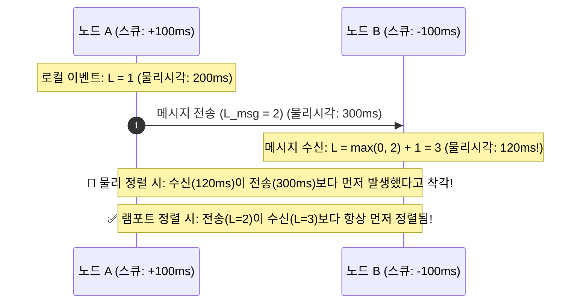

# 📚 Problem #060 이론 백서: 질문보다 답변이 먼저 뜨는 타임머신 버그?!: 분산 시계 드리프트와 램포트 논리적 시계 (Physical Clock Drift vs Lamport Logical Clock)

> **"분산 시스템에서 '절대적인 물리 시간'이란 환상에 불과하다. 지구상의 어떤 두 컴퓨터도 시계가 완벽히 일치할 수 없다. 시간을 믿지 말고, 인과관계(Causality)를 믿어라!"**  
> — 레슬리 램포트 (Leslie Lamport, 튜링상 수상자)

---

### 1. 현실 세계 비유: 5분 느린 벽시계와 5분 빠른 손목시계

서로 다른 마을에 사는 철수와 영희가 우편으로 대화를 나눕니다.

```text
❌ 물리 시계의 배신 (NAIVE - 타임머신 역전 버그):
1. 철수네 집 벽시계는 10분 느립니다 (스큐 -10분).
2. 영희네 집 손목시계는 10분 빠릅니다 (스큐 +10분).
3. 철수가 실제 시각 12:00에 "오늘 저녁에 치킨 먹을래?" 편지를 보냅니다.
   -> 편지 봉투에 찍힌 철수네 집 시계: [11:50]
4. 우체부가 10분 만에 배달하여 영희가 실제 시각 12:10에 편지를 받았습니다.
5. 영희는 기뻐하며 실제 시각 12:15에 "응 치킨 좋아!" 답장을 썼습니다.
   -> 답장 봉투에 찍힌 영희 손목시계: [12:25]
6. 중앙 우체국 관제탑이 편지 봉투의 물리 시각대로 게시판에 공지했습니다:
   - [11:50]: 철수 -> "오늘 저녁에 치킨 먹을래?"
   - 만약 영희가 5분 만에 답장해서 [11:45]가 찍혔다면?!
   - [11:45]: 영희 -> "응 치킨 좋아!" (답변이 먼저 뜸!)
   - [11:50]: 철수 -> "오늘 저녁에 치킨 먹을래?" (질문이 나중에 뜸!)
7. 결과: 영희가 미래를 예지하고 답변을 먼저 보낸 꼴이 되어 메신저 타임라인이 완전히 뒤죽박죽 난장판이 됩니다!

✅ 램포트 논리적 시계 (LAMPORT LOGICAL CLOCK):
1. 레슬리 램포트 주치의가 나타나 말합니다. "벽시계 숫자는 쳐다보지도 마라! 편지마다 인과 카운터 번호표를 붙여라!"
2. 철수가 질문을 보낼 때 카운터를 1 올려서 보냅니다: [번호표: 1]
3. 영희는 [번호표: 1] 편지를 받는 순간, 자신의 카운터를 max(내카운터, 1) + 1 = [번호표: 2]로 올립니다.
4. 영희가 답장을 쓸 때 카운터를 1 더 올려서 보냅니다: [번호표: 3]
5. 두 집의 시계가 1시간씩 어긋나 있든 말든, 번호표 순서(1 -> 2 -> 3)대로 정렬하면
   "질문(1) -> 수신(2) -> 답변(3)"의 완벽한 인과관계가 100% 보존됩니다!
```

---

### 2. 레슬리 램포트(Leslie Lamport)의 1978년 불후의 명작 논문

1978년 레슬리 램포트가 발표한 **"Time, Clocks, and the Ordering of Events in a Distributed System (분산 시스템에서의 시간, 시계, 그리고 사건의 순서)"**는 컴퓨터 과학 역사상 가장 많이 인용된 논문 중 하나(13,000회 이상 인용)이며, 2013년 그에게 컴퓨터 과학의 노벨상인 **튜링상(Turing Award)**을 안겨준 기념비적인 업적입니다.

#### 왜 물리 시계(Physical Clock)는 분산 시스템에서 쓸모가 없을까?
초보 개발자는 누구나 `System.currentTimeMillis()`나 `Date.now()`를 DB에 저장하고 `ORDER BY timestamp`를 걸면 모든 문제가 해결될 것이라 믿습니다.

하지만 현실의 서버들은:
1. **NTP(Network Time Protocol) 동기화 오차**: 아무리 정밀하게 NTP를 맞춰도 네트워크 지연으로 인해 수십~수백 밀리초의 시계 드리프트(Clock Skew)가 항상 존재합니다.
2. **가상머신(VM) 및 컨테이너 일시정지**: 가상화 환경에서는 하이퍼바이저가 VM을 스케줄링하거나 라이브 마이그레이션할 때 시계가 뒤로 점프(Time Backward Jump)하거나 멈춥니다.
3. **윤초(Leap Second)**: 지구 자전 속도 보정을 위해 1초가 추가될 때 리눅스 커널 시계가 뒤로 감기거나 멈추는 사고가 발생합니다.

따라서 여러 대의 분산 서버에서 수집된 물리 타임스탬프로 정렬하면, **원인(Cause)이 결과(Effect)보다 나중에 일어난 것으로 기록되는 인과성 붕괴(Causal Inversion)**가 100% 필연적으로 발생합니다!

---

### 3. "일어남-선행(Happened-Before)" 관계 ($\to$)

램포트는 시간의 본질이 '몇 시 몇 분인가'가 아니라 **'어떤 사건이 다른 사건에 영향을 미쳤는가(인과율)'**에 있음을 간파했습니다.

그는 두 사건 $a, b$ 사이의 인과 관계를 나타내는 **일어남-선행(Happened-Before, $\to$)** 관계를 정의했습니다:

1. **프로세스 내 순서**: 동일한 컴퓨터/노드에서 사건 $a$가 사건 $b$보다 먼저 실행되었다면, $a \to b$이다.
2. **메시지 전송-수신**: 한 컴퓨터에서 메시지를 보낸 사건이 $a$이고, 다른 컴퓨터에서 그 메시지를 받은 사건이 $b$라면, $a \to b$이다. (보내지도 않은 메시지를 받을 수는 없다!)
3. **추이율(Transitivity)**: $a \to b$이고 $b \to c$이면, $a \to c$이다.
4. **독립 사건(Concurrent Events, $\parallel$)**: $a \not\to b$이고 $b \not\to a$이면 두 사건은 서로에게 아무런 영향을 미치지 않은 독립적인 동시 사건($a \parallel b$)이다.

---

### 4. 램포트 논리적 시계 알고리즘 (Lamport Logical Clock)

각 분산 노드 $i$는 단조 증가하는 정수 카운터 $C_i$ (초기값 0)를 유지합니다.



#### 알고리즘 3대 규칙
1. **로컬 이벤트(Local Event)** 발생 시:
   $$C_i \leftarrow C_i + 1$$
2. **메시지 전송(Send Message)** 시:
   $$C_i \leftarrow C_i + 1$$
   보내는 네트워크 패킷 헤더에 자신의 논리 시계 값 $C_i$를 함께 실어 보낸다.
3. **메시지 수신(Receive Message)** 시:
   메시지에 실려온 시계 값 $C_{msg}$를 확인하고, 자신의 시계를 최신으로 당긴 후 1 증가시킨다:
   $$C_i \leftarrow \max(C_i, C_{msg}) + 1$$

#### 램포트의 시계 조건(Clock Condition)
이 단순한 알고리즘을 따르면 다음 불변식(Invariant)이 수학적으로 항상 성립합니다:

$$a \longrightarrow b \implies C(a) < C(b)$$

**"원인이 된 사건 $a$의 램포트 시계는, 결과가 된 사건 $b$의 램포트 시계보다 무조건 엄격하게 작다!"**

#### 전체 순서화 (Total Ordering) 동률 해결
만약 서로 다른 두 노드에서 발생한 독립적인 사건의 램포트 시계가 우연히 같다면($C(a) = C(b)$), 노드 ID를 사전순으로 비교하여 동률을 깹니다:

$$a \prec b \iff (C(a) < C(b)) \lor (C(a) == C(b) \land \text{node}(a) < \text{node}(b))$$

이로써 분산 시스템 전체의 모든 사건에 대해 100% 모순 없는 유일한 전체 순서(Total Order)가 결정됩니다.

---

### 5. 현대 분산 아키텍처에서의 계승

1. **구글 스패너(Google Spanner)의 TrueTime**:
   - 구글은 데이터센터마다 GPS 수신기와 원자시계(Atomic Clock)를 설치하여 시계 불확실성 구간 $[\text{time} - \epsilon, \text{time} + \epsilon]$을 7ms 이내로 묶고 트랜잭션 순서를 보장합니다.
2. **벡터 시계(Vector Clocks / Version Vectors)**:
   - 램포트 시계의 한계($C(a) < C(b)$라고 해서 반드시 $a \to b$인 것은 아님)를 극복하기 위해, 모든 노드의 시계를 벡터 $[C_1, C_2, \dots, C_n]$로 기록하여 분산 DB(Amazon DynamoDB, Cassandra)의 동시성 충돌을 정밀 감지합니다.
3. **분산 트레이싱(Distributed Tracing - OpenTelemetry / Jaeger)**:
   - 마이크로서비스 간 HTTP 호출 흐름을 추적할 때 Span ID와 Parent Span ID를 인과적으로 연결하여 서비스 호출 트리를 시각화합니다.

---

### 6. 비전공자/AI 바이브 코더를 위한 3대 실무 체크리스트

1. **분산 서버 간의 정렬 기준으로 `System.currentTimeMillis()`를 맹신하지 마라**:
   - 여러 대의 서버가 관여하는 채팅, 주문, 로그는 반드시 인과 시퀀스나 버전 번호를 함께 기록하세요.
2. **메시지 큐(Kafka, SQS) 메시지 전송 시 부모 이벤트 ID(Causal ID)를 헤더에 넣어라**:
   - "이 알림은 주문 101번의 결제 성공 이벤트로 인해 발생했다"는 인과 링크를 유지하세요.
3. **이벤트 소싱(Event Sourcing)을 설계할 때 램포트 시계 개념을 차용하라**:
   - 상태 변경 이벤트마다 단조 증가 시퀀스를 붙이면 복제 지연이 발생해도 완벽한 순서 재생(Replay)이 가능합니다!
