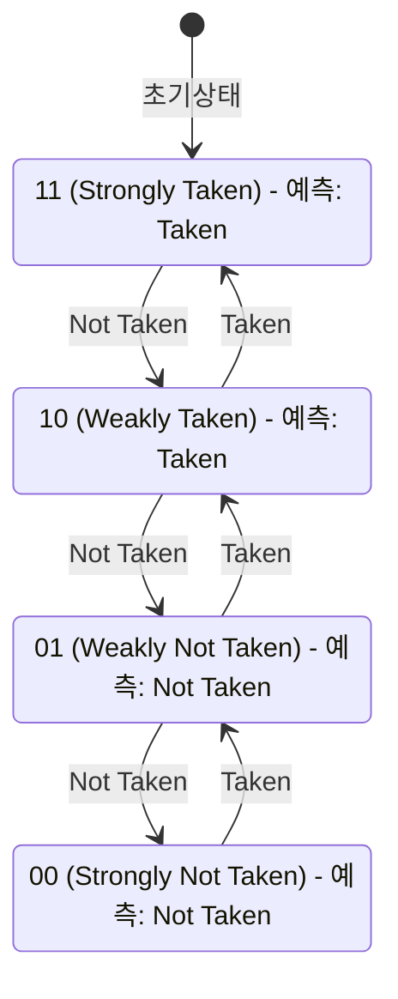

# 099. 배열 정렬만 먼저 했을 뿐인데 왜 루프 도는 속도가 6배나 빨라져요?!: CPU 분기 예측기(Branch Predictor)와 파이프라인 플러시(Pipeline Flush)의 마법

---

## 1. 비극과 미스터리: Stack Overflow 역사상 최다 추천 질문

2012년, 한 C++ 개발자가 전 세계 35,000명 이상의 엔지니어들을 매료시킨 미스터리한 질문 하나를 올렸습니다:

```cpp
#include <algorithm>
#include <ctime>
#include <iostream>

int main() {
    const unsigned ARRAY_SIZE = 32768;
    int data[ARRAY_SIZE];
    for (unsigned c = 0; c < ARRAY_SIZE; ++c)
        data[c] = std::rand() % 256;

    // !!! 의문의 핵심 라인 !!!
    // std::sort(data, data + ARRAY_SIZE);

    long long sum = 0;
    for (unsigned i = 0; i < 100000; ++i) {
        for (unsigned c = 0; c < ARRAY_SIZE; ++c) {
            if (data[c] >= 128)
                sum += data[c];
        }
    }
}
```

실행 결과:
- **`std::sort` 주석 처리 시 (정렬되지 않은 무작위 배열)**: **11.54초**
- **`std::sort` 활성화 시 (정렬된 배열)**: **1.93초** (무려 **6배** 빠름!)

질문자는 머리를 쥐어뜯었습니다:  
*"정렬(Sort)을 하면 추가적인 CPU 연산이 더 들면 들었지, 똑같이 32,768개의 원소를 순회하며 `data[c] >= 128` 조건을 검사하는 루프 연산 횟수는 100% 동일한데, 왜 정렬 여부에 따라 속도가 6배나 차이가 나는 거죠?!"*

---

## 2. 현실 비유: 철도 분기점과 시속 300km 질주 열차

안개가 자욱한 19세기 철도길을 상상해 봅시다:
- 고속 열차(CPU 명령어 파이프라인)가 시속 300km로 맹렬하게 질주하고 있습니다.
- 앞에는 좌회전 선로(조건문 참, `Taken`)와 우회전 선로(조건문 거짓, `Not Taken`)로 갈라지는 분기점이 나타납니다.
- 짙은 안개 때문에 갈림길의 신호등 색깔은 분기점 50m 앞에 도달해야만 비로소 보입니다.
- **선택 1: 매 분기점마다 멈춰서 신호 확인하기 (파이프라인 스톨 / Pipeline Stall)**:
  - 열차가 멈췄다가 다시 출발하느라 하루 종일 기어가는 속도로 달리게 됩니다.
- **선택 2: 신호를 미리 찍어서 감속 없이 통과하기 (분기 예측 / Branch Prediction)**:
  - 기관사(CPU Branch Predictor)는 멈추지 않고 과감하게 한쪽 선로로 핸들을 꺾습니다.
  - **예측 성공 (Prediction Hit)**: 예상한 신호가 맞았으므로 열차는 감속 0%로 최고 속도로 질주합니다!
  - **예측 실패 (Branch Misprediction)**: 틀린 선로로 진입했습니다! 열차는 비상 브레이크를 밟고, 잘못 들어간 객차들을 전부 뒤로 끌어내린 뒤(파이프라인 플러시, Pipeline Flush), 올바른 선로로 다시 갈아타야 합니다. 엄청난 시간 낭비(**15~20 사이클 페널티**)가 발생합니다!

### 정렬된 배열 vs 무작위 배열의 차이
- **무작위 배열 (Unsorted)**:
  - 신호등이 `좌-우-우-좌-우-좌-좌...` 동전 던지기처럼 무작위로 켜집니다.
  - 아무리 똑똑한 기관사라도 승률은 50%에 불과합니다.
  - 열차는 툭하면 비상 브레이크를 밟고 후진하느라 속도가 6배나 곤두박질칩니다!
- **정렬된 배열 (Sorted)**:
  - 신호등이 앞쪽에는 `우-우-우-우...` (128 미만)만 수만 번 켜지다가, 뒤쪽에는 `좌-좌-좌-좌...` (128 이상)만 수만 번 켜집니다.
  - 기관사는 "계속 우회전이네? 앞으로도 우회전이겠지!", "계속 좌회전이네? 앞으로도 좌회전이겠지!" 하고 99.9% 확률로 완벽하게 예측합니다.
  - 열차는 브레이크를 단 한 번도 밟지 않고 최고 속도로 질주합니다!

---

## 3. 컴퓨터 구조 / CPU 마이크로아키텍처 이론

### 1) 명령어 파이프라인 (Instruction Pipeline)과 제어 해저드 (Control Hazard)
현대 고성능 CPU(Intel Core, AMD Ryzen, Apple Silicon)는 처리량을 극대화하기 위해 명령어를 15~20개 이상의 미세 단계로 나누어 처리합니다:
$$	ext{Fetch} 
ightarrow 	ext{Decode} 
ightarrow 	ext{Rename} 
ightarrow 	ext{Dispatch} 
ightarrow 	ext{Execute} 
ightarrow 	ext{Write-back}$$

- `if (data[c] >= 128)`와 같은 조건 분기문(Branch Instruction)을 만나면, 조건이 실제로 계산되는 `Execute` 단계까지 약 10~15단계가 걸립니다.
- 조건 결과가 나올 때까지 다음 명령어를 Fetch하지 않고 기다리면 파이프라인에 거대한 빈 공간(**파이프라인 버블 / Stall**)이 발생합니다.

### 2) 2비트 포화 카운터 (2-bit Saturating Counter) 예측기
현대 CPU 분기 예측기의 가장 기초적인 핵심 빌딩 블록은 4가지 상태를 갖는 유한 상태 기계(FSM)입니다:



- **장점**: 단 1번의 튀는 예외(Loop 종료 조건 등)가 발생해도 예측 성향을 즉시 뒤집지 않고 한 번은 참아줍니다(Weakly 상태).

### 3) 분기 예측 실패 페널티 (Misprediction Penalty)
- 분기 예측이 틀렸음이 판명되는 순간, 이미 파이프라인에 들어와서 디코딩되고 투기적으로 실행 중이던 모든 뒤따르는 명령어들을 강제로 파기(**Pipeline Flush / Squash**)해야 합니다.
- 페널티 비용: 일반적으로 **14~20 CPU 사이클(Cycles)**!
- 예측 성공 시: **단 1 사이클**!
- 예측 성공률이 50%로 떨어지면 명령어 1개당 평균 실행 시간이 10배 이상 치솟게 됩니다.

### 4) 하드웨어 친화적 기법: 분기 없는 프로그래밍 (Branchless Code)
조건 분기문 자체를 없애버리면 분기 예측 실패 페널티가 0이 됩니다:

```cpp
// 1. 조건 분기 코드 (Branching) - 예측 실패 시 15~20 사이클 낭비
if (data[c] >= 128) {
    sum += data[c];
}

// 2. 비트 마스킹 분기 없는 코드 (Branchless) - 예측 실패 0건, 항상 2~3 사이클
int t = (data[c] - 128) >> 31; // 음수면 0xFFFFFFFF(-1), 0 이상이면 0x00000000
sum += ~t & data[c];

// 3. CMOV (Conditional Move) 기반 분기 없는 코드
sum += (data[c] >= 128) ? data[c] : 0; // 컴파일러가 CMOVcc 명령어로 최적화
```

---

## 4. 실무 결론 및 최적화 교훈

1. **핫 패스(Hot Path)의 데이터 정렬**:
   - 수백만 번 반복되는 루프 내부에서 조건 분기를 평가해야 한다면, 데이터를 미리 정렬해 두는 것만으로도 CPU 하드웨어 레벨에서 수 배의 성능 향상을 얻을 수 있습니다.
2. **분기 없는 알고리즘 (Branchless Algorithms)**:
   - 고주파 매매(HFT), 게임 물리 엔진, 오디오/비디오 코덱 등 1나노초가 아쉬운 고성능 시스템에서는 `if/else` 분기 대신 비트 연산 마스킹 및 `CMOV`를 적극 활용합니다.
3. **컴파일러 힌트 활용**:
   - `likely()` / `unlikely()` 매크로(`__builtin_expect`)를 통해 컴파일러가 가장 빈번한 실행 경로를 연속적인 선형 메모리에 배치하도록 유도합니다.
