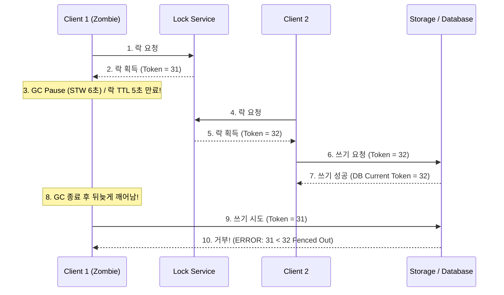

# 100. 분산 락을 잡았는데 왜 두 명이 동시에 결제돼요?!: 분산 시스템의 성배, Redis Redlock의 GC STW 시계 왜곡과 펜싱 토큰(Fencing Token)의 구원

---

## 1. 비극의 시작: Martin Kleppmann vs Antirez의 전설적인 Redlock 논쟁

2016년, 캠브리지 대학의 저명한 분산 시스템 학자 **마틴 클레프만(Martin Kleppmann)** 교수는 분산 시스템 커뮤니티를 뒤흔든 한 편의 논문성 블로그 글을 발표했습니다:
> **"Redis의 분산 락 알고리즘인 Redlock은 상호 배제(Mutual Exclusion)를 보장하지 못하며, 데이터 정합성이 중요한 시스템에서 사용해서는 안 된다."**

이에 대해 Redis의 창시자인 **살바토레 산필리포(Salvatore Sanfilippo, antirez)**가 즉각 반박 글을 올리며, 컴퓨터 과학 역사상 가장 뜨겁고 품격 있는 분산 합의 논쟁이 불붙었습니다.

도대체 마틴 클레프만 교수는 어떤 치명적인 허점을 발견했던 걸까요?  
실무에서 수많은 백엔드 엔지니어들이 선착순 한정 수량 티켓팅이나 특가 상품 결제 시스템에 Redis 분산 락을 도입했다가 다음과 같은 **기괴한 동시성 버그**를 목격합니다:

```text
[Client 1] 락 획득 성공 (key="product:101", TTL=5000ms)
... (아무 일도 일어나지 않음) ...
[Client 2] 락 획득 성공 (key="product:101", TTL=5000ms)
[Client 2] DB 재고 차감 완료: 1개 -> 0개 (Commit)
[Client 1] DB 재고 차감 시도: 0개 -> -1개 (Commit)  <--- 락이 걸려있었는데 중복 결제 발생?!
```

분명히 `Client 1`이 분산 락을 정상적으로 잡고 작업을 시작했는데, 어떻게 `Client 2`가 동시에 락을 잡고 동일한 재고를 깎을 수 있었을까요?

---

## 2. 현실 비유: 호텔 401호 도어락과 복도 얼음땡 마법

호텔 스위트룸 401호(DB 공유 자원)를 상상해 봅시다:
1. **카드키 발급 (분산 락 획득)**:  
   프런트 데스크(Redis 락 서버)에서 손님 A(Client 1)에게 카드키를 발급하며 말합니다:  
   *"손님, 401호 카드키는 배터리 절약을 위해 발급 후 **5분(TTL=5초)**이 지나면 자동으로 전자 도어락이 초기화됩니다!"*
2. **복도 얼음땡 마법 (JVM Stop-The-World GC)**:  
   손님 A가 카드키를 들고 401호 문 앞 복도를 걷던 도중, 갑자기 **얼음땡 마법(Full GC STW / 6분간 일시정지)**에 걸려 돌처럼 굳어버렸습니다!
3. **도어락 자동 초기화 & 손님 B 입실**:  
   - 5분이 지나자 401호 도어락 키는 자동으로 만료되었습니다.
   - 프런트 데스크는 "A가 방을 다 쓰고 체크아웃했나 보네!" 하고 손님 B(Client 2)에게 401호 카드키를 새로 발급했습니다.
   - 손님 B는 401호에 들어가서 침대에 짐을 풀고 편히 쉬고 있었습니다.
4. **마법 해제와 유령의 습격**:  
   - 6분이 지난 순간, 손님 A의 얼음땡 마법이 풀렸습니다!
   - 손님 A는 자신이 얼어있었다는 사실조차 모른 채, **"난 아까 정상적으로 카드키를 받았으니 들어가야지!"** 하고 401호 문을 벌컥 열고 들어왔습니다.
   - 방 안에서 손님 A와 손님 B가 서로 "내가 진짜 주인이야!"라며 몸싸움을 벌이는 **처참한 난투극(동시성 붕괴, 데이터 오염)**이 터진 것입니다!

---

## 3. 컴퓨터 과학 / 분산 시스템 이론

### 1) 비동기 분산 시스템의 3대 불확실성 (The Three Demons)
실제 운영체제와 클라우드 환경에서는 다음 세 가지 현상이 언제든 발생할 수 있습니다:
1. **비결정적 프로세스 일시 정지 (Unbounded Process Pauses)**:  
   JVM Garbage Collection(STW), OS 컨텍스트 스위칭, 하이퍼바이저 vCPU 도둑질(Steal Time), 페이징 스왑(Paging Swap).
2. **비결정적 네트워크 지연 (Unbounded Network Delays)**:  
   스위치 버퍼링, 패킷 재전송, 일시적 망 단절.
3. **시계 불일치 (Clock Drift / NTP Jumps)**:  
   서버 간 시계는 절대 완벽하게 일치하지 않으며, NTP 동기화 과정에서 시간이 앞으로 튀거나 뒤로 튈 수 있습니다.

### 2) Time-of-Check to Time-of-Use (TOCTOU)의 덫
- 클라이언트가 Redis에서 락을 획득하고 "내가 락을 쥐고 있다"고 확인한 시점(**Time-of-Check**)과, 실제 데이터베이스에 UPDATE 쿼리를 날리는 시점(**Time-of-Use**) 사이에는 **임의의 시간 간격**이 존재합니다.
- 프로세스가 중간에 단 몇 초라도 멈추면, 클라이언트 본인은 자신이 여전히 락 소유자라고 굳게 믿고 있지만, 분산 락 서비스 입장에서는 이미 TTL 만료로 다른 클라이언트에게 락을 넘겨준 상태가 됩니다.

### 3) 구원의 열쇠: 펜싱 토큰 (Fencing Token)
마틴 클레프만 교수는 분산 락만으로는 공유 자원을 완벽히 보호할 수 없으며, **저장소(DB/스토리지) 계층이 스스로를 지키는 펜싱 토큰(Fencing Token)**이 필수적임을 수학적으로 증명했습니다:



1. **단조 증가 토큰 발급**:  
   락 서비스는 락을 발급할 때마다 숫자가 절대 줄어들지 않고 계속 증가하는 **단조 증가 펜싱 토큰(Monotonically Increasing Token, 예: 31, 32, 33...)**을 함께 발급합니다.
2. **저장소의 펜싱 검증 (Conditional Write / Version Check)**:  
   저장소(DB)는 자신이 지금까지 승인한 **가장 높은 토큰 번호(`max_token`)**를 기억합니다.
3. **좀비 클라이언트 차단**:  
   Client 2가 토큰 32로 쓰기를 마쳤다면 저장소의 `max_token = 32`입니다.  
   뒤늦게 GC에서 깨어난 Client 1이 옛날 토큰 31을 들고 쓰기를 시도하면, 저장소는 **"당신이 가져온 토큰(31)은 이미 처리된 최신 토큰(32)보다 과거의 유물입니다!"**라며 요청을 즉시 폐기(`FENCED_OUT`)합니다!

---

## 4. 실무 아키텍처 및 교훈

1. **분산 락의 한계를 인정하라**:
   - 락의 유효시간(TTL)이 존재하는 한, 프로세스 일시 정지(GC STW)로 인한 락 유실은 100% 막을 수 없습니다.
   - Redisson의 Watchdog(락 갱신 스레드)도 메인 프로세스가 Full GC로 멈추면 와치독 스레드도 함께 멈추기 때문에 근본적인 해결책이 될 수 없습니다.
2. **최종 방어선은 항상 데이터베이스(스토리지)여야 한다**:
   - 낙관적 락(Optimistic Locking, `@Version`)이나 DB 시퀀스를 활용한 Fencing Token 검증을 통해, 애플리케이션 계층이 뚫리더라도 스토리지 계층에서 데이터 오염을 완벽히 방어해야 합니다:
     ```sql
     UPDATE accounts 
     SET balance = balance - 100, fencing_token = 32 
     WHERE account_id = 'ACC_01' AND fencing_token < 32;
     ```
3. **분산 시스템의 성배**:
   - 완벽한 분산 락은 존재하지 않지만, **펜싱 토큰과 조건부 쓰기의 결합**은 분산 환경에서도 100% 무결점 정합성을 보장하는 가장 우아한 해법입니다.
