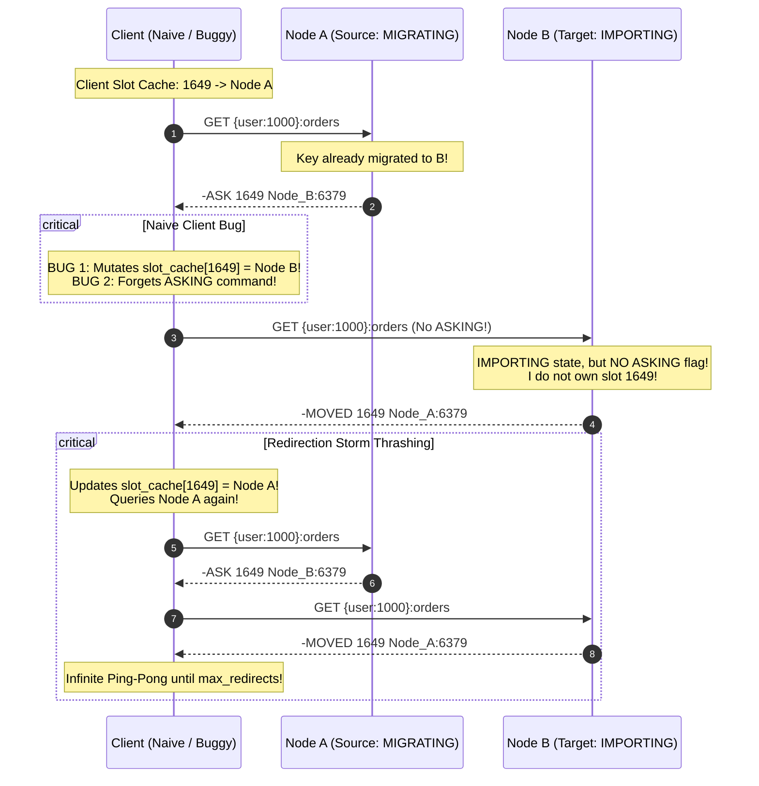

# [CS Deep Dive] Redis Cluster 분산 슬롯 아키텍처와 MOVED vs ASK 리다이렉트 메커니즘

## 1. 16,384개 해시 슬롯과 CRC-16/XMODEM 해시 태그 알고리즘

### 왜 정확히 16,384 ($2^{14}$)개의 슬롯인가?
Redis 공식 문서와 Salvatore Sanfilippo(antirez)의 설계 메모에 따르면:
1. **하트비트 패킷 오버헤드**:
   - Redis Cluster 노드들은 초당 수 차례 Gossip 프로토콜로 핑/퐁 패킷을 교환합니다.
   - 슬롯 비트맵을 전송할 때 16,384비트는 정확히 **2KB (16384 / 8 bytes)**에 불과합니다.
   - 만약 일반적인 해시 링처럼 $2^{32}$ (40억 개) 슬롯이나 65,536개 슬롯을 사용한다면 비트맵 크기만 8KB 이상으로 커져 네트워크 대역폭 낭비가 극심해집니다.
2. **클러스터 규모 상한선**:
   - Redis Cluster는 마스터 노드를 최대 1,000개 수준으로 권장합니다. 1,000개 노드 기준 노드당 평균 약 16개의 슬롯 청크가 할당되므로 슬롯 분할 단위로서 충분한 정밀도를 가집니다.

### 해시 태그(Hash Tag)와 슬롯 코로케이션(Co-location)
Redis Cluster는 단일 슬롯 내에서만 멀티 키 트랜잭션(MGET, Pipeline, Lua Script)을 허용합니다(`CROSSSLOT Keys in request don't hash to the same slot` 에러 방지).
키에 중괄호 `{...}`를 감싸면 내부 문자열만 CRC16 해싱을 거치므로 서로 다른 엔터티를 동일 노드로 강제 배치할 수 있습니다:
```python
# {user:1000} 슬롯 = CRC16("user:1000") % 16384 = 1649
slot("{user:1000}:profile") # -> 1649
slot("{user:1000}:orders")  # -> 1649
slot("{user:1000}:cart")    # -> 1649
```

---

## 2. 온라인 슬롯 리샤딩(Online Resharding)의 4단계 라이프사이클

온라인 서비스 무중단 상태에서 슬롯 $S$를 원본 노드 $A$에서 타깃 노드 $B$로 이동하는 절차:

```
[ Step 1: 타깃 준비 ]
B> CLUSTER SETSLOT S IMPORTING A

[ Step 2: 원본 준비 ]
A> CLUSTER SETSLOT S MIGRATING B

[ Step 3: 키 배치 마이그레이션 ]
A> CLUSTER GETKEYSINSLOT S 100
A> MIGRATE B_IP B_PORT "" 0 5000 KEYS key1 key2 ...

[ Step 4: 소유권 확정 전파 ]
전체 노드> CLUSTER SETSLOT S NODE B
```

마이그레이션이 진행 중인 과도기(Intermediate State) 동안:
- 아직 노드 $A$에 남아있는 키는 노드 $A$가 직접 서빙합니다.
- 이미 노드 $B$로 마이그레이션되었거나 새로 생성되는 키는 노드 $A$가 알지 못하므로 `-ASK S B_IP:B_PORT`를 반환합니다.

---

## 3. `-MOVED` vs `-ASK`의 비교 및 리다이렉트 스톰 분석



### 수학적 지연 시간 및 커넥션 부하 비교
- **Smart Client**:
  - 미이전 키 조회: 1 RTT (원본 노드 직행).
  - 이전된 키 조회: 2 RTT (원본 노드 `-ASK` $	o$ 타깃 노드 `ASKING` + 명령).
  - 슬롯 캐시 불변 $	o$ 다음 요청도 1 RTT 유지.
- **Naive Client**:
  - 리다이렉트 핑퐁 횟수: $K = 	ext{max\_redirects}$
  - 소모 네트워크 RTT: $O(K)$
  - 결과: $K 	imes 	ext{RTT}$ 지연 시간 발생 후 `TooManyRedirectsException` 폭사.
  - 노드별 동시 연결 수 급증 $	o$ Connection Pool Exhaustion.

---

## 4. 프로덕션 클러스터 운영 모범 사례

1. **Smart Client 라이브러리 검증**:
   - Java: **Jedis Cluster** 또는 **Lettuce** (Netty 기반 비동기 파이프라이닝 및 ASKING 완벽 지원).
   - Go: **go-redis/v9** (ClusterClient 모드 지원).
   - Python: **redis-py** (`RedisCluster`).
   - 자체 프록시나 L4/L7 로드밸런서를 둘 경우 반드시 `MOVED`와 `ASK`의 캐시 정책을 분리해야 함.
2. **리샤딩 속도 조절(Throttling)**:
   - 한 번에 수천 개의 슬롯을 동시에 리샤딩하지 말고, 1개 슬롯 단위로 키 마이그레이션 완료 후 즉시 `CLUSTER SETSLOT NODE`를 실행하여 과도기 지속 시간을 최소화해야 합니다.
3. **대용량 키(Big Key) 격리**:
   - 수십 MB 크기의 Hash/List/Set 키가 슬롯에 포함되어 있으면 `MIGRATE` 명령 실행 중 Redis 싱글 스레드가 블로킹되어 전체 노드의 지연 시간이 튑니다.
   - 사전 슬롯 점검 시 `redis-cli --bigkeys` 또는 `MEMORY USAGE`로 빅 키를 사전에 정리해야 합니다.
