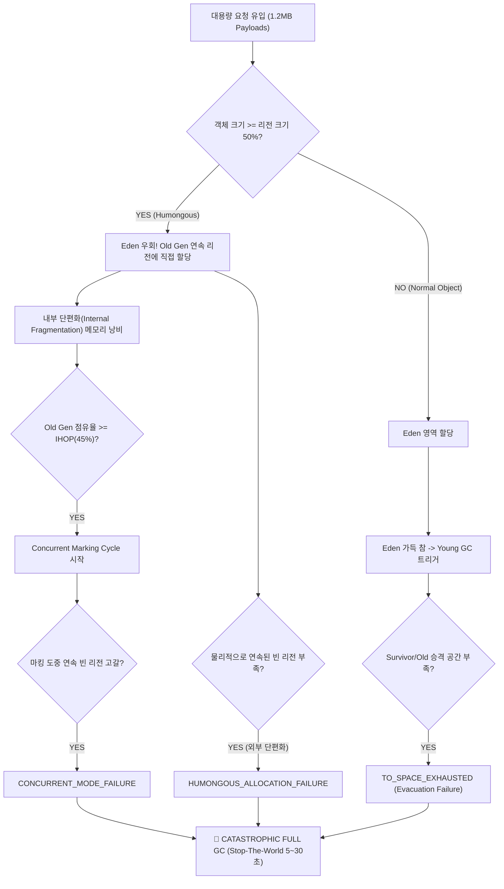

# [CS Deep Dive] JVM G1GC Humongous Allocation 파편화와 Old Gen 승격 실패(Promotion Failure)

## 1. G1GC(Garbage-First) 아키텍처와 리전(Region) 분할 원리

Java 9부터 HotSpot JVM의 기본 가비지 컬렉터로 채택된 **G1GC(Garbage-First GC)**는 기존 세대별 컬렉터(Serial, Parallel, CMS)가 힙 메모리를 고정된 연속 물리 공간(Eden, Survivor, Old)으로 나눈 것과 달리, 전체 힙을 수천 개의 동일한 크기의 독립적인 **리전(Region)**으로 균등 분할합니다.

```
+-------+-------+-------+-------+-------+-------+-------+-------+
| Eden  | Free  | Old   | Surv  |  Old  | Starts| Contin| Free  |
|       |       |       |       |       |  Hum  |  Hum  |       |
+-------+-------+-------+-------+-------+-------+-------+-------+
|  Old  | Eden  | Free  | Eden  | Free  |  Old  | Surv  | Free  |
|       |       |       |       |       |       |       |       |
+-------+-------+-------+-------+-------+-------+-------+-------+
```

### 리전 크기 결정 공식
G1GC는 힙 전체를 약 2,048개의 리전으로 분할하는 것을 목표로 하며, 리전 크기는 항상 **1MB, 2MB, 4MB, 8MB, 16MB, 32MB ($2^n$)** 중 하나로 자동 설정됩니다:

$$R_{\text{size}} = \max\left(1\text{MB}, \min\left(32\text{MB}, 2^{\lfloor \log_2(\text{HeapSize} / 2048) \rfloor}\right)\right)$$

- 힙이 2GB일 경우: $2048\text{MB} / 2048 = 1\text{MB}$ 리전
- 힙이 4GB일 경우: $4096\text{MB} / 2048 = 2\text{MB}$ 리전
- 힙이 16GB일 경우: $16384\text{MB} / 2048 = 8\text{MB}$ 리전

각 리전은 정적으로 고정되지 않고, 필요에 따라 `EDEN`, `SURVIVOR`, `OLD`, `HUMONGOUS` 역할을 동적으로 전환합니다.

---

## 2. Humongous Object의 정의와 물리적 할당 재앙

### Humongous 임계값 (50% Rule)
G1GC 명세상 단일 객체의 크기가 **리전 크기의 50% 이상($\ge 0.5 \times R_{\text{size}}$)**인 경우, JVM은 이를 일반 객체가 아닌 **Humongous Object(거대 객체)**로 분류합니다.
예를 들어 2GB 힙(리전 1MB) 환경에서 600KB짜리 JSON 파싱 버퍼나 바이트 배열(`byte[]`)은 즉시 Humongous Object가 됩니다.

```
+-------------------------------------------------------------+
|                      1MB G1 Region                          |
+------------------------------+------------------------------+
| Normal Allocation Space (50%)|   Humongous Threshold (50%)  |
|          <= 512KB            |            > 512KB           |
+------------------------------+------------------------------+
```

### 왜 Humongous Object가 재앙을 부르는가?
1. **Eden & Survivor 우회(Bypass)**:
   - 일반 객체는 수명이 매우 짧다는 **약한 세대 가설(Weak Generational Hypothesis)**에 따라 Eden에 할당되어 수 밀리초(ms) 단위의 가벼운 Young GC로 회수됩니다.
   - 그러나 Humongous Object는 객체 복사 비용이 크다는 이유로 **Eden과 Survivor를 완전히 건너뛰고 곧바로 Old Generation에 직접 할당**됩니다.
2. **연속된 물리 리전 요구 (Contiguous Regions)**:
   - 일반 Old 객체는 비연속적인 임의의 리전에 쪼개어 담길 수 있지만, Humongous Object는 반드시 메모리상에서 **물리적으로 연속된(Contiguous) 리전 세트**(`STARTS_HUMONGOUS` + `CONTINUES_HUMONGOUS`)를 요구합니다.
3. **심각한 내부 단편화 (Internal Fragmentation)**:
   - $1.2\text{MB}$ 객체는 $1\text{MB}$ 리전 1개에 들어가지 못하므로 반드시 $2\text{MB}$ (리전 2개)를 통째로 차지합니다.
   - 이 과정에서 $2\text{MB} - 1.2\text{MB} = 0.8\text{MB} (800\text{KB})$가 **아무도 쓸 수 없는 죽은 공간(Internal Waste)**으로 버려집니다. 낭비율이 무려 40%에 달합니다!

---

## 3. 리전 고갈과 연쇄 Full GC 메커니즘



### 3대 Full GC 유발 원인 분석
1. **`HUMONGOUS_ALLOCATION_FAILURE` (외부 단편화)**:
   - 힙에 총 $500\text{MB}$의 여유 공간이 남아있더라도, 그 공간이 단일 리전 단위로 파편화되어 있으면 $3\text{MB}$짜리 거대 객체가 요구하는 3개의 연속된 리전을 찾지 못해 즉시 Full GC가 터집니다.
2. **`CONCURRENT_MODE_FAILURE`**:
   - Humongous 객체가 Old Gen을 급속도로 채우면서 IHOP(기본 45%)를 넘겨 백그라운드 동시 마킹(Concurrent Mark)이 시작됩니다.
   - 그러나 마킹이 미처 끝나기도 전에 새로운 거대 객체들이 Old Gen을 100% 포화시키면 JVM은 동시성 수집을 포기하고 Full GC로 전환합니다.
3. **`TO_SPACE_EXHAUSTED` (Evacuation / Promotion Failure)**:
   - 정상적인 Young GC 도중 살아남은 Eden/Survivor 객체를 복사할 빈 Survivor 리전이나 Old 리전이 부족하여 발생합니다.

---

## 4. Full GC의 파괴적 영향 (Stop-The-World)

G1GC의 Full GC는 최신 JDK에서도 **힙 전체를 동결하는 단일/병렬 압축(Mark-Sweep-Compact)** 알고리즘으로 동작합니다:
- 모든 애플리케이션 스레드가 완전히 멈춥니다(Stop-The-World).
- 힙 크기와 살아있는 데이터 양에 비례하여 **수 초에서 길게는 30초 이상** 애플리케이션이 먹통이 됩니다.
- **쿠버네티스 장애 전파**:
  - K8s `livenessProbe` / `readinessProbe` HTTP 헬스체크 타임아웃(보통 1~3초).
  - kubelet이 파드를 비정상으로 간주하고 `SIGKILL` 강제 재시작.
  - 재시작되는 동안 다른 파드로 트래픽이 몰려 클러스터 전체가 연쇄 다운(Cascading Failure)되는 재앙이 발생합니다.

---

## 5. 실무 프로덕션 튜닝 모범 사례

### 1. `-XX:G1HeapRegionSize` 수동 튜닝
가장 효과적이고 확실한 인프라 레벨 해결책입니다:
- 만약 서비스의 주요 대용량 페이로드가 $1.2\text{MB} \sim 3\text{MB}$ 수준이라면:
  ```bash
  # 리전 크기를 8MB로 설정 (Humongous 임계값 = 4MB)
  java -XX:+UseG1GC -Xms4g -Xmx4g -XX:G1HeapRegionSize=8m -jar app.jar
  ```
- $1.2\text{MB}$ 객체는 $8\text{MB}$ 리전의 15%에 불과하므로 **일반 객체로 판정되어 Eden에 할당**됩니다.
- 요청 처리 후 $5\sim 10\text{ms}$의 가벼운 Young GC만으로 Old Gen을 더럽히지 않고 100% 회수됩니다!

### 2. 애플리케이션 레벨 스트리밍 및 버퍼 풀링
인프라 튜닝과 더불어 코드 레벨에서 거대 객체 생성을 원천 차단해야 합니다:
- **Streaming Parser**: 10MB짜리 대용량 JSON을 통째로 메모리에 올려 문자열로 파싱하지 말고, Jackson `JsonParser`나 GSON의 스트리밍 토큰 파서 사용.
- **청킹(Chunking) & Netty ByteBuf Pooling**:
  - $5\text{MB}$ 파일을 통짜 `byte[]`로 받지 않고, $64\text{KB}$ 청크 스트림으로 분할 수신.
  - Netty의 `PooledByteBufAllocator`를 사용하여 다이렉트 메모리 버퍼를 재사용함으로써 JVM 힙 할당 자체를 0으로 억제.

### 3. IHOP 및 G1 옵션 최적화
- `-XX:+G1UseAdaptiveIHOP`: 실시간 할당률과 마킹 시간을 통계적으로 추적하여 최적의 마킹 시작 시점을 동적 산정.
- `-XX:G1ReservePercent=15`: 승격 실패(To-space exhausted)를 방지하기 위해 비상 예비 리전 비율 확보.
