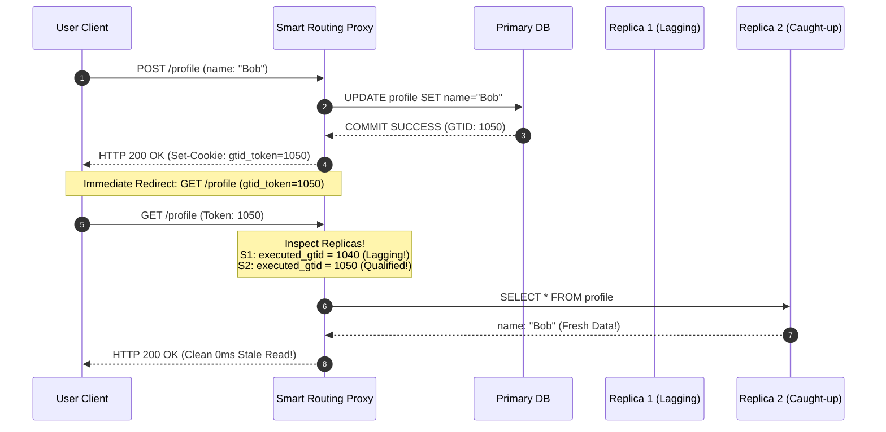

# [CS Deep Dive] MySQL 비동기 복제 아키텍처와 Read-Your-Own-Writes 세션 일관성

## 1. MySQL InnoDB 비동기 복제(Replication) 파이프라인

MySQL의 Master-Replica 복제는 3개의 핵심 스레드와 2개의 로그 파일을 통해 단계별로 이루어집니다:

```
[ Primary (Master) ]
1. Client commits -> InnoDB Redo Log Commit & Write to Binary Log (binlog.000001)
2. Dump Thread reads binlog -> Sends network packet to Replica

[ Network Transfer ] === (Latency / Bandwidth / Packet Delay) ===>

[ Read Replica (Slave) ]
3. I/O Thread: Receives binlog event -> Appends sequentially to Relay Log (relay-bin.000001)
4. SQL Thread (or MTS Applier Workers): Reads Relay Log -> Executes SQL -> Updates Storage Engine
```

### 복제 지연(Replication Lag)이 필연적인 근본 이유
1. **네트워크 전송 지연 (Dump Thread $	o$ I/O Thread)**:
   - 물리적 거리, 패킷 손실, 네트워크 버퍼 지연.
2. **단일 스레드 재생 병목 (Single-Threaded SQL Applier)**:
   - Primary는 64개 CPU 코어로 동시 1,000개의 커넥션을 병렬 커밋합니다.
   - 하지만 고전적인 Replica의 SQL Thread는 이 이벤트들을 **직렬(Sequentially)** 로 실행하므로, 무거운 DDL이나 대량 `UPDATE` 발생 시 즉시 수십 초의 Lag가 누적됩니다.
   - MySQL 5.7/8.0의 MTS(Multi-Threaded Slave - `slave_parallel_type=LOGICAL_CLOCK`)를 도입하더라도 동일 커밋 그룹 단위의 종속성 제약 때문에 완벽한 0ms 복제는 불가능합니다.

---

## 2. `Seconds_Behind_Master`의 위험천만한 착시

수많은 시스템 모니터링 대시보드(Prometheus, Datadog)가 `SHOW REPLICA STATUS`의 `Seconds_Behind_Master`를 바라보며 안심합니다:
$$	ext{Seconds\_Behind\_Master} = 	ext{Time}_{	ext{Replica System}} - 	ext{Timestamp}_{	ext{Relay Log Event Currently Executing}}$$

### `Seconds_Behind_Master`를 믿으면 망하는 이유
1. **1초 단위의 거친 정밀도**:
   - 밀리초 단위로 수만 건의 쿼리가 오가는 웹 환경에서 `0`초라고 표시되어도 실제로는 300ms 뒤처져 있을 수 있습니다.
2. **I/O 스레드가 죽었을 때의 거짓말**:
   - 네트워크 단절로 Primary와의 연결이 끊겨 신규 이벤트가 Relay Log로 들어오지 않으면, SQL 스레드는 로컬 Relay Log를 다 비운 후 **`Seconds_Behind_Master = 0`**을 반환합니다! 실제로는 수 시간 전 데이터인데도 지연이 없다고 거짓 보고하는 것입니다.
3. **정답은 GTID 차이(Lag Diff) 계산**:
   - Primary의 `Retrieved_Gtid_Set`과 Replica의 `Executed_Gtid_Set` 간의 트랜잭션 시퀀스 갭을 직접 대조해야만 진정한 복제 지연을 파악할 수 있습니다.

---

## 3. 분산 일관성 모델 계층과 Read-Your-Own-Writes

분산 데이터 시스템에서 일관성(Consistency)은 비용과 직결되는 스펙트럼입니다:

| 일관성 레벨 | 정의 | 구현 비용 및 레이턴시 | 적용 예시 |
| :--- | :--- | :--- | :--- |
| **Strict Serializability** | 모든 읽기는 실시간 전역 최신 상태를 반환 | 분산 락, Raft/Paxos 합의, 무거운 2PC 필요 | 금융 계좌 이체 |
| **Read-Your-Own-Writes (RYOW)** | **내가 쓴 데이터는 즉시 내가 볼 수 있음** (세션 인과성) | **GTID 토큰 라우팅, 가벼운 세션 쿠키** | **소셜 미디어 글 작성, 배송지 변경, 장바구니** |
| **Eventual Consistency** | 시간이 지나면 언젠가 모든 복제본이 수렴 | 비용 최저, 무한 확장 가능, Stale Read 발생 | 조회수 카운터, 타인 피드 목록 |

사용자 경험(UX) 측면에서 사용자는 "남이 방금 쓴 글"이 500ms 늦게 보이는 것은 눈치채지 못하지만, **"내가 방금 쓴 글이나 결제 내역"이 안 보이는 것은 즉각 시스템 장애로 인식**합니다. 따라서 RYOW는 분산 아키텍처의 최대 효율과 사용자 신뢰를 동시에 달성하는 최적의 스위트 스팟입니다.

---

## 4. GTID 기반 Causal Token 라우팅 메커니즘



### 수학적 효율성 비교
- $N$개의 Read Replica가 존재할 때:
  - `PRIMARY_ONLY`: Primary 부하 $	o O(W + R)$ (읽기 트래픽 $R$이 전부 몰려 붕괴).
  - `NAIVE_REPLICA`: Primary 부하 $O(W)$, Replica 부하 $O(R/N)$, 그러나 **Stale Read 확률 $P(	ext{Stale}) > 0$ 발생**.
  - `RYOW_GTID`:
    - 복제본 반영 성공 확률을 $P_{	ext{sync}}$라 할 때:
    - Primary 읽기 부하: $O(R_{	ext{author}} \cdot (1 - P_{	ext{sync}})) pprox 0$
    - Replica 읽기 부하: $O(R_{	ext{other}} + R_{	ext{author}} \cdot P_{	ext{sync}}) pprox O(R)$
    - **Stale Read 확률 $P(	ext{Stale}) \equiv 0$ (완벽한 무결성 보장)**.
