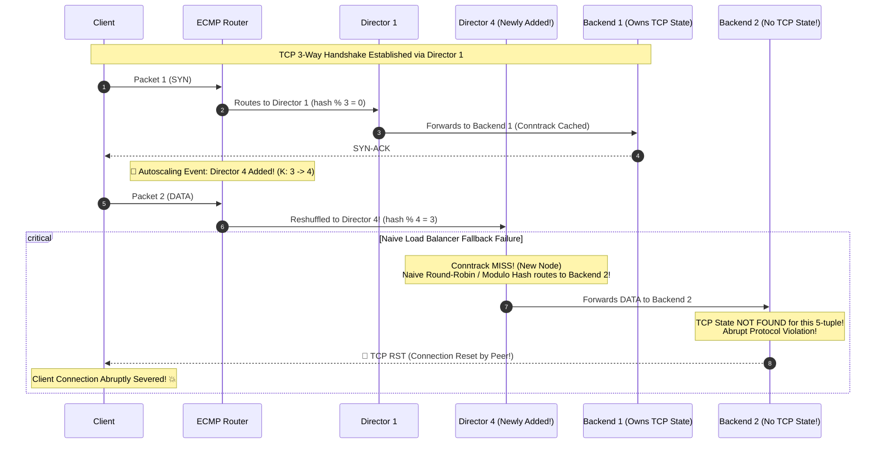

# [CS Deep Dive] BGP Anycast 라우팅과 Google Maglev 일관된 해싱(Consistent Hashing)

## 1. BGP Anycast와 ECMP(Equal-Cost Multi-Path) L4 아키텍처

현대 글로벌 CDN(Cloudflare, Fastly), 하이퍼스케일 클라우드(Google, Meta, AWS)는 수천만 PPS(Packets Per Second)의 인터넷 트래픽을 처리하기 위해 **BGP Anycast**와 **ECMP(Equal-Cost Multi-Path)** 라우팅 아키텍처를 결합하여 사용합니다.

```
                  [ Internet Client Traffic ]
                              │ (BGP Anycast VIP: 203.0.113.1)
                              ▼
                 [ Tier-1 / ToR ECMP Router ]
                hash(5-tuple) % K_directors
                 ┌────────────┼────────────┐
                 ▼            ▼            ▼
           [Director 1] [Director 2] [Director 3]  <- L4 Software LBs
                 │            │            │          (Maglev / Katran)
                 └────────────┼────────────┘
                              ▼
             [ Backend Servers (Web / API / DB) ]
             (backend-1, backend-2, backend-3, ...)
```

### 1) BGP Anycast
- 전 세계 수많은 엣지 PoP(Point of Presence) 및 데이터센터가 **동일한 단일 IP(VIP)**를 인터넷 BGP 라우팅 테이블에 공표(Advertise)합니다.
- 클라이언트의 패킷은 네트워크 거리(AS-Hop, 지연 시간)가 가장 가까운 PoP로 자동 유입됩니다.

### 2) 상위 라우터의 ECMP(Equal-Cost Multi-Path)
- 데이터센터에 들어온 패킷은 Tier-1 스위치/라우터에 도착합니다.
- 라우터는 고가의 하드웨어 로드 밸런서 대신, 여러 대의 저비용 상용 x86 소프트웨어 로드 밸런서(**L4 Director**, 예: DPDK, XDP/eBPF 기반)로 트래픽을 균등 분산합니다.
- 패킷의 5-tuple(`src_ip, src_port, dst_ip, dst_port, protocol`)을 하드웨어 해싱하여 디렉터를 선택합니다:
  $$	ext{Director Index} = 	ext{ECMP\_Hash}(5	ext{-tuple}) \pmod K$$

---

## 2. ECMP 패킷 리셔플링(Reshuffling) 참사와 TCP RST 폭발

### 왜 오토스케일링이나 디렉터 장애 시 연결이 끊어지는가?
TCP는 **상태를 유지하는(Stateful) 연결 지향 프로토콜**입니다. 클라이언트가 서버와 3-Way Handshake(`SYN` $	o$ `SYN-ACK` $	o$ `ACK`)를 맺고 데이터를 주고받는 동안, 동일한 TCP 연결의 모든 패킷은 **반드시 동일한 백엔드 서버**로 전달되어야 합니다.



### TCP RST(Reset)가 발생하는 원리
1. **ECMP 경로 재계산**:
   - 디렉터 노드가 3대에서 4대로 증설(`ADD_DIRECTOR`)되거나 1대가 죽어 2대로 축소되면, 라우터의 해시 모듈로 값($K$)이 변경됩니다.
   - 기존 연결의 약 $1 - rac{K_{	ext{old}}}{K_{	ext{new}}}$ (수십 %)의 플로우가 새로운 디렉터로 강제 리셔플링됩니다.
2. **로컬 Conntrack 미스**:
   - 신규 디렉터(Director 4)는 방금 기동되었으므로 로컬 커넥션 트래킹(Conntrack) 테이블이 완전히 비어 있습니다.
3. **백엔드 매핑 불일치와 TCP RST**:
   - 나이브 디렉터(Round-Robin, 비일관된 해시 등)는 이 패킷을 기존 `Backend 1`이 아닌 엉뚱한 `Backend 2`로 보냅니다.
   - `Backend 2`의 커널 TCP 스택은 수신한 패킷의 5-tuple에 해당하는 소켓 TCB(Transmission Control Block)를 찾지 못합니다.
   - **RFC 793 규격에 따라 커널은 즉시 TCP RST(Reset) 패킷을 반환**하며 연결을 강제 종료시킵니다!
   - 결과: L4 디렉터 한 대를 재시작하거나 스케일아웃했을 뿐인데 수십만 명의 사용자가 `Connection reset by peer` 에러를 맞고 세션이 폭파됩니다.

---

## 3. Google Maglev(NSDI '16) 일관된 해싱 알고리즘

Google은 2016년 USENIX NSDI 학회에서 전 세계 Google 트래픽을 처리하는 분산 L4 로드 밸런서 **Maglev**의 아키텍처를 공개했습니다. Maglev의 핵심은 **"모든 디렉터 노드가 Conntrack이 없어도 100% 동일한 백엔드를 찾아내도록 보장하는 일관된 해시 룩업 테이블"**입니다.

### 1) 소수 크기 룩업 테이블 ($M$)
- 룩업 테이블 크기 $M$은 반드시 **소수(Prime Number)**로 지정합니다 (예: $M = 997$, $M = 65,537$).
- 소수를 사용해야 각 백엔드의 스킵(Skip) 주기와 슬롯 인덱스가 서로소를 이루어 전체 테이블을 균등하게 순회할 수 있습니다.

### 2) 백엔드별 결정론적 순열(Permutation) 생성
각 백엔드 서버 $b \in B$에 대해 두 개의 독립적인 해시 함수 $h_1, h_2$를 이용해 오프셋(Offset)과 스킵(Skip)을 계산합니다:

$$	ext{offset} = h_1(b) \pmod M$$
$$	ext{skip} = (h_2(b) \pmod{M - 1}) + 1 \quad (	ext{단, } 1 \le 	ext{skip} < M)$$

각 백엔드는 크기 $M$의 의사 난수 순열 배열을 생성합니다:
$$	ext{permutation}[b][j] = (	ext{offset} + j 	imes 	ext{skip}) \pmod M \quad (0 \le j < M)$$

### 3) 룩업 테이블 채우기 (Round-Robin Filling)
1. 크기 $M$의 테이블 $E[0 \dots M-1]$을 빈 값(`None`)으로 초기화합니다.
2. 모든 백엔드 $b$의 순열 포인터 `next[b] = 0`으로 둡니다.
3. 테이블 $E$의 $M$개 슬롯이 전부 채워질 때까지 백엔드들을 라운드로빈으로 돌며 슬롯을 선점합니다:
   - 각 백엔드 $b$는 자신의 `permutation[b][next[b]]` 슬롯 $c$를 확인합니다.
   - 만약 $E[c]$가 아직 비어 있다면 $E[c] = b$로 채우고 다음 백엔드로 턴을 넘깁니다.
   - 이미 다른 백엔드가 선점했다면, 빈 슬롯을 찾을 때까지 `next[b]`를 증가시킵니다.

```
[ Maglev Lookup Table E of size M=997 ]
Index:   0    1    2    3    ...   995  996
Backend: [B1] [B3] [B2] [B1]  ...  [B4] [B2]
```

---

## 4. Maglev의 핵심 수학적 특성

### 1) 최대 균등성 (Maximal Uniformity)
- $M \gg N$ (백엔드 수 $N$에 비해 $M$이 충분히 큼, 통상 $M > 100 	imes N$)일 때, 각 백엔드가 차지하는 슬롯 개수는 거의 정확히 $rac{M}{N}$개로 수렴합니다.
- 백엔드 간 트래픽 쏠림(Hot-spot) 현상이 완벽히 제거됩니다.

### 2) 최소 중단성 (Minimal Disruption)
- 신규 백엔드가 추가되거나 기존 백엔드가 제거될 때:
  - 오직 변경된 백엔드에 해당하는 약 $rac{1}{N}$의 슬롯만 이동합니다.
  - 나머지 기존 백엔드들 사이에서는 슬롯의 자리바꿈(Chrun)이 전혀 발생하지 않습니다.
- 따라서 백엔드 1대를 증설하더라도 기존 연결의 80% 이상은 본래의 백엔드로 그대로 라우팅됩니다.

### 3) 0-State 결정론적 라우팅 (Stateless Resilience)
- 클러스터 내의 **모든 디렉터 노드는 동일한 알고리즘과 백엔드 목록을 가지므로 100% 동일한 Maglev 룩업 테이블 $E$**를 메모리에 보유합니다.
- 상위 ECMP 라우터가 아무리 패킷을 이 디렉터 저 디렉터로 리셔플링하더라도, 패킷을 받은 디렉터는 자신의 Maglev 테이블에서 동일한 슬롯 $s = 	ext{hash}(5	ext{-tuple}) \pmod M$을 조회하여 **항상 동일한 백엔드로 직행**시킵니다.
- Conntrack 미스가 나더라도 백엔드가 절대 바뀌지 않으므로 **TCP RST가 단 1건도 발생하지 않습니다.**

---

## 5. 프로덕션 아키텍처 비교 요약

| 비교 항목 | 나이브 라운드로빈 / 일반 모듈로 | 표준 일관된 해싱 (Ketama Hash Ring) | Google Maglev Consistent Hashing |
|---|---|---|---|
| **ECMP 리셔플 시 Conntrack 미스 처리** | 엉뚱한 백엔드 매핑 $	o$ **TCP RST 폭발** | 가상 노드 분산 불균형 가능성 | **동일 백엔드 100% 보장 $	o$ 0 TCP RST** |
| **백엔드 추가 시 슬롯 변경률** | 최대 $100\%$ 슬롯 교체 (Chrun) | 약 $rac{1}{N}$ | **수학적 최소치 $pprox rac{1}{N}$** |
| **부하 분산 균등성** | 우수함 | 가상 노드 수에 따라 10~20% 편차 | **거의 완벽한 균등성 ($< 1\%$ 편차)** |
| **메모리 룩업 시간 복잡도** | $O(1)$ | $O(\log V)$ (이진 탐색) | **$O(1)$ 단일 배열 인덱싱 (초고속 DPDK 최적화)** |
