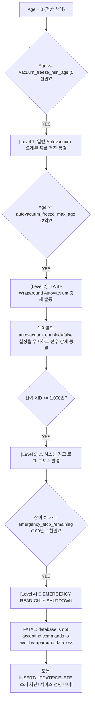

# [CS Deep Dive] PostgreSQL MVCC Transaction ID (TXID) Wraparound 재앙과 Autovacuum Freeze

## 1. 32비트 트랜잭션 ID(TXID)와 순환 비교(Circular Comparison) 공간

PostgreSQL의 MVCC(Multi-Version Concurrency Control) 엔진은 모든 튜플(Tuple)의 헤더에 생성 트랜잭션 ID인 `xmin`과 삭제/갱신 트랜잭션 ID인 `xmax`를 32비트 부호 없는 정수(Unsigned 32-bit Integer)로 기록합니다.

$$2^{32} = 4,294,967,296 \approx 42.9\text{억 개}$$

초당 수천 건의 트랜잭션을 처리하는 엔터프라이즈 환경에서 42.9억 개는 수개월~1년 만에 고갈될 수 있는 크기입니다. 이를 극복하기 위해 PostgreSQL은 32비트 정수 공간을 **원형 시계(Circular Modulo-$2^{32}$ Space)**로 취급합니다:

```
                          TXID = 0
                             │
               미래 (Future)  │  과거 (Past)
               [Invisible]   │  [Visible]
                             │
     T_current + 2^31 ───────┼─────── T_current - 2^31
                             │
                             │
                         T_current
```

### 순환 가시성 판정 공식
현재 실행 중인 트랜잭션을 $T_{\text{curr}}$, 대상 튜플의 생성 트랜잭션을 $x_{\text{min}}$이라 할 때:

$$\Delta = (T_{\text{curr}} - x_{\text{min}}) \pmod{2^{32}}$$

- **과거 데이터 (Visible)**: $\Delta < 2^{31}$ (약 21.4억 개 트랜잭션 이내에 생성된 과거 튜플은 정상 조회됨)
- **미래 데이터 (Invisible)**: $\Delta \ge 2^{31}$ (아직 커밋되지 않은 미래의 트랜잭션으로 취급되어 숨겨짐)

---

## 2. TXID Wraparound와 침묵의 데이터 유실(Silent Data Loss)

만약 데이터베이스가 동결(Freeze) 작업 없이 계속해서 $2^{31}$ (약 21.4억 개) 이상의 트랜잭션을 소비하면 어떻게 될까요?

```
[ 초기 상태 (T_curr = 1,000) ]
xmin = 100 튜플:
  Delta = (1,000 - 100) = 900 < 2^31  -->  [정상 과거 데이터 (Visible)]

[ 21.4억 트랜잭션 소비 후 (T_curr = 2,147,484,000) ]
xmin = 100 튜플:
  Delta = (2,147,484,000 - 100) = 2,147,483,900 >= 2^31 (2,147,483,648)
  -->  [미래 데이터로 판정 (Invisible!)] 💥
```

수년 전 작성된 고객의 결제 내역, 회원 정보 튜플이 삭제되지도 않았는데, **단지 시간(TXID)이 21.4억 번 흘렀다는 이유만으로 하루아침에 모든 `SELECT` 쿼리에서 증발해버리는 침묵의 데이터 유실(Silent Data Loss)**이 발생합니다.

---

## 3. 튜플 동결(Tuple Freezing)과 datfrozenxid

PostgreSQL은 이 재앙을 방지하기 위해 **튜플 동결(Tuple Freezing)** 메커니즘을 제공합니다.

### 1) FrozenTransactionId (2)
- 오래된 튜플에 대해 `xmin`을 특수한 예약 번호인 `FrozenTransactionId`($2$)로 대체하거나, 튜플 헤더의 인포마스크 플래그(`HEAP_XMIN_FROZEN`)를 활성화합니다.
- 동결된 튜플은 **"우주에 존재하는 그 어떤 트랜잭션보다 영원히 과거에 생성된 튜플"**로 정의됩니다.
- 아무리 시간이 흘러 TXID가 수백억 번 회전해도 동결된 튜플은 영원히 정상 가시성을 유지합니다.

### 2) datfrozenxid와 relfrozenxid
- 각 테이블의 메타데이터(`pg_class.relfrozenxid`): 해당 테이블 내에서 아직 동결되지 않은 가장 오래된 `xmin`.
- 데이터베이스 전체의 메타데이터(`pg_database.datfrozenxid`):
  $$\text{datfrozenxid} = \min_{t \in \text{Tables}}(\text{relfrozenxid}_t)$$
- 데이터베이스의 나이(Database Age):
  $$\text{Age} = \text{current\_xid} - \text{datfrozenxid}$$

---

## 4. 4단계 위험 수위와 긴급 셧다운 (The Approaching Wall)

PostgreSQL은 래핑어라운드 재앙을 막기 위해 4단계의 엄격한 가드레일을 두고 있습니다:



### 1) Level 1: 일반 점진적 Autovacuum (`vacuum_freeze_min_age`)
- 기본값: 50,000,000 (5천만 XID).
- 생성된 지 5천만 트랜잭션이 지난 튜플을 백그라운드 워커가 조용히 동결합니다.

### 2) Level 2: 강제 안티 래핑어라운드 Autovacuum (`autovacuum_freeze_max_age`)
- 기본값: 200,000,000 (2억 XID).
- 개발자가 성능 최적화를 핑계로 `ALTER TABLE orders SET (autovacuum_enabled = false);`를 걸어두었더라도, **PostgreSQL 커널은 이 설정을 완전히 무시하고 강제로 VACUUM FREEZE를 실행**합니다.

### 3) Level 3: 치명적 경고 발령 (Remaining XIDs $\le$ 10,000,000)
- `WARNING: database "mydb" must be vacuumed within 10000000 transactions`
- `HINT: To avoid a database shutdown, execute a database-wide VACUUM in that database.`

### 4) Level 4: 비상 읽기 전용 셧다운 (Emergency Standby Stop)
- 한계선($2^{31}$) 직전인 잔여 1,000,000 ~ 10,000,000 트랜잭션 도달 시 발동.
- 데이터 유실을 막기 위해 **데이터베이스가 모든 쓰기(INSERT, UPDATE, DELETE)를 거부**하고 즉시 읽기 전용으로 잠겨버립니다.
- 에러 메시지: `FATAL: database is not accepting commands to avoid wraparound data loss in database "mydb"`
- 해결 방법: 단일 사용자 모드(`postgres --single`)로 오프라인 점검에 들어가 수 시간 동안 `VACUUM FULL FREEZE`를 돌려야만 잠금이 풀립니다.

---

## 5. 엔터프라이즈 트러블슈팅 및 예방 가이드

1. **방치된 레거시 테이블 함정(Abandoned Table Trap)**:
   - 데이터베이스의 `datfrozenxid`는 **클러스터 내의 단 하나의 가장 오래된 테이블**에 의해 묶입니다.
   - 활성 테이블을 아무리 열심히 진공 청소해도, 수년 전 백업해두고 잊어버린 1,000행짜리 `temp_backup_2021` 테이블이 하나라도 있으면 전체 DB가 비상 셧다운에 걸립니다.
2. **장기 트랜잭션 및 유령 복제 슬롯 모니터링**:
   - `pg_stat_activity`의 장기 실행 트랜잭션, 방치된 `pg_prepared_xacts`, 비활성 `pg_replication_slots`는 autovacuum의 동결 진행을 가로막는 주범입니다.
3. **핵심 모니터링 메트릭**:
   ```sql
   -- 가장 나이가 많은 테이블 Top 5 감시
   SELECT relname, age(relfrozenxid)
   FROM pg_class
   WHERE relkind = 'r'
   ORDER BY age(relfrozenxid) DESC
   LIMIT 5;
   ```
