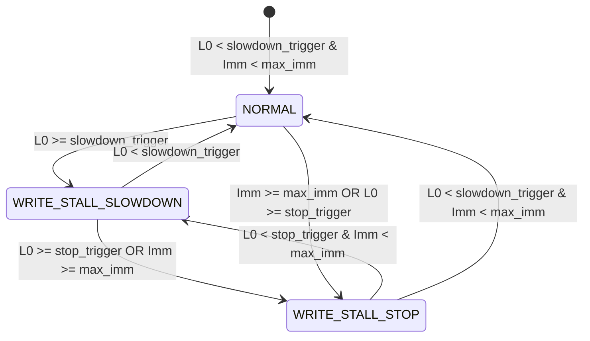

# [CS Deep Dive] LSM-Tree 스토리지 엔진과 RocksDB 라이트 스톨(Write Stall) 메커니즘

## 1. LSM-Tree(Log-Structured Merge-tree)와 RUM 콩젝트(Conjecture)

전통적인 B-Tree 인덱스는 데이터를 갱신할 때 디스크의 해당 페이지를 직접 수정하는 **In-Place Update(제자리 수정)** 방식을 취합니다. 이는 랜덤 I/O를 유발하여 대량 쓰기 환경에서 디스크 대역폭을 급격히 고갈시킵니다.

반면 LSM-Tree는 모든 쓰기(INSERT, UPDATE, DELETE)를 메모리(`MemTable`)와 순차 로그(WAL)에 **Append-Only(추가 전용)** 로 기록하여 순차 I/O의 압도적 쓰기 성능을 취합니다. 하지만 이는 공짜가 아니며, 컴퓨터 과학의 **RUM 콩젝트(Read, Update, Memory/Space Amplification Trade-off)** 가 엄격히 적용됩니다:

1. **Write Amplification (WA)**: 1바이트를 쓸 때 디스크에 실제로 기록되는 총 바이트 수 ($WA = rac{	ext{Bytes Written to Storage}}{	ext{Bytes Written by User}}$). LSM-Tree에서는 컴팩션마다 데이터를 여러 번 다시 쓰므로 WA가 10~30에 달합니다.
2. **Read Amplification (RA)**: 1건의 데이터를 읽기 위해 디스크/메모리 파일을 몇 번 조회해야 하는가?
3. **Space Amplification (SA)**: 중복 버전과 삭제 묘비(Tombstone)로 인해 디스크 공간이 부풀어 오르는 비율.

---

## 2. Level 0의 키 중첩(Overlapping Key Ranges)과 읽기 증폭

LSM-Tree의 계층 구조에서 Level 0(L0)은 가장 특별하고 위험한 계층입니다:

```
[ In-Memory MemTables ] -> Flush directly as files
           │
           ▼
[ Level 0 (L0) ]  File 1: [k10 ~ k90]   File 2: [k05 ~ k70]   File 3: [k20 ~ k99]
                  ===> KEY RANGES OVERLAP COMPLETELY!
                  ===> MUST PROBE ALL L0 FILES ON EVERY GET!
           │
           ▼ Compaction (Sort-Merge)
[ Level 1 (L1) ]  File A: [k01~k30] | File B: [k31~k60] | File C: [k61~k99]
                  ===> STRICTLY NON-OVERLAPPING SORTED RUN!
                  ===> BINARY SEARCH FINDS AT MOST 1 FILE!
```

- **L1 이상의 계층**: 각 레벨 내의 파일들은 키 범위가 완벽하게 분할(Non-overlapping)되어 있어, 이진 탐색을 통해 레벨당 정확히 1개의 파일만 검사하면 됩니다.
- **L0 계층**: MemTable이 덤프된 순서대로 만들어진 파일들이므로 **모든 L0 파일의 키 범위가 서로 겹칩니다**.
- 따라서 L0에 파일이 $N$개 쌓여 있으면 최악의 경우 **$N$개의 L0 파일을 전부 디스크에서 읽어야 하는 읽기 증폭($RA = O(N)$)** 이 발생합니다.

---

## 3. RocksDB 라이트 스톨(Write Stall) 비상 제동 원리

백그라운드 컴팩션 스레드가 L0 파일을 L1으로 제때 병합하지 못해 L0 파일이 무한정 늘어나면 시스템의 모든 읽기 요청이 마비됩니다. 이를 막기 위해 RocksDB는 **의도적으로 쓰기 속도를 제한하는 3단계 피드백 루프**를 둡니다:



### 라이트 스톨이 발생하는 3대 원인
1. **MemTable Flush Backlog**: 쓰기 속도가 너무 빨라 `immutable_memtables` 개수가 `max_write_buffer_number`에 도달했을 때 $	o$ 즉시 `STOP`.
2. **L0 File Accumulation**: L0 파일 수가 `level0_slowdown_writes_trigger`(보통 20) $	o$ `level0_stop_writes_trigger`(보통 36)에 도달했을 때.
3. **Pending Compaction Bytes**: 아직 병합되지 못한 대기 컴팩션 바이트 수가 `hard_pending_compaction_bytes_limit`(예: 256GB)를 초과했을 때.

---

## 4. 프로덕션 환경 권장 튜닝 및 아키텍처 가이드

1. **컴팩션 병렬성 증대 (`max_background_jobs`, `max_subcompactions`)**:
   - 컴팩션 스레드가 1개뿐이면 쓰기 폭주 시 즉시 스톨에 빠집니다. NVMe SSD 환경에서는 `max_background_jobs = 8` 이상으로 설정하여 다중 코어가 L0 $	o$ L1 병합을 병렬 수행하도록 해야 합니다.
2. **동적 레벨 바이트 사이징 (`dynamic_level_bytes = true`)**:
   - 고정 L1 크기(10MB) 방식 대신 최하위 레벨(L_max) 크기를 기준으로 역산하여 레벨별 타깃 크기를 동적으로 스케일링함으로써 불필요한 L0 $	o$ L1 병합 증폭비를 40% 이상 절감합니다.
3. **Write Buffer Manager를 통한 부드러운 속도 조절 (Rate Limiting Pacing)**:
   - 10만 QPS와 0 QPS를 극단적으로 오가는 핑퐁 스톨을 피하기 위해 토큰 버킷 기반의 `rate_limiter`를 장착하여 초당 쓰기 속도를 컴팩션 처리 용량에 맞추어 평활화(Smoothing)해야 합니다.
