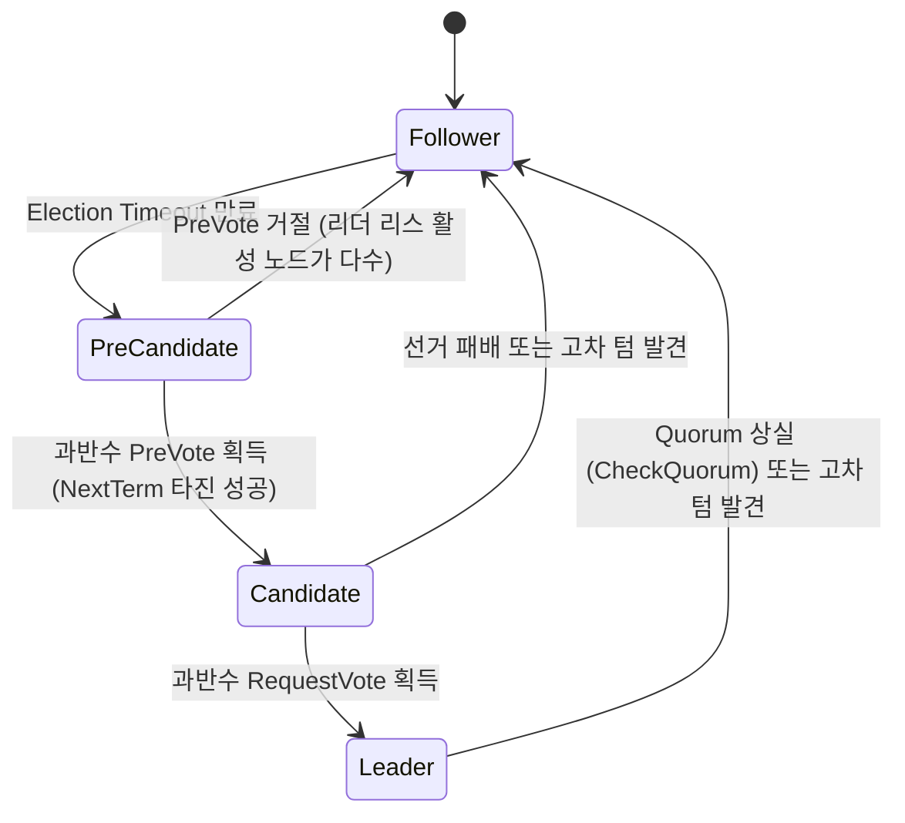

# 이론 및 백서: Raft 분산 합의 알고리즘에서의 비대칭 파티션, 디스럽티브 서버(Disruptive Server) 및 Pre-Vote / CheckQuorum 프로토콜

## 1. 개요: Raft 합의 알고리즘의 리더 선출 불변식

Raft(Diego Ongaro & John Ousterhout, 2014)는 Paxos의 난해함을 극복하고 분산 시스템의 이해 가능성(Understandability)과 상태 머신 복제(State Machine Replication, SMR)의 안전성을 보장하기 위해 설계되었습니다.

Raft의 핵심 불변식(Invariants) 중 하나는 **단조 증가 텀(Monotonically Increasing Terms)**입니다:
- 시간은 임의 길이의 논리적 텀(Term, $t \in \mathbb{N}$)으로 나뉩니다.
- 각 텀은 최대 하나의 리더(Leader)만을 가질 수 있습니다(Election Safety).
- 모든 서버는 현재 텀(`currentTerm`)을 저장하며, RPC 메시지에 항상 자신의 텀을 동반합니다.
- **표준 Raft 텀 갱신 규칙 (RFC / Thesis Section 5.1)**:
  $$\text{If } \text{RPC.term} > \text{server.currentTerm} \implies \text{server.currentTerm} \leftarrow \text{RPC.term}, \quad \text{server.state} \leftarrow \text{Follower}$$

이 규칙은 낡은(Stale) 리더를 신속하게 퇴출시키고 최신 텀의 리더가 클러스터를 장악할 수 있도록 돕는 매우 간결하고 강력한 메커니즘입니다. 그러나 **비대칭 네트워크 단절(Asymmetric Network Partition)** 상황에서는 이 규칙이 치명적인 취약점으로 작용합니다.

---

## 2. 디스럽티브 서버(Disruptive Server)와 선거 폭풍(Election Storm)

### 2.1 비대칭 파티션(Partial Partition)의 형성
5개 노드 $L, A, B, C, D$로 이루어진 클러스터에서 노드 $D$가 리더 $L$로부터의 유입 패킷(하트비트)만 유실되고, 나머지 동료 노드 $A, B, C$와는 양방향 통신이 완벽하게 유지되는 비대칭 단절을 가정합니다:

```
[비대칭 네트워크 단절 구조]
        +------------+
        |  Leader L  |
        +------+-----+
               | (Heartbeat: 200ms)
       +-------+-------+
       |       |       |
       v       v       v
     +---+   +---+   +---+
     | A |   | B |   | C |
     +---+   +---+   +---+
       ^       ^       ^
       |       |       | (양방향 RPC 통신 원활)
       +-------+-------+
               |
        +------+-----+
        | Follower D | <--- L로부터 하트비트 수신 불가 (단절)
        +------------+
```

### 2.2 장애 메커니즘 단계별 분석
1. **팔로워 D의 선거 타임아웃**:
   - $D$는 $L$의 하트비트를 받지 못하므로 `election_timeout`이 만료됩니다.
   - $D$는 Candidate 상태로 전이하고 자신의 텀을 올립니다: $\text{term}_D = \text{term}_L + 1$.
2. **RequestVote 브로드캐스트와 동료 노드의 강제 강등**:
   - $D$는 $A, B, C$에게 `RequestVote(term = term_D)`를 전송합니다.
   - $A, B, C$는 방금 전까지 리더 $L$로부터 정상 하트비트를 수신하고 있었음에도 불구하고, Raft의 텀 갱신 규칙에 따라 $\text{RPC.term} > \text{currentTerm}$ 조건을 마주합니다.
   - 따라서 $A, B, C$는 즉시 자신의 텀을 $\text{term}_D$로 올리고 리더 지위를 인정받던 $L$의 하트비트 신뢰를 끊으며 Follower 상태로 초기화됩니다.
   - 리더 $L$ 역시 높은 텀을 목격하거나 팔로워들의 거부를 접하고 Follower로 강등됩니다.
3. **후보자 D의 선출 실패**:
   - $D$는 오랫동안 로그 복제를 받지 못했으므로 로그가 뒤처져 있습니다($\text{lastLogIndex}_D < \text{lastLogIndex}_{A, B, C}$).
   - Raft의 로그 비교 규칙(Log Up-to-Date Rule, Thesis §5.4.1)에 의해 $A, B, C$는 $D$에게 투표하지 않습니다.
   - 결국 $D$는 과반수 득표에 실패하여 리더가 되지 못합니다.
4. **선거 폭풍(Election Storm)의 무한 반복**:
   - 클러스터에 리더가 없으므로 동료 노드(예: $A$)가 타임아웃 후 새 텀($\text{term}_D + 1$)으로 리더가 됩니다.
   - 그러나 $D$는 여전히 새 리더의 하트비트를 받지 못하므로 다시 타임아웃되어 $\text{term} + 1$로 선거를 시작합니다.
   - 클러스터는 영구적으로 리더 선출, 강등, 텀 증가를 반복하며 클라이언트의 쓰기 요청을 전혀 처리하지 못하는 가용성 마비 상태(`DISRUPTIVE_SERVER_LEADER_ELECTION_STORM`)에 빠집니다.

---

## 3. Pre-Vote 프로토콜 (Diego Ongaro Thesis §9.6)

Pre-Vote는 실제 텀 번호를 증가시키기 전에, 후보자가 선거에서 승리할 수 있는지 **사전 타진(Speculative Pre-Vote Phase)**하는 2단계 선거 프로토콜입니다.



### 3.1 Pre-Vote 알고리즘 상세
1. **PreCandidate 전이**:
   - 팔로워가 타임아웃되면 텀을 올리지 않고 상태만 `PreCandidate`로 전환합니다.
   - 가상 텀 `term + 1`을 담아 `PreVote(term + 1, candidateId, lastLogIndex, lastLogTerm)` RPC를 전송합니다.
2. **수신자의 PreVote 판정 규칙**:
   - 수신 노드는 다음 조건을 **모두** 만족할 때만 PreVote에 찬성(`VoteGranted = true`)합니다:
     $$\text{VoteGranted} \iff (\text{RPC.term} > \text{currentTerm}) \land (\text{RPC.log} \ge \text{my.log}) \land (\text{LeaderLeaseExpired})$$
   - 여기서 **$\text{LeaderLeaseExpired}$ 조건**이 핵심입니다:
     - 수신자가 최근 최소 선거 타임아웃(`min_election_timeout`) 이내에 유효한 리더로부터 하트비트/AppendEntries를 받았다면, 클러스터에 건전한 리더가 존재한다고 판단하여 **PreVote를 무조건 거부**합니다.
3. **디스럽티브 서버 차단 효과**:
   - 고립 노드 $D$가 PreVote를 보내더라도, 정상 작동 중인 $A, B, C$는 리더 $L$의 하트비트를 받고 있으므로 $D$의 PreVote를 거절합니다.
   - $D$는 사전 투표에서 과반수를 얻지 못하므로 정식 `Candidate`로 승격하지 않으며, 클러스터의 텀을 올리지 못합니다.
   - 기존 리더 $L$은 아무런 간섭 없이 클라이언트 쓰기를 계속 처리할 수 있습니다.

---

## 4. CheckQuorum 메커니즘 (대칭 분할 및 리더 자진 강등)

Pre-Vote가 비대칭 분할에서 고립된 팔로워가 리더를 교란하는 것을 막는다면, **CheckQuorum**은 리더가 고립되었을 때(대칭 분할) 스스로 퇴출되도록 강제하는 메커니즘입니다.

1. **리더의 하트비트 응답 추적**:
   - 리더는 주기적으로 과반수 노드로부터 하트비트 응답(ACK)을 수신했는지 확인합니다.
2. **자진 강등 (Voluntary Step Down)**:
   - 만약 한 선거 타임아웃 주기 동안 과반수의 ACK를 받지 못했다면, 자신이 네트워크 파티션으로 인해 소수 그룹(Minority)에 고립되었다고 판단합니다.
   - 리더는 즉시 Follower로 강등(`LEADER_ISOLATED_VOLUNTARY_STEPDOWN`)하여 자신에게 도착하는 쓰기 요청을 거부하고, 클라이언트가 새 리더를 찾도록 유도하여 스플릿 브레인(Split-Brain) 및 오래된 데이터 덮어쓰기를 방지합니다.

---

## 5. 실무 구현 비교 (Production Systems)

| 분산 시스템 | Pre-Vote 구현체 | CheckQuorum 지원 | 기본 활성화 여부 |
| :--- | :--- | :--- | :--- |
| **etcd (raft)** | `raft.Config.PreVote = true` | `raft.Config.CheckQuorum = true` | etcd v3.0부터 기본 활성화 |
| **CockroachDB** | etcd raft 기반 커스텀 포크 | 리스 기반 쿼럼 검증 | 활성화 |
| **TiKV (Raft Engine)** | `raft-rs` 라이브러리 | `check_quorum: true` | 활성화 |
| **Apache Ratis (Java)** | Pre-Vote RPC 핸들러 구현 | `raft.server.leader.lease.enabled` | 옵션 지원 |

이 두 메커니즘의 결합은 현대 분산 데이터베이스가 네트워크 불안정, 비대칭 지연, 부분 파티션 상황에서도 99.999%의 가용성을 유지할 수 있게 하는 핵심 초석입니다.
