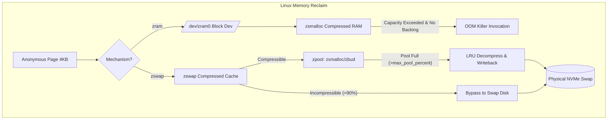

# 이론 및 백서: 리눅스 커널 압축 RAM 스왑(zswap vs zram)과 압축 풀 메모리 할당자(zsmalloc, zbud, z3fold) 및 쓰기백(Writeback) 역학

## 1. 배경: 현대 메모리 계층 구조와 스왑의 딜레마

현대 컴퓨팅 시스템에서 DRAM과 비휘발성 저장장치(NAND Flash NVMe SSD) 사이에는 여전히 약 $1,000 \sim 10,000$배의 거대한 지연시간 격차(Memory Latency Gap)가 존재합니다:
- **DRAM 읽기/쓰기**: 약 $50 \sim 100\text{ns}$
- **커널 압축/해제 (LZ4)**: 4KB 페이지당 약 $1 \sim 3\mu\text{s}$
- **초고속 PCIe Gen4 NVMe SSD 4KB 랜덤 I/O**: 약 $80 \sim 150\mu\text{s}$
- **레거시 SATA SSD**: 약 $500 \sim 1,000\mu\text{s}$

서버의 메모리가 부족할 때 전통적인 스왑(Traditional Swap)은 비활성 익명 메모리(Anonymous Pages)를 디스크로 밀어내어 물리 메모리를 확보합니다. 하지만 SSD의 I/O 지연시간으로 인해 응용 프로그램의 워킹셋이 조금만 스왑으로 넘어가도 심각한 I/O 스톨(D-state 대기)이 발생하고 서비스가 마비됩니다.

이를 극복하기 위해 리눅스 커널은 **"디스크에 쓰기 전에 남는 CPU를 사용하여 RAM 안에서 페이지를 압축하자"**는 아이디어를 도입했습니다.

---

## 2. zram vs zswap 아키텍처 비교

리눅스 커널은 메모리 압축을 위해 서로 다른 목적과 구조를 가진 두 가지 서브시스템을 제공합니다:

| 비교 항목 | **zram** (구 compcache) | **zswap** |
| :--- | :--- | :--- |
| **성격** | 독립적인 가상 블록 디바이스 (`/dev/zramX`) | 물리 스왑 장치 앞단의 압축 쓰기백 캐시 |
| **스왑 디스크 필요 여부** | 불필요 (순수 RAM에서 동작) | **필수 (Backing Swap Device 전제)** |
| **메모리 초과 시 동작** | 기본적으로 스왑 거부 $\to$ 즉시 **OOM Killer** 호출 | LRU 기반으로 압축을 풀어 물리 스왑으로 **Writeback** |
| **주요 사용처** | 안드로이드 스마트폰, ChromeOS, 저사양 임베디드 | 클라우드 서버, K8s 워커 노드, 고성능 엔터프라이즈 |
| **커널 도입 시기** | Linux 3.14 (정식 스테이징 해제) | Linux 3.11 |

---

## 3. 압축 메모리 풀 할당자(zpool Allocator) 비교

압축된 4KB 페이지는 크기가 제각각(예: 850바이트, 1420바이트, 2300바이트 등)이므로 표준 버디 할당자(`page_alloc`)나 고정 크기 슬랩(`slab`)을 그대로 사용할 수 없습니다. 리눅스 커널은 이를 위해 `zpool` 추상화 계층 아래 특수 할당자들을 개발했습니다:

### 3.1 zbud (2:1 바운드 할당자)
- **설계 철학**: 결정론적(Deterministic) 공간 보장.
- 한 개의 물리 4KB 페이지에 **최대 2개의 압축 청크**만 저장합니다.
- **치명적 단점 (내부 단편화)**:
  - 만약 압축된 페이지 크기가 2048바이트보다 크면(예: 2200바이트), 나머지 1896바이트 공간에는 어떠한 청크도 들어갈 수 없어 1개 페이지 전체를 낭비합니다.
  - 이로 인해 압축률이 보통 수준(0.5 ~ 0.7)인 워크로드에서는 실제 메모리 소모가 2배로 폭증하여 조기 축출(`ZBUD_ALLOCATOR_FRAGMENTATION_PREMATURE_EVICTION`)이 발생합니다.

### 3.2 z3fold (3:1 바운드 할당자)
- 한 개의 4KB 페이지에 **최대 3개의 압축 청크**를 담을 수 있도록 확장된 할당자입니다.
- 단편화는 `zbud`보다 개선되었으나 락 경합 및 페이지 압축/이동 복잡도가 높습니다.

### 3.3 zsmalloc (현대적 크기 클래스 할당자)
- **설계 철학**: 고밀도 패킹과 외부 단편화 최소화.
- 크기별 클래스(Size Classes)를 나누고 다중 페이지(Multi-page `zspage`)를 결합하여 압축 청크를 조밀하게 패킹합니다.
- 조각 모음(Compaction)과 마이그레이션을 지원하여 메모리 저장 효율이 85~95%에 달합니다.
- Android 및 현대 Linux 배포판에서 기본으로 권장되는 최적 할당자입니다.

---

## 4. zswap의 쓰기백(Writeback) 및 압축 거부(Rejection) 역학

### 4.1 비압축성 데이터 거부 (Incompressible Page Reject)
암호화된 데이터, 압축된 이미지/동영상, 랜덤 바이너리 등은 LZ4나 ZSTD로 압축해도 크기가 거의 줄어들지 않습니다.
- zswap은 압축 후 크기가 원본의 90% 이상(`effective_ratio >= 0.90`)이면 저장을 거부합니다(`zswap_reject_incompressible`).
- 이 페이지는 메모리 풀에 저장되지 않고 즉시 물리 스왑 장치로 직행(Bypass)합니다.
- 만약 시스템의 대다수 데이터가 비압축성이라면, CPU 사이클만 낭비되고 물리 I/O는 그대로 발생하는 참사(`INCOMPRESSIBLE_DATA_ZSWAP_BYPASS_THRASHING`)가 발생합니다.

### 4.2 풀 포화와 LRU 쓰기백 (Pool Saturation & Writeback)
zswap 메모리 풀이 허용 한도(`max_pool_percent * total_ram`)에 도달하면:
1. zswap 풀 내부의 LRU 큐에서 가장 오래된 엔트리를 선택합니다.
2. 엔트리를 메모리 상에서 **압축 해제(Decompress)**하여 원래의 4KB 페이지로 복원합니다.
3. 복원된 페이지를 물리 스왑 장치(NVMe/SSD)로 비동기/동기 쓰기를 수행합니다(`zswap_writeback_pages`).
4. zpool에서 해당 엔트리를 제거하여 신규 유입 페이지를 위한 공간을 확보합니다.
- **물리 스왑 장치가 없는 경우(`swap_disk_type == "NONE"`)**: 쓰기백 대상을 보낼 곳이 없으므로 커널은 신규 스왑 아웃을 포기하고 즉시 OOM Killer를 트리거합니다(`ZSWAP_POOL_EXHAUSTION_NO_BACKING_SWAP`).

---

## 5. 압축 알고리즘: LZ4 vs ZSTD

| 알고리즘 | 압축 속도 | 해제 속도 | 압축률 | CPU 오버헤드 | 권장 환경 |
| :--- | :--- | :--- | :--- | :--- | :--- |
| **LZ4** | $\approx 700 \text{ MB/s}$ | $\approx 3,000 \text{ MB/s}$ | 중간 ($1.8 \sim 2.5\times$) | 극도로 낮음 | 고성능 저지연 서버, K8s 노드 |
| **ZSTD** | $\approx 250 \text{ MB/s}$ | $\approx 1,200 \text{ MB/s}$ | 높음 ($2.5 \sim 3.5\times$) | 중간 | 메모리 제약이 극심한 엣지 노드 |
| **LZO** | $\approx 400 \text{ MB/s}$ | $\approx 800 \text{ MB/s}$ | 레거시 | 보통 | 구형 커널 기본값 |

현대 엔터프라이즈 환경에서는 **`zswap` + `zsmalloc` + `LZ4`**의 조합이 CPU 오버헤드를 2% 미만으로 억제하면서 디스크 스왑 I/O의 80~100%를 방어하는 사실상의 표준(De Facto Standard)으로 자리잡고 있습니다.
