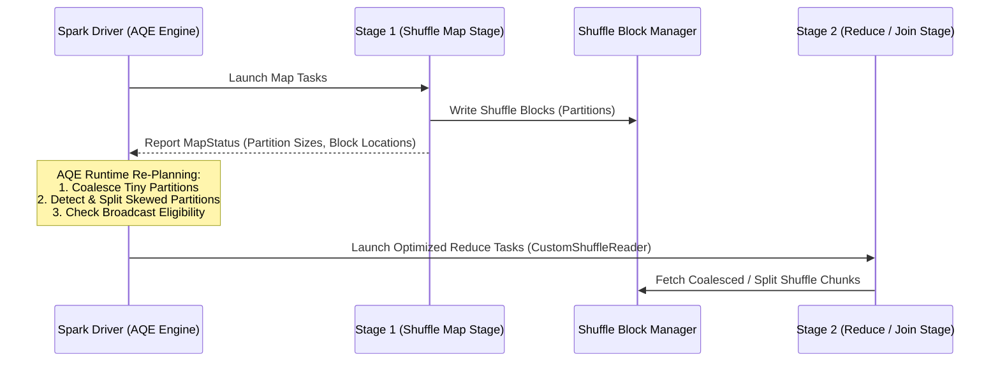

# 이론 및 백서: Apache Spark 적응형 쿼리 실행(AQE) 아키텍처와 스큐 조인(Skew Join) 최적화 및 동적 파티션 병합

## 1. 배경: 정적 쿼리 최적화(Static Query Optimization)의 한계

전통적인 빅데이터 쿼리 엔진(Hive, Presto, Spark 2.x 이전)은 쿼리 제출 시점의 정적 통계(카탈로그 메타데이터, 카디널리티 추정치)만을 기반으로 실행 계획(Physical Plan)을 생성합니다. 그러나 정적 플래닝은 현실 데이터 파이프라인에서 필연적인 결함에 직면합니다:

1. **필터링 및 UDF 이후의 데이터 크기 왜곡**:
   - 복잡한 WHERE 조건이나 사용자 정의 함수(UDF)를 통과한 후 데이터가 99.9% 걸러질지, 아니면 그대로 유지될지 정적 컴파일러는 알 수 없습니다.
2. **고정 셔플 파티션 수의 딜레마 (`spark.sql.shuffle.partitions`)**:
   - 파티션을 2000개로 크게 잡으면: 대용량 데이터는 잘 돌지만 소형 데이터셋에서는 수천 개의 마이크로 태스크가 생성되어 드라이버 태스크 스케줄링과 블록 전송 오버헤드로 클러스터가 질식합니다.
   - 파티션을 50개로 작게 잡으면: 소형 데이터셋은 빠르지만 대용량 데이터에서 개별 파티션 크기가 수 기가바이트로 폭증하여 메모리 스필과 OOM 크래시가 발생합니다.
3. **데이터 편중(Data Skew)과 스트래글러(Straggler)**:
   - 지프의 법칙(Zipf's Law)이나 파레토 법칙에 따라 현실 데이터의 80%는 상위 20%의 키(예: 널값, 봇 트래픽, 인기 검색어)에 집중됩니다.
   - 해시 파티셔닝 시 핫키(Hot-key)가 1개 파티션으로 몰리면 99개 태스크는 수 초 만에 끝나지만, 1개 태스크가 1시간 동안 디스크 스필을 반복하며 전체 잡을 붙잡고 늘어집니다.

---

## 2. Spark 3.0+ AQE(Adaptive Query Execution) 핵심 아키텍처

AQE는 스테이지(Stage) 경계(Shuffle Boundary)에서 실제 디스크/메모리에 영속화된 셔플 데이터의 런타임 통계(`MapStatus`)를 수집하고, 이를 기반으로 **후속 스테이지의 물리 실행 계획을 실시간 재최적화(Re-plan)**합니다.

AQE의 3대 핵심 서브시스템:
1. **Dynamically Coalescing Shuffle Partitions**: 인접한 소형 파티션들을 런타임에 동적으로 병합.
2. **Dynamically Handling Skew Joins**: 비정상적으로 거대한 스큐 파티션을 여러 개의 서브 태스크로 분할.
3. **Dynamically Switching Join Strategies**: 필터링 후 크기가 임계치 이하로 줄어든 테이블을 런타임에 브로드캐스트 해시 조인(BHJ)으로 전환.

---

## 3. 스큐 조인(Skew Join) 분할 알고리즘 상세

### 3.1 스큐 파티션 탐지 수학
Spark AQE는 파티션 $P_i$가 다음 두 조건을 **동시에** 만족할 때 스큐 파티션으로 선언합니다:
$$\text{IsSkewed}(P_i) \iff (\text{Size}(P_i) \ge \text{skew\_threshold}) \;\land\; (\text{Size}(P_i) \ge \text{Median}(\{P\}) \times \text{skew\_factor})$$
- `spark.sql.adaptive.skewJoin.skewedPartitionThresholdInBytes` (기본 256MB)
- `spark.sql.adaptive.skewJoin.skewedPartitionFactor` (기본 5.0)

### 3.2 조인 분할 및 복제(Replicate-and-Split) 메커니즘
스큐 파티션 $P_{\text{skew}}$(크기 $S$)가 우측 테이블 $R$에 존재하고, 대응하는 좌측 테이블 파티션을 $L_{\text{skew}}$라고 할 때:

1. **우측 파티션 분할**:
   $$N = \left\lceil \frac{S}{\text{advisory\_partition\_size}} \right\rceil$$
   $P_{\text{skew}}$를 $N$개의 균등한 서브 파티션 $P_{\text{skew}}^{(1)}, P_{\text{skew}}^{(2)}, \dots, P_{\text{skew}}^{(N)}$으로 나눕니다.
2. **좌측 파티션 복제**:
   좌측 파티션 $L_{\text{skew}}$를 $N$번 복제(Read Replication)합니다.
3. **병렬 조인 태스크 실행**:
   $$T_k = \text{Join}(L_{\text{skew}}, P_{\text{skew}}^{(k)}) \quad (k = 1, \dots, N)$$
   $N$개의 분할 태스크가 클러스터의 여러 익스큐터 코어에 병렬로 스케줄링됩니다.
4. **효과**:
   - 단일 코어의 메모리 한도를 초과하지 않으므로 **디스크 스필(Disk Spill)이 0건**으로 제거됩니다.
   - 단일 태스크의 실행 시간이 $\frac{1}{N}$ 수준으로 단축되어 스트래글러가 완벽히 소멸합니다.

---

## 4. 셔플 파티션 동적 병합 (Dynamic Partition Coalescing)

- 사용자가 `spark.sql.shuffle.partitions`를 2,000 등 넉넉하게 설정하더라도, AQE는 셔플 직후 생성된 파티션 크기를 검사합니다.
- 인접한 파티션들의 합이 `spark.sql.adaptive.advisoryPartitionSizeInBytes`(기본 64MB)에 도달할 때까지 파티션들을 하나로 묶는 `CustomShuffleReaderExec` 연산자를 주입합니다.
- 결과적으로 2,000개로 쪼개졌던 셔플이 단 10~20개의 고효율 파티션으로 병합되어 불필요한 태스크 스케줄링 오버헤드와 네티(Netty) RPC 폭풍을 방지합니다.

---

## 5. 실무 Spark AQE 핵심 튜닝 가이드

| 설정 파라미터 | 권장 기본값 | 설명 |
| :--- | :--- | :--- |
| `spark.sql.adaptive.enabled` | `true` | Spark 3.2부터 기본 true이나 명시적 확인 필수 |
| `spark.sql.adaptive.coalescePartitions.enabled` | `true` | 소형 셔플 파티션 동적 병합 |
| `spark.sql.adaptive.advisoryPartitionSizeInBytes` | `64m` ~ `128m` | 병합 및 스큐 분할 목표 크기 |
| `spark.sql.adaptive.skewJoin.enabled` | `true` | 스큐 조인 동적 감지 및 분할 |
| `spark.sql.adaptive.skewJoin.skewedPartitionFactor` | `5` | 중앙값 대비 스큐 배수 (노이즈 방지) |
| `spark.sql.adaptive.autoBroadcastJoinThreshold` | `10m` ~ `50m` | 런타임 셔플 후 BHJ 전환 한도 |

AQE의 도입은 고정 파티션 튜닝에 시달리던 데이터 엔지니어링의 생산성을 혁신하고, 롱테일 지연으로 인한 파이프라인 지연을 근원적으로 해결한 현대 빅데이터 시스템의 핵심 설계 패턴입니다.
