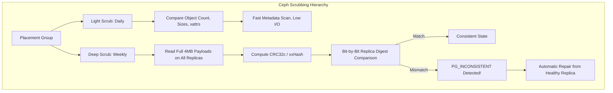

# 이론 및 백서: 분산 스토리지 Ceph/ZFS 침묵의 데이터 부패(Silent Bit-Rot)와 딥 스크러빙(Deep Scrub) 및 I/O 우선순위 스케줄링

## 1. 개요: 침묵의 데이터 부패(Silent Data Corruption)의 실체

현대 엔터프라이즈 스토리지 환경에서 가장 치명적인 재앙 중 하나는 하드웨어가 에러 신호를 전혀 보내지 않은 채 데이터 비트만 조용히 변조되는 **침묵의 데이터 부패(Silent Bit-Rot)**입니다.

CERN(유럽 입자 물리 연구소)과 NetApp의 대규모 디스크 신뢰성 연구에 따르면:
- 연간 수만 대의 엔터프라이즈 HDD/SSD 중 약 **0.05% ~ 0.5%**에서 컨트롤러 에러 없이 비트가 변조되는 현상이 관측됩니다.
- **물리적 원인**:
  1. 우주 방사선(Cosmic Rays) 및 알파 입자에 의한 SRAM/DRAM 캐시 비트 플립
  2. 자기 디스크 플래터 자성 감쇄 및 산화물 분해
  3. 플래시 메모리 플로팅 게이트(Floating Gate) 산화막 전하 누설
  4. 드라이브 내부 펌웨어 버그로 인한 가짜 쓰기 완료(Lost Writes / Misdirected Writes)
- **전통적 파일시스템(ext4, XFS)의 한계**:
  - 메타데이터에 일부 체크섬을 포함할 수 있으나 유저 데이터 페이로드 전체에 대한 종단간(End-to-End) 체크섬 검증 기능이 부재합니다. 디스크가 손상된 섹터를 읽어 넘겨주어도 OS는 이를 정상 데이터로 간주하고 애플리케이션으로 전달합니다.

---

## 2. Ceph 스토리지의 2단계 스크러빙 계층

Ceph의 배치 그룹(Placement Group, PG) 엔진은 데이터 무결성을 보장하기 위해 2단계 검사 체계를 구축하고 있습니다:



### 2.1 라이트 스크러빙 (Light Scrub)
- 주기: 매일 1회
- 동작: 모든 OSD 복제본 간의 오브젝트 목록, 파일 크기, 확장 속성(xattr, omap) 등의 메타데이터만 상호 비교합니다.
- 장점: 디스크 I/O와 CPU 소모가 극히 적어 운영 중 상시 수행 가능.
- 한계: 페이로드 내부의 1비트 손상은 감지 불가능.

### 2.2 딥 스크러빙 (Deep Scrub)
- 주기: 기본 7일마다 1회
- 동작: 각 OSD가 디스크에서 오브젝트 전체 데이터 블록을 전수 읽어 들여 **CRC32c(Castagnoli)** 다항식 체크섬을 계산하고, 프라이머리 OSD가 세컨더리 복제본들의 체크섬과 바이트 단위로 교차 검증합니다.
- 장점: 단 1비트의 손상도 완벽히 적발(`PG_INCONSISTENT`).
- 비용: 수 테라바이트의 연속 읽기 I/O를 유발하여 디스크 병목 유발.

---

## 3. 백그라운드 I/O 쓰로틀링과 서비스 SLA 보호

딥 스크러빙이 유저의 실시간 쿼리 및 트랜잭션과 경쟁하게 되면 P99 읽기 지연시간이 10배 이상 폭증합니다. 이를 완화하기 위한 Ceph와 Linux 커널의 공조 기법:

### 3.1 시간대 제한 (Time Window)
```ini
[osd]
osd_scrub_begin_hour = 23   # 23:00 시작
osd_scrub_end_hour = 6      # 06:00 종료
osd_scrub_during_recovery = false
```
클라이언트 트래픽이 최저점인 심야 시간에만 스크러빙을 허용합니다.

### 3.2 청크 간 슬립(Sleep)과 레이트 리미팅
```ini
osd_scrub_sleep = 0.1       # 청크 작업마다 100ms 슬립 주입
osd_scrub_chunk_max = 25    # 한 번에 잠그는 최대 오브젝트 수
```
연속적인 디스크 큐 포화를 방지하고 클라이언트 I/O 요청이 디스크 스케줄러를 우선 선점할 수 있도록 인터리빙 공간을 제공합니다.

### 3.3 Linux 커널 I/O 스케줄러 우선순위 (`ionice`)
- 스크러빙 워커 스레드에 **IDLE I/O 클래스 (`ionice -c 3`)**를 부여하여, 시스템에 클라이언트 I/O 요청이 단 하나라도 대기 중이면 스크러빙 읽기 디스크 요청을 전면 일시정지시킵니다.

---

## 4. 자가 치유(Self-Healing) 및 자동 복구 역학

1. **불일치 발견 (`PG_INCONSISTENT`)**:
   - 딥 스크러빙 중 프라이머리 복제본과 세컨더리 복제본 간의 체크섬 불일치가 확인되면 해당 PG는 즉시 비정상 경고 상태로 마킹됩니다.
2. **권위 복제본(Authoritative Replica) 판정**:
   - 3-Way 복제 환경에서 2개 복제본의 CRC가 일치하고 1개만 다른 경우, 다수결 원칙 및 버전 타임스탬프를 통해 정상 복제본을 권위 복제본으로 지정합니다.
3. **무중단 블록 덮어쓰기 (`ceph pg repair`)**:
   - 정상 복제본으로부터 정상 청크를 네트워크 스트리밍으로 수신하여 손상된 OSD의 섹터에 즉시 덮어씁니다.
   - 복구가 완료되면 클러스터 헬스는 `HEALTH_OK`로 자동 복구되며, 데이터 손실률은 0%를 유지합니다.
   - 단, 모든 복제본이 손상되었거나 잔여 복제본이 없을 경우 영구 결손(`BIT_ROT_DETECTED_PERMANENT_DATA_LOSS`)으로 기록되어 백업 복구가 요구됩니다.
