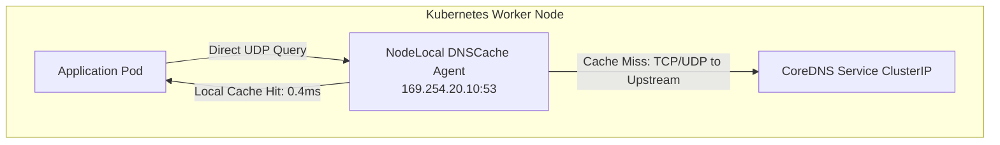

# 이론 및 백서: 쿠버네티스 5초 DNS 지연 장애와 Linux Netfilter Conntrack UDP Race Condition 및 NodeLocal DNSCache

## 1. 개요: 전설적인 Kubernetes #56903 이슈의 실체

쿠버네티스 운영 환경에서 수많은 SRE와 백엔드 엔지니어들을 괴롭혀 온 가장 대표적인 미스터리 장애는 **"간헐적으로 특정 API 요청이 정확히 5초 동안 멈춘다"**는 현상입니다.

이는 쿠버네티스 자체의 버그가 아니라, 리눅스 표준 C 라이브러리인 **GNU libc (glibc)**의 리졸버 구현과 리눅스 커널의 네트워크 필터 프레임워크인 **Netfilter / conntrack**의 연결 추적 메커니즘이 결합되어 발생하는 구조적 **경쟁 상태(Race Condition)**입니다.

---

## 2. 장애 발생 메커니즘 상세 분석

```
[Linux Kernel Netfilter Conntrack Tuple Insertion Flow]

Socket: (src_ip:port_49152 -> 10.96.0.10:53 UDP)
                     │
         ┌───────────┴───────────┐
         │                       │
Packet 1 (A Query)      Packet 2 (AAAA Query)
[Handled on Core 1]     [Handled on Core 2]
         │                       │
PREROUTING (NAT):       PREROUTING (NAT):
DNAT -> CoreDNS Pod 1   DNAT -> CoreDNS Pod 2
         │                       │
POSTROUTING:            POSTROUTING:
__nf_conntrack_confirm  __nf_conntrack_confirm
         │                       │
   [1st Lock & Insert]     [2nd Lock & Collision Detected!]
   Tuple: SUCCESS!         Tuple: NF_CT_CONFIRM_FAILED -> NF_DROP!
                                 │
                           [Silent Drop!]
```

### 2.1 glibc의 비동기 소켓 재사용 (Single Socket A & AAAA)
- 표준 glibc `getaddrinfo()`는 IPv4(`A`)와 IPv6(`AAAA`) 레코드를 동시에 조회하기 위해 동일한 UDP 소켓 파일 디스크립터에서 연속으로 2개의 `sendto()` 시스템 콜을 호출합니다.
- 따라서 두 패킷은 **발신지 IP, 발신지 포트, 목적지 ClusterIP(`10.96.0.10`), 목적지 포트(`53`), 프로토콜(`UDP`)**이 완전히 동일합니다.

### 2.2 Netfilter conntrack의 확인 단계 (Confirmation Race)
- 리눅스 커널의 Netfilter는 패킷의 NAT를 처리하고 연결 상태를 추적하기 위해 `nf_conntrack` 모듈을 사용합니다.
- 패킷이 라우팅을 마치고 네트워크 인터페이스로 나가기 직전, `POSTROUTING` 훅에서 `__nf_conntrack_confirm()` 함수가 호출되어 튜플을 전역 해시 테이블에 삽입합니다.
- **충돌 조건**:
  - 패킷 1과 패킷 2가 멀티코어 CPU의 서로 다른 코어에서 동시 처리될 때, 두 패킷은 NAT 이전의 오리지널 5-튜플이 동일합니다.
  - 코어 1이 먼저 락을 획득하고 패킷 1의 conntrack 엔트리를 성공적으로 등록합니다.
  - 코어 2가 거의 동시에 패킷 2의 엔트리를 등록하려 할 때, 커널은 동일한 소켓 튜플에 대해 이미 등록된 엔트리가 존재함을 발견하고 충돌(`NF_CT_CONFIRM_FAILED`)로 판정합니다.
  - 커널은 패킷 2를 즉시 **폐기(Silent Drop, NF_DROP)**하고 `insert_failed` 카운터를 증가시킵니다.

### 2.3 5초의 저주: glibc의 재전송 타임아웃
- UDP는 비연결형 프로토콜이므로 커널이 패킷을 드롭해도 송신자에게 아무런 에러(RST나 ICMP)를 돌려주지 않습니다.
- glibc의 `/etc/resolv.conf` 기본 타임아웃은 `timeout: 5` (5.0초)로 하드코딩되어 있습니다.
- 따라서 glibc 리졸버는 5초 동안 멍하니 응답을 기다리다가, 타임아웃이 만료된 후 재전송(Retransmit)을 수행하여 그제야 응답을 받게 됩니다.
- 결과적으로 애플리케이션의 P99 응답 시간은 평소 2ms에서 **5,005ms**로 폭증합니다.

---

## 3. 해결책 및 진화 과정

### 3.1 임시 방편 (Workarounds)
1. **`options single-request-reopen`**:
   - `/etc/resolv.conf`에 설정 주입.
   - A 질의와 AAAA 질의 사이에 소켓을 닫고 서로 다른 임시 포트로 재생성하여 전송.
   - 충돌은 피하지만 소켓 생성/해제 오버헤드와 직렬화 지연이 발생함.
2. **`options single-request`**:
   - A와 AAAA 질의를 순차적으로 직렬화하여 동일 소켓에서 교대로 전송.

### 3.2 영구적 아키텍처 해결책: NodeLocal DNSCache
쿠버네티스 SIG-Network가 공식 채택한 최선의 표준 아키텍처입니다:



1. **로컬 더미 인터페이스 바인딩**:
   - 각 노드에 데몬셋(DaemonSet)으로 가동되며 로컬 루프백 더미 IP(`169.254.20.10:53`)를 바인딩합니다.
2. **iptables DNAT 및 conntrack 우회**:
   - 파드는 원격의 Service ClusterIP 대신 노드 로컬의 169.254.20.10으로 직접 질의합니다.
   - 로컬 인터페이스 통신은 iptables DNAT와 conntrack을 거치지 않으므로 튜플 충돌 레이스 컨디션이 원천 차단됩니다.
3. **압도적인 성능 향상**:
   - 클러스터 전체 DNS 질의의 80~95%가 로컬 캐시에서 즉시 반환(0.4ms).
   - CoreDNS 파드로 향하는 네트워크 트래픽 및 conntrack 테이블 점유율을 90% 이상 절감.
