# 이론 및 백서: 데이터베이스 부분 쓰기(Torn Page Write)와 크래시 복구: MySQL Doublewrite Buffer, PostgreSQL FPW 및 NVMe Atomic Writes

## 1. 개요: 하드웨어 섹터와 데이터베이스 페이지의 불일치

관계형 데이터베이스 시스템(RDBMS)의 핵심 약속은 ACID 원자성(Atomicity)과 지속성(Durability)입니다. 트랜잭션이 커밋되면 변경 사항은 디스크의 로그(WAL / Redo Log)에 영속화되어야 하며, 이후 정전이나 OS 크래시가 발생하더라도 데이터는 완벽히 복원되어야 합니다.

그러나 RDBMS는 **물리 하드웨어의 입출력 단위와 데이터베이스의 논리적 관리 단위 간의 거대한 격차**라는 근원적 취약점을 안고 있습니다:
- **물리 섹터(Sector) 단위**: 레거시 HDD/SSD는 512바이트, 현대 Advanced Format(4Kn) 드라이브는 **4KB(4,096 Bytes)**입니다.
- **데이터베이스 페이지(Page) 단위**:
  - MySQL InnoDB: **16KB** (4개 물리 섹터)
  - PostgreSQL: **8KB** (2개 물리 섹터)
  - Oracle: **8KB 또는 16KB**

저장장치 컨트롤러는 단일 섹터(4KB)의 쓰기 원자성만을 물리적으로 보장합니다. 따라서 16KB 페이지를 디스크 파일(`.ibd`)에 기록하는 도중 전원이 차단되면, 1개~3개의 섹터만 기록되고 나머지는 기록되지 않는 **부분 페이지 쓰기(Torn Page Write / Partial Write)**가 발생합니다.

---

## 2. 왜 표준 WAL Redo Log만으로 찢어진 페이지를 복구할 수 없는가?

초보 엔지니어들은 흔히 *"WAL/Redo Log가 있으니 디스크 페이지가 깨져도 로그를 다시 돌리면 되지 않느냐?"*고 반문합니다. 하지만 이는 데이터베이스 로깅의 본질을 오해한 것입니다:

### 2.1 Physiological Logging (물리적-논리적 로깅)
대다수 현대 RDBMS의 Redo Log는 성능과 디스크 용량을 위해 **Physiological Log Record** 방식을 채택합니다:
- 전체 16KB를 매 트랜잭션마다 쓰는 대신, *"페이지 번호 1024번의 슬롯 3에 80바이트 레코드를 삽입하라"* 또는 *"오프셋 512부터 20바이트를 0xAA로 변경하라"*는 델타 변경분만을 기록합니다.

### 2.2 베이스 페이지 온전성 전제(Base Page Integrity Invariant)
$$\text{State}_{t+1} = \text{Apply}(\text{State}_t, \text{RedoDelta})$$
- 델타를 적용하여 올바른 최신 상태를 도출하려면, 디스크에 남아있는 기본 페이지($\text{State}_t$)가 **과거의 어느 한 시점에서 물리적으로 완전히 유효한 페이지**여야 합니다.
- 만약 앞쪽 8KB는 10시 시점의 새 데이터이고 뒤쪽 8KB는 9시 시점의 과거 데이터라면, 페이지 내부의 B+Tree 슬롯 배열, 힙 레코드 오프셋, 체크섬, LSN(Log Sequence Number)이 완전히 뒤엉켜 있습니다.
- 이 상태에서 델타 레코드를 적용하면 엉뚱한 메모리 오프셋을 덮어써서 인덱스 링크드 리스트가 끊어지고, 데이터베이스는 치명적 손상(`Page Corrupted, Aborting Recovery`)을 선언하며 영구 정지합니다.

---

## 3. 솔루션 비교: InnoDB vs PostgreSQL vs NVMe Atomic Writes

```mermaid
graph TD
    subgraph MySQL InnoDB
        D_PAGE[Dirty 16KB Page] --> DWB[(Doublewrite Buffer on Disk)]
        DWB -->|1. Sequential fsync| DWB_OK[DWB fsync Confirmed]
        DWB_OK -->|2. Random Write| IBD[(Tablespace .ibd)]
        IBD -. Crash & Torn Page .-> DWB_RESTORE[Restore pristine 16KB from DWB!]
        DWB_RESTORE --> REDO[Replay Physiological Redo Log]
    end

    subgraph PostgreSQL
        PG_PAGE[Dirty 8KB Page] -->|First modification after Checkpoint| WAL[(WAL Full Page Image)]
        WAL -. Crash & Torn Page .-> WAL_RESTORE[Restore pristine 8KB from WAL FPI!]
        WAL_RESTORE --> WAL_REDO[Replay Subsequent Delta WAL]
    end
```

### 3.1 MySQL InnoDB Doublewrite Buffer
- **동작 원리**:
  1. 버퍼 풀에서 더티 페이지를 디스크로 내보낼 때, 먼저 시스템 테이블스페이스 내의 연속된 블록인 **Doublewrite Buffer**에 16KB 단위로 순차 기록하고 `fsync`를 수행합니다.
  2. 그 후 각 페이지를 원래 테이블스페이스(`.ibd`) 파일의 랜덤 위치에 기록합니다.
  3. `.ibd`에 쓰던 중 전원이 나가 16KB 페이지가 찢어지더라도, 크래시 복구 시 InnoDB는 Doublewrite Buffer에서 손상되지 않은 온전한 16KB 페이지를 읽어와 `.ibd`의 찢어진 페이지를 덮어씁니다.
  4. 온전해진 베이스 페이지 위에 Redo Log를 정상 재생합니다.
- **트레이드오프**: 모든 더티 페이지를 2번 기록하므로 **디스크 쓰기 증폭(Write Amplification)이 약 2.0배** 발생합니다.

### 3.2 PostgreSQL Full Page Writes (`full_page_writes = on`)
- **동작 원리**:
  1. 체크포인트(Checkpoint) 직후 어떤 페이지가 처음으로 더티가 되면, 변경 델타만 쓰는 것이 아니라 **8KB 전체 페이지 이미지(FPI, Full Page Image)**를 WAL 레코드에 통째로 덤프합니다.
  2. 크래시 복구 시 찢어진 페이지가 감지되면 WAL에 저장된 최초의 8KB 완전체를 덮어씌워 베이스를 복구하고, 그 이후의 델타 WAL을 적용합니다.
- **트레이드오프**: 체크포인트 직후 대량의 8KB FPI가 WAL로 유입되어 일시적인 **WAL 쓰기 폭증(WAL Bloat / Checkpoint Spikes)**이 발생합니다.

### 3.3 현대 엔터프라이즈 NVMe 하드웨어 원자적 쓰기 (Atomic Write Units)
- 엔터프라이즈 NVMe 1.4+ 사양은 전원 차단 보호(PLP, Power Loss Protection) 캐패시터와 함께 **AWUN (Atomic Write Unit Normal)** 및 **AWUPF (Atomic Write Unit Power Fail)** 속성을 제공합니다.
- 드라이브가 16KB 이상의 원자적 쓰기를 하드웨어 수준에서 보장(`atomic_write_unit_max >= 16KB`)하면 OS나 DB가 아무리 정전으로 꺼져도 16KB 페이지는 전부 써지거나 전혀 안 써지는 둘 중 하나만 발생하며, 중간에 찢어지는 일은 물리적으로 불가능합니다.
- 따라서 하드웨어 원자적 쓰기 환경에서는 **`innodb_doublewrite = 0`** 또는 **`full_page_writes = off`**로 안전하게 끌 수 있어, 데이터 안정성을 100% 사수하면서 디스크 쓰기 대역폭을 2배로 절감할 수 있습니다.
