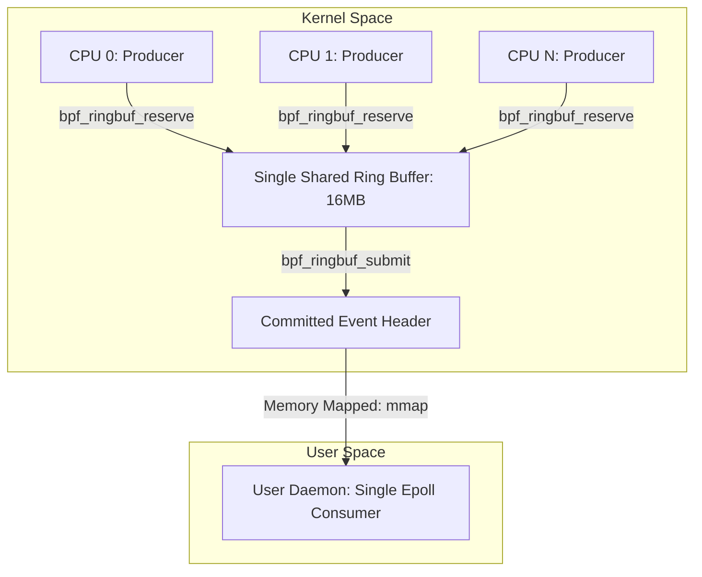

# 이론 및 백서: 리눅스 커널 eBPF 고성능 이벤트 스트리밍 아키텍처: Perf Event Array vs BPF Ring Buffer

## 1. 개요: 커널-유저스페이스 이벤트 전달의 진화

eBPF(Extended Berkeley Packet Filter)는 리눅스 커널 내부의 트레이스포인트, kprobe, 소켓, XDP 훅에서 실행되는 안전한 샌드박스 가상 머신입니다. eBPF 프로그램이 커널 내부에서 이벤트를 캡처하여 유저스페이스 에이전트로 전달하는 메커니즘은 eBPF 관측성(Observability) 및 런타임 보안의 핵심 초석입니다.

역사적으로 이벤트 전송에는 두 가지 메커니즘이 사용되었습니다:
1. **`BPF_MAP_TYPE_PERF_EVENT_ARRAY` (Perf Buffer)**: Linux 4.4부터 도입된 레거시 per-CPU 버퍼.
2. **`BPF_MAP_TYPE_RINGBUF` (BPF Ring Buffer)**: Linux 5.8에 Andrii Nakryiko에 의해 도입된 MPSC Lockless 링 버퍼.

---

## 2. Perf Buffer(`BPF_MAP_TYPE_PERF_EVENT_ARRAY`)의 구조적 한계

```
[Perf Buffer Architecture (Per-CPU Rings)]
CPU 0 ───> [ Ring Buffer 0 ] ───> fd 0 ──┐
CPU 1 ───> [ Ring Buffer 1 ] ───> fd 1 ──┼──> epoll() & User Daemon
...                                       │    (Needs Timestamp Sorting)
CPU N ───> [ Ring Buffer N ] ───> fd N ──┘
```

### 2.1 Per-CPU 메모리 할당의 곱셈적 폭증
Perf Buffer는 각 CPU 코어마다 독립된 원형 버퍼를 생성합니다:
$$\text{Memory}_{\text{perf}} = N_{\text{cpu}} \times \text{buffer\_size\_per\_cpu}$$
- 대형 서버(128코어)에서 코어당 8MB 버퍼를 주면 **1GB**의 Pinned Kernel Memory가 즉시 소모됩니다.
- 이는 cgroup 메모리 제한을 초과하거나 노드의 가용 메모리를 압박하는 주범이 됩니다.

### 2.2 코어 불균형과 조기 패킷 드롭 (Core Skew Drop)
현대 리눅스 네트워킹 및 고성능 컴퓨팅 환경에서 트래픽은 모든 코어에 균등하게 분산되지 않습니다:
- NIC RSS 해시 불균형, ksoftirqd 바인딩, CPU 어피니티로 인해 특정 코어(예: Core 0)에 트래픽의 80~90%가 집중됩니다.
- Core 0의 8MB 버퍼는 즉시 포화되어 **이벤트 드롭(`perf_event_output() failed: -ENOSPC`)**이 발생합니다.
- 반면 나머지 코어의 수백 MB 버퍼는 완전히 유휴 상태로 낭비됩니다.

### 2.3 시간 역전과 정렬 오버헤드
- 각 CPU 버퍼는 독립적이므로 유저스페이스 컨슈머는 $N_{\text{cpu}}$개의 파일 디스크립터를 감시해야 합니다.
- 서로 다른 코어에서 발생한 이벤트는 서로 다른 버퍼를 거쳐 유저스페이스로 오므로 **도착 순서가 뒤죽박죽**이 됩니다.
- 보안 감사는 인과 관계(Process Fork $\to$ Exec $\to$ Connect)의 순서 보장이 생명인데, 유저스페이스에서 타임스탬프 기반의 값비싼 재정렬 버퍼링을 수행해야 합니다.

---

## 3. Modern BPF Ring Buffer (`BPF_MAP_TYPE_RINGBUF`)

Linux 5.8에 도입된 BPF Ring Buffer는 단일 공유 메모리 풀을 사용하는 **MPSC(Multi-Producer, Single-Consumer)** 락리스 링 버퍼입니다.



### 3.1 공유 메모리 풀과 98% 절감 효과
- 모든 CPU 코어가 단 하나의 전역 링 버퍼(예: 16MB)를 공유합니다.
- 특정 코어에 트래픽이 90% 집중되더라도 전체 16MB 공간을 자유롭게 활용하므로 **코어 편중에 의한 허위 드롭이 원천 차단**됩니다.
- 128코어 기준 메모리 사용량이 1,024MB에서 16MB로 **98.4% 절감**됩니다.

### 3.2 2단계 메모리 예약 API (Zero-Copy Transfer)
과거 Perf Buffer는 eBPF 스택(512바이트 한도)에 임시 구조체를 만든 뒤 `bpf_perf_event_output()`으로 메모리를 복사했습니다.
Ring Buffer는 2단계 무복사 API를 제공합니다:
1. **`bpf_ringbuf_reserve(ringbuf, size, flags)`**:
   - 링 버퍼에서 필요한 바이트만큼 원자적으로 공간을 예약하고 포인터를 반환합니다.
   - eBPF 프로그램은 커널 스택 복사 없이 **링 버퍼 메모리에 직접 데이터를 작성(In-Place Write)**합니다.
2. **`bpf_ringbuf_submit(ptr, flags)`**:
   - 메모리 배리어와 함께 헤더 비트를 토글하여 유저스페이스 컨슈머에게 가시화(Commit)합니다.
3. **`bpf_ringbuf_discard(ptr, flags)`**:
   - 유효성 검증 실패 시 예약했던 메모리를 즉시 취소 처리합니다.
- *주의*: `reserve()` 후 `submit()`이나 `discard()`를 호출하지 않으면 링 버퍼 헤더가 진행되지 못해 영구 교착상태(`RINGBUF_RESERVATION_LEAK_DEADLOCK`)가 발생합니다.

### 3.3 엄격한 글로벌 시간 순서 (Total Chronological Ordering)
- 모든 코어의 이벤트가 단 하나의 선형 링 버퍼에 예약 순서대로 기록되므로, 유저스페이스 컨슈머는 별도의 정렬 알고리즘 없이도 **완벽한 시간순 스트림**을 즉시 수신할 수 있습니다.
