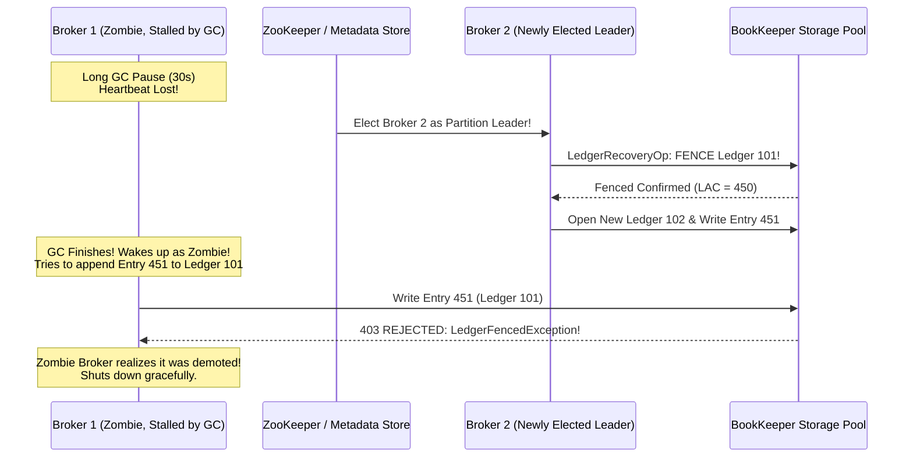

# 이론 및 백서: 분산 메시징 스토리지 아키텍처: Kafka 모놀리식 파티션 vs Apache Pulsar BookKeeper 세그먼트 스토리지 및 원장 펜싱(Ledger Fencing)

## 1. 개요: 분산 로그의 스토리지 결합 vs 분리 패러다임

실시간 이벤트 스트리밍 시스템에서 "로그(Log)"는 순서가 보장되는 불변의 추가 전용(Append-Only) 데이터 시퀀스입니다. 이 로그를 클러스터에 어떻게 배치하고 영속화하느냐에 따라 Apache Kafka와 Apache Pulsar는 근본적으로 다른 아키텍처 철학을 취합니다.

| 비교 항목 | **Apache Kafka** | **Apache Pulsar (BookKeeper)** |
| :--- | :--- | :--- |
| **아키텍처 모델** | 컴퓨팅 + 스토리지 결합형 (Monolithic Broker) | **컴퓨팅(Broker)과 스토리지(Bookie) 분리** |
| **파티션 구조** | 특정 브로커 디스크에 바인딩된 단일 연속 파일 | **세그먼트(Ledger) 단위로 잘게 쪼개진 분산 원장** |
| **브로커 상태성** | 유상태(Stateful): 파티션 데이터 직접 소유 | **무상태(Stateless): 오직 서빙/라우팅/캐시만 담당** |
| **파티션 리밸런싱** | 네트워크를 통한 **수백 GB~수 TB 전체 복사** ($O(N)$) | **메타데이터(ZooKeeper) 소유권 이전** ($O(1)$, 10ms) |
| **스토리지 노드 장애** | 잔여 복제본이 전체 파티션을 재복제 (수 시간 소요) | **새 원장을 열어 즉시 쓰기 재개** (다운타임 0ms) |

---

## 2. Apache BookKeeper 앙상블(Ensemble)과 스트라이핑 역학

Pulsar의 스토리지 엔진인 Apache BookKeeper는 하나의 파티션을 여러 개의 **Ledger(원장)**로 나누고, 각 Ledger마다 3가지 쿼럼 파라미터로 데이터를 스트라이핑합니다:

- **$E$ (Ensemble Size)**: 원장 저장에 참여하는 Bookie 노드 집합의 크기 (예: $E=5$).
- **$Qw$ (Write Quorum)**: 각 엔트리가 물리적으로 복제되는 Bookie 수 (예: $Qw=3$).
- **$Qa$ (Ack Quorum)**: 클라이언트에 성공을 알리기 위해 필요한 최소 ACK 수 (예: $Qa=2$).

```
[BookKeeper Striping Mechanism: E=5, Qw=3, Qa=2]
Entry 0 ───> [ Bookie 0 ] [ Bookie 1 ] [ Bookie 2 ]
Entry 1 ───>              [ Bookie 1 ] [ Bookie 2 ] [ Bookie 3 ]
Entry 2 ───>                           [ Bookie 2 ] [ Bookie 3 ] [ Bookie 4 ]
Entry 3 ───> [ Bookie 0 ]                           [ Bookie 3 ] [ Bookie 4 ]
Entry 4 ───> [ Bookie 0 ] [ Bookie 1 ]                           [ Bookie 4 ]
```

### 2.1 스트라이핑의 장점
1. **균등한 디스크 I/O 분산**: 특정 Bookie에 쓰기 부하가 집중되지 않고 앙상블 전체로 라운드로빈 분산됩니다.
2. **무중단 내결함성**: $Qw=3, Qa=2$일 때 Bookie 1대가 고장 나더라도 $Qa=2$개의 응답을 즉시 확보할 수 있으므로 쓰기가 중단되지 않습니다.
3. **동적 앙상블 교체 (Ensemble Switching)**: 지속적으로 응답이 없는 Bookie가 발생하면 BookKeeper는 현재 원장을 닫고, 살아있는 건강한 Bookie들로 즉시 새 원장 세그먼트를 개설하여 쓰기를 지속합니다.

---

## 3. 좀비 브로커와 원장 펜싱(Ledger Fencing)

무상태 브로커 환경에서 가장 치명적인 위험은 **네트워크 파티션 또는 긴 JVM Stop-the-World GC로 인한 스플릿 브레인(Split-Brain)**입니다:



1. **원장 펜싱 (Fencing)**:
   - 신규 브로커는 파티션을 인수하자마자 Bookie들에게 이전 원장에 대해 **Fence 명령**을 보냅니다.
   - Bookie들은 해당 원장을 `FENCED` 상태로 마킹하고, 원장의 마지막 확인 오프셋인 **LAC(Last Add Confirmed)**를 확정합니다.
2. **스플릿 브레인 방어**:
   - 뒤늦게 깨어난 구 브로커가 이전 원장에 쓰기를 시도하면 Bookie는 즉시 `LedgerFencedException`을 던져 쓰기를 거부합니다.
   - 이를 통해 동일 파티션에 두 브로커가 동시에 서로 다른 데이터를 기록하여 로그가 갈라지는 참사를 100% 방지합니다.

---

## 4. BookKeeper 디스크 I/O 분리 철칙: Journal vs EntryLog

BookKeeper가 고성능과 일관성을 동시에 달성하는 비결은 서로 상반된 두 가지 I/O 워크로드를 물리적으로 격리하는 것입니다:

```
+-------------------------------------------------------------------------------+
| BookKeeper Storage Node (Bookie)                                              |
|                                                                               |
| 1. Journal Path (WAL):                                                        |
|    Dedicated NVMe Drive ---> Sequential Append ---> fsync() ---> FAST ACK (2ms)|
|                                                                               |
| 2. EntryLog Path (LedgerStorage):                                             |
|    Separate Data Drive  ---> Large Batch Buffer ---> Background Flush / Read  |
+-------------------------------------------------------------------------------+
```

- **Journal (저널)**:
  - 오직 트랜잭션의 영속성을 위해 순차적으로 기록되며 매 요청마다 `fsync`를 수행합니다.
  - 디스크 헤드 이동이 없는 전용 NVMe 드라이브에 배치할 경우 2~3ms 미만의 초저지연 ACK를 보장합니다.
- **EntryLog (엔트리 로그)**:
  - 수많은 토픽의 메시지가 섞여 들어오므로 버퍼에 모았다가 주기적으로 디스크에 플러시하고 인덱스 락을 갱신합니다.
- **공유 디스크 배치 안티패턴**:
  - 만약 하나의 SATA SSD/HDD에 Journal과 EntryLog를 함께 두면, EntryLog의 대용량 플러시와 인덱스 조회가 Journal의 `fsync` 디스크 I/O 큐를 선점하여 쓰기 지연시간이 200ms 이상으로 튀어 오르는 참사(`BOOKKEEPER_JOURNAL_SHARED_DISK_LATENCY_SPIKE`)가 발생합니다.
