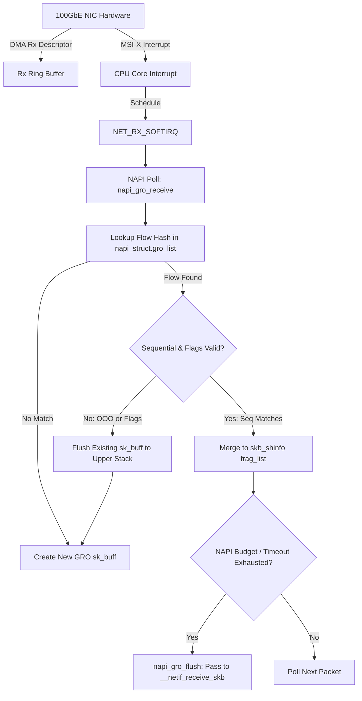

# Problem #293: 리눅스 커널 GRO (Generic Receive Offload)와 고성능 NAPI 패킷 집계 이론

## 1. 하드웨어 LRO(Large Receive Offload)의 한계와 커널 GRO의 탄생

전통적인 네트워크 인터페이스 카드(NIC)는 이더넷 프레임을 수신할 때마다 하드웨어 인터럽트를 발생시키고 커널 네트워크 스택으로 1개의 `sk_buff` 구조체를 넘겼습니다. 1GbE 시대에는 문제가 없었으나, 10GbE, 40GbE, 100GbE로 대역폭이 급증하면서 초당 수천만 개의 패킷(Packet Per Second, pps)이 유입되었고, 리눅스 커널은 패킷당 메모리 할당 및 헤더 파싱 오버헤드로 인해 심각한 병목을 겪었습니다.

초기에 하드웨어 벤더들은 **LRO (Large Receive Offload)**를 도입했습니다. LRO는 NIC 하드웨어가 직접 여러 TCP 세그먼트를 하나의 거대한 프레임으로 합쳐서 OS로 넘기는 기술이었습니다.
그러나 하드웨어 LRO는 치명적인 결함들이 있었습니다:
1. **프로토콜 불투명성**: LRO 하드웨어는 IP 옵션, TCP 타임스탬프, SACK 옵션, ECN(Explicit Congestion Notification) 비트 등을 손실시키거나 변형시켰습니다.
2. **라우터/포워딩 비호환성**: 패킷을 재포워딩(Bridging/Routing)해야 하는 노드에서 LRO로 합쳐진 거대 패킷은 MTU를 초과하여 경로 상에서 단편화(Fragmentation)되거나 폐기되었습니다.
3. **터널링 미지원**: VXLAN, Geneve, GRE 같은 오버레이 터널 패킷을 파싱하지 못했습니다.

이러한 한계를 극복하기 위해 리눅스 커널 2.6.29에서 **GRO (Generic Receive Offload)**가 소프트웨어 계층(드라이버 NAPI 폴링 루프)으로 도입되었습니다. GRO는 원본 패킷의 헤더 정보(IP ID, Checksum, TCP Options, Flags)를 손실 없이 보존하며, 필요 시 언제든지 다시 완벽하게 분할할 수 있는 완전성을 제공합니다.

---

## 2. 리눅스 커널 GRO 아키텍처 및 NAPI 폴링 루프

GRO는 하드웨어 인터럽트 컨텍스트가 아닌, 커널의 **소프트인터럽트(SoftIRQ `NET_RX_SOFTIRQ`)**에서 실행되는 **NAPI(New API) 폴링 루프** 내에서 동작합니다.

### 핵심 커널 자료구조
- `struct napi_struct`: 드라이버가 등록한 NAPI 구조체로, 수신 폴링 루프와 `gro_list`(현재 병합 대기 중인 `sk_buff` 연결 리스트)를 보유합니다.
- `struct skb_shared_info`: `skb_shinfo(skb)`를 통해 접근하며, 수신된 후속 패킷들의 데이터 버퍼를 `frag_list`에 링크하여 제로 카피(Zero-Copy)로 슈퍼 패킷을 구성합니다.
- `NAPI_GRO_CB(skb)`: GRO 전용 제어 블록(`struct napi_gro_cb`)으로, 동일 플로우 플래그(`same_flow`), 플러시 플래그(`flush`), 카운트(`count`) 등을 저장합니다.

---

## 3. GRO 병합 실패 및 즉시 방출(Flush) 트리거

GRO는 패킷의 무결성과 순서 보장을 위해 매우 엄격한 규칙 하에서만 병합을 허용하며, 다음 상황에서는 즉시 기존 버퍼를 상위 스택으로 방출합니다:

1. **비순차(Out-of-Order) 패킷 유입**:
   - `tcp_seq != flow.next_seq`
   - 네트워크 지터, ECMP 해시 불균형, 패킷 손실 등으로 인해 시퀀스 갭이 발생하면, 순서가 뒤바뀐 패킷을 병합할 경우 수신측 TCP 스택의 Fast Retransmit / SACK 로직이 왜곡될 수 있으므로 기존 누적 패킷을 즉시 방출합니다.
2. **TCP 제어 플래그(SYN, FIN, RST)**:
   - 3-Way 핸드셰이크 및 세션 종료 플래그는 상태 머신 전이를 즉시 유발해야 하므로 지연 없이 방출됩니다.
3. **크기 제한 (`gro_max_size`)**:
   - 기본 64KB(65,536 바이트). 리눅스 5.19부터는 800GbE 시대를 대비하여 IPv6 Hop-by-Hop 옵션을 활용한 **BIG TCP (최대 512KB)**가 지원됩니다.
4. **타임아웃 페이싱 (`gro_flush_timeout`)**:
   - 저지연(Low-Latency) 애플리케이션의 패킷 전달 지연을 방지하기 위해 일정 시간(기본 수십 $\mu s$) 이상 병합되지 않은 패킷은 강제로 방출됩니다.
5. **순수 ACK 압축 (ACK Compression / Coalescing)**:
   - 대규모 다운로드 수신 시 수신되는 수만 개의 빈 ACK 패킷을 하나로 압축하여 CPU 부하를 최대 80% 절감합니다.

---

## 4. 커널 실무 튜닝 및 성능 분석 파라미터

- `ethtool -k <eth0> rx-gro-hw / rx-gro-list`: 하드웨어 및 소프트웨어 GRO 활성화 확인.
- `sysctl -w net.core.gro_normal_batch=8`: 정상 패킷 수신 시 일괄 전달 배치 크기.
- `ethtool -C <eth0> rx-usecs 50 rx-frames 64`: 인터럽트 병합(Interrupt Coalescing / Adaptive Moderation) 설정.
