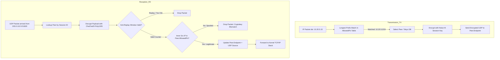

# Problem #294: WireGuard 암호키 라우팅(Cryptokey Routing)과 안티 리플레이 슬라이딩 윈도우 이론

## 1. 기존 VPN(IPsec/OpenVPN)의 복잡성과 WireGuard의 설계 철학

전통적인 엔터프라이즈 VPN 솔루션들은 거대하고 복잡합니다:
- **IPsec**: IKEv1/IKEv2 협상 데몬, X.509 인증서, 수많은 암호 스위트(AES, SHA, 3DES 등), 커널 XFRM 서브시스템, SA(Security Association)와 SP(Security Policy)의 괴리로 인해 설정 파일이 수천 줄에 달하며, 수십만 줄의 커널 C 코드로 인해 심각한 보안 취약점의 온상이었습니다.
- **OpenVPN**: 사용자 공간(Userspace) 데몬으로 동작하며, TUN/TAP 가상 인터페이스를 거치면서 발생하는 잦은 컨텍스트 스위칭(Context Switching)과 메모리 복사로 인해 10GbE 이상의 고속 회선에서 심각한 병목을 유발합니다.

제이슨 도넨펠드(Jason A. Donenfeld)가 고안한 **WireGuard**는 단 **4,000줄 미만의 C 코드**로 리눅스 커널에 직접 구현되어, 기존 솔루션 대비 4~5배 높은 처리량과 획기적으로 낮은 지연시간을 달성했습니다.

---

## 2. 암호키 라우팅 (Cryptokey Routing)의 원리와 수학적 모델

WireGuard의 가장 독창적인 개념은 **암호키(Cryptographic Key)와 IP 라우팅의 완전한 1:1 결합**입니다.

### 송신 최장 접두사 일치 (Longest Prefix Match, LPM)
WireGuard 드라이버는 내부적으로 피어들의 `AllowedIPs` 목록을 트라이(Trie) 구조(커널에서는 `fib_trie` 또는 패트리샤 트리)로 관리합니다. 패킷을 보낼 때 목적지 IP $D$에 대해 가장 구체적인 서브넷 마스크를 가진 피어 $P$를 $O(1)$~$O(32)$ 시간에 찾아냅니다.

### 수신 스푸핑 차단 (Cryptographic Source IP Guard)
복호화된 패킷의 내부 출발지 IP가 송신 피어의 `AllowedIPs`에 속하지 않는다면, 중간자가 다른 노드의 트래픽을 위조하여 주입하려 한 것이므로 커널 방화벽(iptables/nftables)에 도달하기도 전에 무조건 폐기합니다.

---

## 3. 안티 리플레이 슬라이딩 윈도우 (Anti-Replay Sliding Window)

공격자가 전송 중인 패킷을 가로채어 복호화하지 못하더라도, 그대로 다시 수신자에게 전송하면(Replay Attack) 금융 거래 중복 실행이나 세션 마비가 발생할 수 있습니다. WireGuard는 RFC 6479에 기반한 **비트맵 슬라이딩 윈도우** 기법으로 $O(1)$ 시간에 완벽하게 차단합니다.

### 64비트 비트맵 알고리즘
- 수신자는 `rx_max_counter`와 64비트 정수 `rx_window_bitmap`을 관리합니다.
- 패킷 카운터 $C$가 도착했을 때:
  1. $C > rx\_max\_counter$:
     - 상대 오프셋 $\Delta = C - rx\_max\_counter$
     - $\Delta < 64$이면 비트맵을 $\Delta$ 비트 좌측 시프트(`bitmap <<= \Delta`)하고 최하위 비트를 1로 설정.
     - $\Delta \ge 64$이면 이전 윈도우를 완전히 건너뛰었으므로 `bitmap = 1`로 초기화.
     - `rx_max_counter = C`.
  2. $C \le rx\_max\_counter$:
     - 상대 오프셋 $\Delta = rx\_max\_counter - C$
     - $\Delta \ge 64$이면 윈도우 밖의 너무 오래된 패킷: **폐기 (`COUNTER_TOO_OLD`)**.
     - `bitmap & (1 << \Delta) != 0`이면 이미 수신된 패킷: **폐기 (`REPLAY_ATTACK_DUPLICATE`)**.
     - 정상이면 비트 마킹: `bitmap |= (1 << \Delta)`.

---

## 4. 무상태성 엔드포인트 로밍 (Endpoint Roaming)과 세션 리키(Rekey)

- **동적 로밍**: WireGuard 피어는 상대방의 IP 주소를 고정할 필요가 없습니다. 모바일 기기가 기지국을 이동하여 공인 IP와 포트가 바뀌더라도, Noise 프로토콜 핸드셰이크 또는 유효한 Poly1305 인증 태그를 가진 데이터 패킷이 수신되는 순간 수신측은 해당 피어의 엔드포인트를 새 주소로 자동 교체합니다.
- **주기적 리키 (Forward Secrecy)**: 단일 세션 키로 너무 많은 패킷을 암호화할 경우 발생할 수 있는 통계적 암호 분석을 차단하기 위해, $120$초 또는 일정 패킷 수마다 새 핸드셰이크를 개시하여 새로운 세션 키로 순단 없이 교체합니다.
