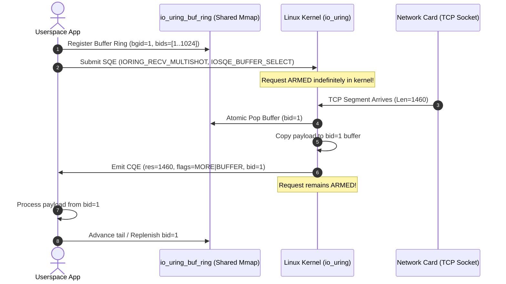

# Problem #295: Linux io_uring 멀티샷 수신과 제공된 버퍼 링(io_uring_buf_ring) 이론

## 1. 전통적인 epoll 및 비동기 수신 모델의 확장성 한계

수십만 개의 동시 웹소켓 또는 gRPC 마이크로서비스 연결을 처리하는 현대 클라우드 프록시(Envoy, NGINX)에서 메모리 관리는 성능의 핵심입니다:

1. **epoll + 논블로킹 I/O (`epoll_wait` + `recv`)**:
   - 이벤트 통지만 제공하므로, 통지 후 실제 패킷을 읽기 위해 별도의 `read()`/`recv()` 시스템 콜을 호출해야 합니다.
   - 10만 연결에서 패킷당 1회의 시스템 콜은 막대한 컨텍스트 스위칭 오버헤드를 유발합니다.
2. **1세대 io_uring 수신 (`IORING_OP_RECV`)**:
   - 시스템 콜 오버헤드는 제거했으나, SQE마다 버퍼 주소(`addr`)와 길이(`len`)를 고정 지정해야 했습니다.
   - 유휴 연결이 언제 패킷을 보낼지 모르므로, 10만 개 소켓 모두에 버퍼를 할당해 두어야 했고, 이로 인해 수 기가바이트의 메모리가 묶이는 **버퍼 핀닝(Buffer Pinning) 문제**가 발생했습니다.

---

## 2. 제공된 버퍼 링 (`struct io_uring_buf_ring`)의 혁신

리눅스 커널 5.19에서 옌스 악스보(Jens Axboe)는 사용자 공간과 커널 공간이 단 하나의 잠금(Lock-Free)도 없이 공유 메모리 상에서 버퍼를 교환할 수 있는 **`io_uring_buf_ring`** 메커니즘을 도입했습니다.

### 핵심 장점
- **진정한 주문형(On-Demand) 버퍼 할당**: 패킷이 NIC 링버퍼에 실제로 도착한 그 순간에만 버퍼를 소비하므로, 10만 연결이라 하더라도 실제 동시 활성 패킷 수(예: 1,000개)만큼의 버퍼만 풀(Pool)로 유지하면 됩니다. (메모리 사용량 99% 절감!)
- **락 프리(Lock-Free) 메모리 배리어**: 커널과 사용자 공간은 `tail` 포인터에 대해 `smp_store_release`와 `smp_load_acquire` 메모리 배리어만을 사용하여 락 경합(Lock Contention)이 전혀 없습니다.

---

## 3. 멀티샷 수신 (`IORING_RECV_MULTISHOT`)과 라이프사이클

- **`IORING_CQE_F_MORE`**:
  CQE의 플래그 필드 최하위 비트(1)는 해당 SQE가 종료되지 않고 계속해서 다음 패킷을 수신할 준비가 되어 있음을 의미합니다. 애플리케이션은 새 SQE를 커널에 다시 제출할 필요가 없습니다.
- **`IORING_CQE_F_BUFFER` & Buffer ID**:
  CQE의 플래그에 비트 2(2)가 설정되어 있으면 상위 16비트에 소비된 버퍼의 고유 ID(`bid`)가 인코딩되어 전달됩니다.
- **`-ENOBUFS` 버퍼 고갈 예외**:
  트래픽 폭주로 인해 버퍼 링에 남은 버퍼가 0개가 되면 커널은 즉시 `res = -ENOBUFS` (-105)를 반환하고, `IORING_CQE_F_MORE` 플래그를 제거하여 해당 멀티샷 요청을 해제(Disarm)합니다. 애플리케이션은 버퍼를 보충한 뒤 새 멀티샷 SQE를 재등록(Re-arm)해야 합니다.
- **정상 종료 (`res == 0`)**:
  원격 호스트가 `close()` 또는 `shutdown()`을 호출하여 TCP FIN 패킷이 도달하면 0바이트가 읽히며, `res = 0` 및 `MORE=0`으로 멀티샷이 정상 종료됩니다.
